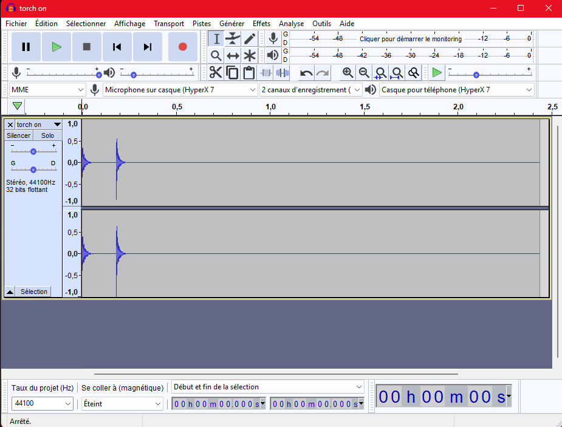
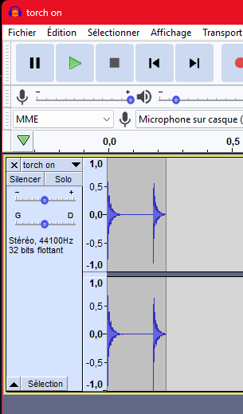

# Audio in DyingStar

This section is for **sound designers**. It explains how a sound gets into the game, the file rules to
follow, and where each object's sounds are configured. Good news: **adding a sound is almost never code**
— you drop a file in the project and pick it in a slot in the Godot Inspector.

## How sound works in the game

Every sound in DyingStar is a **positional 3D sound**: it plays *at* the object that makes it (a player,
a truck…) and gets quieter with distance, so you can tell where it comes from. There is **no music/UI
mixer to wire** — a shared helper (`Sfx3D`) plays every one-shot the same way, and each object exposes
its sounds as **`@export` slots** grouped under **Audio SFX** in the Inspector.

Each slot comes with the same five knobs, so a knob means the same thing everywhere:

| Knob | What it does |
|---|---|
| **Sound** | the audio file to play (leave empty = silent) |
| **Db** | volume in decibels (0 = nominal, negative = quieter) |
| **Falloff** | the reference distance where the sound is at nominal volume |
| **Distance** | hard cut-off distance (beyond it the sound isn't computed — saves CPU) |
| **Attenuation** | *how* it fades with distance (see below) |

**Attenuation** picks the fade curve to match the kind of sound:

| Attenuation | Curve | Use for |
|---|---|---|
| `REALISTIC` | 1 / distance | engines, general world sounds |
| `VERY_SHORT` | 1 / distance² (dies fast) | footsteps, clicks, small mechanisms |
| `FAR_REACHING` | logarithmic (carries far) | horns, sirens |
| `FLAT` | no fade | rare — non-diegetic |

:::note[The server is silent]
The game **server has no audio** — sounds play on each **client**, from the state that's replicated to
them. So other players hear your footsteps, your torch click, a truck's horn… all without sending any
audio over the network. Nothing to do on your side; just know a sound you add is heard by everyone nearby.
:::

## File rules

### Format: **`.mp3` or `.ogg`** (not `.wav`)

Ship sounds as **`.mp3`** or **`.ogg`** — they're compressed, so the game download stays small. Avoid
`.wav` (uncompressed, many times larger) except for very short one-shots where it's unavoidable.

### Trim the silence — **cut your sounds tight**

A sound file must contain **only the audible sound**, with no dead space before or after it. Extra
silence still ships in the download, and a one-shot with a long tail of silence delays anything that
waits for it to finish.

Open the clip in an editor (Audacity here) and **cut the leading and trailing silence** so the waveform
fills the whole file:

**❌ Don't** — the sound is a short burst but the file runs on with seconds of silence:

**✅ Do** — the same sound, trimmed so the file is just the burst, no dead space:

:::tip[Looping sounds are handled in code]
For a **held / looping** sound (a running engine, a held horn) you don't need to set the *Loop* flag in
Godot's import dock — the game forces looping on at runtime (`Sfx3D.as_looping`). Just deliver a clean
loop with no gap or click at the seams. One steady sample is enough: the engine loop is **pitched and
made louder** as the RPM rises, so a single idle recording covers idle → full throttle.
:::

## Where the files live

Audio assets go under `assets/_universe/audio/`:

- `ambience/` — looping ambiences (sandstorm…)
- `music/` — tracks
- `sfx/` — one-shots and short loops, split by source:
  - `sfx/characters/` — footsteps (per surface: grass / metal / sand / stone), jump…
  - `sfx/machine/`, `sfx/machine/tools/` — buttons, the torch on/off…
  - `sfx/vehicles/ground/` — the truck's doors, engine, horn…
  - `sfx/ui/` — menu buttons

Follow the existing folders and naming; don't invent a new layout.

## Which sounds does each object have?

The actual list of sounds per object lives on that object's **Audio SFX** group in the Inspector:

- **[Player sounds](./player_audio.md)** — footsteps, jump, torch on/off.
- **[Vehicle sounds](./vehicle_audio.md)** — doors, engine (start / stop / running loop), lights,
  handbrake, horn.
