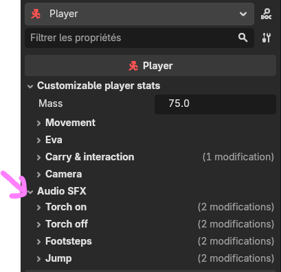

# Player sounds

:::tip[Read the intro first]
**[Audio in DyingStar](./intro.md)** explains positional sound, the five knobs on every slot, and the
file rules (mp3/ogg, trim the silence). This page is just *where the player's sounds are* and what each
one is.
:::

The player's sounds are set on the **`Player`** node, in the **Audio SFX** group of the Inspector. Every
slot is optional — leave the **Sound** empty and that sound is simply silent. They play on **every**
player body, your own and the other players', so everyone hears everyone.

## The slots

| Group | Sound | When it plays |
|---|---|---|
| **Torch on** | `sfx_torch_on` | the flashlight is switched **on** |
| **Torch off** | `sfx_torch_off` | the flashlight is switched **off** |
| **Footsteps** | `sfx_footsteps` (a **list**) | one step per distance walked (see below) |
| **Jump** | `sfx_jump` | the player jumps |

Each group has the usual **Db / Falloff / Distance / Attenuation** knobs next to the sound. Footsteps,
torch and jump default to **`VERY_SHORT`** attenuation (they die off fast — small, local sounds).

## Footsteps — a list, not a single file

`sfx_footsteps` is a **list** of clips (drop several samples of the same surface, e.g. four grass steps).
The game picks a **random** one each step and **never plays the same sample twice in a row**, and adds a
tiny random **pitch** change per step — so walking doesn't sound like a machine gun.

Two extra knobs tune the feel:

- **Footstep Stride** — one step every *N* metres **walked** (not per second). The cadence then follows
  speed on its own: running covers ground faster, so the steps speed up, with no timer to set.
- **Footstep Pitch Jitter** — how much the pitch wanders per step (± fraction).

Steps are silent while airborne (jumping/falling) and while climbing, so only real walking makes noise.

:::note[One surface today]
The current `sfx_footsteps` list is a single surface's samples. When surface-aware footsteps arrive,
the same list pattern extends per material — no change to how you author the clips.
:::
