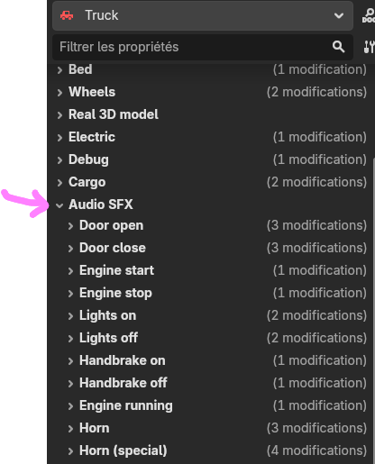

# Vehicle sounds (the truck)

:::tip[Read the intro first]
**[Audio in DyingStar](./intro.md)** explains positional sound, the five knobs on every slot, and the
file rules (mp3/ogg, trim the silence). This page is just *where the truck's sounds are* and what each
one is.
:::

A vehicle's sounds are set on the **`Vehicle`** node (the truck's root), in the **Audio SFX** group of
the Inspector. Every slot is optional (empty = silent). Sounds play on the **clients**, driven by the
truck's **replicated** state — so a horn, a door or an engine you hear is the *same event* every nearby
player hears.

## The slots

| Slot | Kind | When it plays | Default attenuation |
|---|---|---|---|
| **Door open** / **Door close** | one-shot | a door opens / closes | `VERY_SHORT` |
| **Engine start** / **Engine stop** | one-shot | the engine is turned on / off | `REALISTIC` |
| **Engine running** | **loop** | held while the engine runs (idle → redline) | `REALISTIC` |
| **Lights on** / **Lights off** | one-shot | headlights toggled | `VERY_SHORT` |
| **Handbrake on** / **Handbrake off** | one-shot | handbrake set / released | `VERY_SHORT` |
| **Horn** | **held loop** | held while the horn button is pressed | `FAR_REACHING` |
| **Horn (special)** | one-shot | the special horn | `FAR_REACHING` |

Each has the usual **Db / Falloff / Distance / Attenuation** knobs. Horns default to **`FAR_REACHING`**
so they carry across the map; the engine uses **`REALISTIC`**; the small clicks use **`VERY_SHORT`**.

## The engine loop — one idle sample covers everything

You only record **one steady idle loop** for **Engine running**. The game holds it while the engine is
on and, as the RPM rises, **raises its pitch and volume** — so a single sample plays idle through full
throttle. It's held back until the **Engine start** (cranking) clip finishes, then fades in. Three knobs
shape it:

- **Engine Rev Pitch** — the maximum pitch multiplier at the redline (e.g. `2.0` = twice as high).
- **Engine Rev Db** — extra volume (dB) added at the redline.
- **Engine Rev Response** — how quickly the note chases the RPM (the engine's "inertia").

The **Horn** is a held loop too, with **Horn Min Secs** (a minimum honk length even on a quick tap) and
**Horn Fade Secs** (a short release fade so it doesn't click when you let go).

:::tip[Deliver a clean loop — the Loop flag is set in code]
For **Engine running** and **Horn**, don't worry about the *Loop* import flag in Godot — the game forces
looping on at runtime. Just make sure the clip loops seamlessly (no gap or click at the seams). See the
[intro's looping note](./intro.md#file-rules).
:::

## What's replicated

The truck replicates the **state** that drives its sounds (engine on/off, handbrake, headlights, the
doors map, the held-horn bool, and a special-horn **counter**), and each client plays the matching sound
from it. The engine loop's pitch/volume are derived locally from the replicated **speed**, so no audio
stream is ever sent over the network. (For the networking side, see the developer page
[Adding a vehicle](../networkGame/vehicles.md).)
