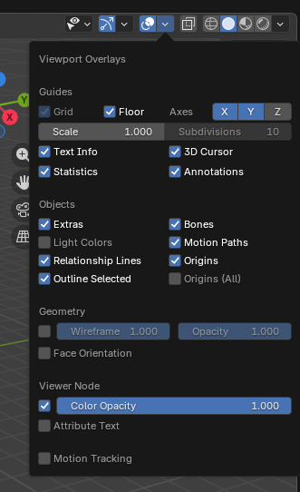
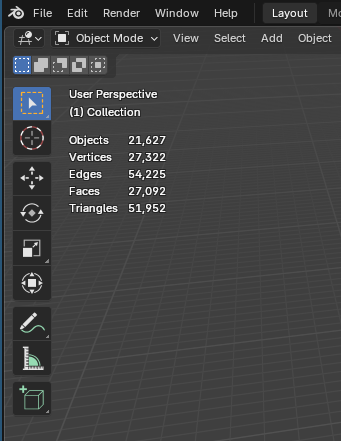

# 3D models

## Conception in blender

### View statistics (number triangles / objects)

In blender, you can see the number of triangles, click on *viewport overlays*, and click on *statictics*, you can now see the statistics.

### One mesh

Each .blend file must have only 1 mesh, or 1 logical group.

This avoids "who touched what" conflicts in version control.

### LOD (Level Of Detail) management

In the goal to keep performance in the game, we need to have 4 LOD.

One you have created your mesh, rename it with the suffix *_LOD0*.

Duplicate it with *alt + D* or in menu *Object* > *Duplicate Linked* and rename it with suffix *_LOD1*.
Repeat the duplicate for *_LOD2* and *_LOD3_*.

On _LOD1, _LOD2 and _LOD3, add the modifier *Decimate*. Apply the ratio like this table:

| LOD | Decimate Ratio | Triangle target |
|-----|----------------|-----------------|
| LOD0 | 1.0 — no decimate | 100% |
| LOD1 | 0.5 | ~50% |
| LOD2 | 0.15–0.2 | ~15–20% |
| LOD3 | 0.05 | ~5% |

### textures

:::danger
**Never** embed textures inside the .blend, keep them as sidecar files so they can be updated without opening Blender
:::

:::tip
A material reused across several models does not live next to its `.blend` at
all. It is published once into the shared library and assigned by Godot at
import time, which is what stops the same texture from existing in four copies
across the repository. Read [Materials](./materials.md) to find out which of the
two flows your material belongs to. The rest of this section covers
model-specific materials.
:::

This is the procedure to manage textures:

**When adding a texture the first time**, in the Shader Editor, add an *Image Texture* node → click *Open* → navigate to your `assets_blender/.../` folder and select the `.png` file there. Blender will store a relative path automatically as long as the `.blend` has already been saved once alongside the textures.

**Check a texture is external (not packed)**: look at the Image Texture node header. If you see a small floppy disk icon with a dot on it, the image is packed. If it shows just the filename, it's external.

**To unpack an already-packed texture:**

1. Go to *File* → *External Data* → *Unpack Resources*
2. Choose *"Write files to current directory"* (this places them next to the `.blend`)
3. Then move them to your proper `assets_blender/…/` folder and re-link (see [Files Structure page](../files_structure))

**To re-link a texture after moving it:** In the Image Texture node, click the folder icon next to the image name → navigate to the new path. Or use *File* → *External Data* → *Find Missing Files* to bulk-fix broken paths across all materials at once.

**Make all paths relative** (important for team/version control): go to *File* → *External Data* → *Make All Paths Relative*. This converts all absolute `/home/you/project/...` paths to `//relative/...` paths, so the `.blend` works on any machine as long as the folder structure is preserved.

The simplest rule: **textures live in the same folder as their `.blend`, or in a subfolder of it**. For your structure that means:

- assets_blender/structures/buildings/houses/
  - house_colonial_2f.blend
  - tex_house_colonial_2f_albedo.png
  - tex_house_colonial_2f_normal.png
  - tex_house_colonial_2f_roughness.png

### Export to Godot

Once finished, export for Godot.

**`File > Export > glTF 2.0 (.glb/.gltf)`**

Choose the format **glTF Binary (`.glb`)** (single file, everything packed in. Best for most use cases).

This is the recommended Settings Panel:

#### 🔵 Include

| Option | Setting |
|---|---|
| **Limit to** | Selected Objects (if you don't want the whole scene) |
| **Data > Mesh** | ✅ UVs, Normals, Vertex Colors |
| **Data > Armature** | ✅ Export Deformation Bones Only |
| **Data > Skinning** | ✅ Enable |

If your model contains blend shapes (shape keys / morph targets), the **Data > Armature > Export Deformation Bones Only** option must be enabled — exporting non-deforming bones will lead to incorrect shading in Godot.

#### 🟢 Transform

| Option | Setting |
|---|---|
| **+Y Up** | ✅ **Enable this** — Godot uses Y-up, Blender uses Z-up |

You can check **Transform > +Y Up** and other options from the built-in glTF exporter panel.

#### 🟡 Geometry / Mesh

| Option | Setting |
|---|---|
| **Apply Modifiers** | ✅ Enable (bakes modifiers into the mesh) |
| **Normals** | ✅ Enable |
| **UVs** | ✅ Enable |
| **Vertex Colors** | ✅ if used |
| **Compression (Draco)** | ❌ Avoid — Godot doesn't support Draco decompression natively |

#### 🟣 Material

| Option | Setting |
|---|---|
| **Materials** | ✅ Export |
| **Images** | **None**, but only for a model using shared library materials |

A model whose materials come from the shared library exports with **Images:
None**. The `.glb` then carries the material *names* and no pixels at all, and
Godot assigns the real materials at import time. Exporting the images would ship
a second copy of textures that already live in the library, which is exactly what
the library exists to avoid. A model with its own model-specific textures keeps
the default. See [Materials](./materials.md).

#### 🟠 Animation (if exporting animated objects)

| Option | Setting |
|---|---|
| **Animation** | ✅ Enable |
| **Export NLA Strips** | ✅ Enable — this separates animations by name in Godot |
| **Bake Animation** | ✅ Enable if you have complex drivers or constraints |
| **Sampling Rate** | 1 (default is fine) |
| **Optimize Animation** | ✅ Recommended |

When exporting with animations, use **NLA Strips** mode — each strip in the NLA Editor becomes a separately named animation track in Godot, which is what allows the AnimationPlayer to recognize them individually.

#### 🔴 Before Exporting — Critical Checklist

1. **Apply all transforms** (`Ctrl+A > All Transforms`) on both mesh and armature. Incorrect scale or rotation on an armature is the #1 cause of weird deformation issues in-engine.
2. **Check origin points** — objects floating in Godot is often caused by a misplaced origin in Blender.
3. **Materials**: Use **Principled BSDF** nodes. The exporter supports Metal/Rough PBR (core glTF) and Shadeless (KHR_materials_unlit) materials, and constructs a glTF material based on the nodes it recognizes in the Blender material.
4. **Textures** must be in PNG or JPEG format — other formats are auto-converted on export.

#### Tip: Save as Export Preset

Once you've configured everything, click the **➕ operator preset button** at the top of the export panel to save these settings as a reusable preset (e.g., "Godot Export"). This avoids reconfiguring every time.

## Import in Godot

Once 3d model exported, open godot, you will have the file with extension *.glb*.

Open it, and you will have the import window.

On *Scene*, be sure to uncheck *Generate LODs*.

On each MeshInstance3D with the suffix *_LOD0*, *_LOD1*, *_LOD2* and *_LOD3*, set the right fields (*Visibility Range Begin* and *Visibility Range End*):

| Category | Examples | LOD0 | LOD1 | LOD2 | LOD3 |
|----------|----------|------|------|------|------|
| **Tiny** | coins, bolts, leaves | 0–0.5m | 0.5–2m | 2–5m | 5-8m |
| **Small** | cups, rocks, bottles | 0–1m | 1–5m | 5–15m | 15-25m |
| **Medium** | chairs, barrels, crates | 0–5m | 5–20m | 20–50m | 50-80m |
| **Large** | cars, trees, statues | 0–15m | 15–40m | 40–80m | 80-150m |
| **Huge** | buildings, terrain chunks | 0–30m | 30–80m | 80–200m | 200-400m |
| **Massive** | mountains, skybox elements | 0–100m | 100–300m | 300–800m | 800-1500m |

Then click on *Import* or *Reimport* button.

**Practical Tips**

- **Transparent / alpha objects** (leaves, fences) switch to a **flat billboard** at LOD2 or LOD3
