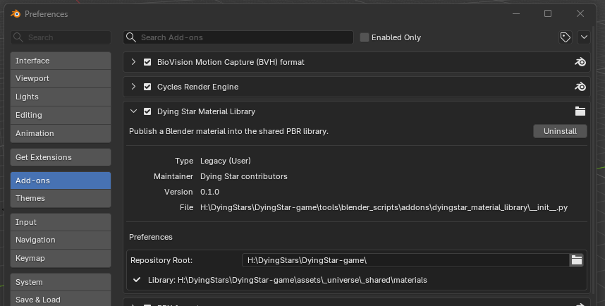
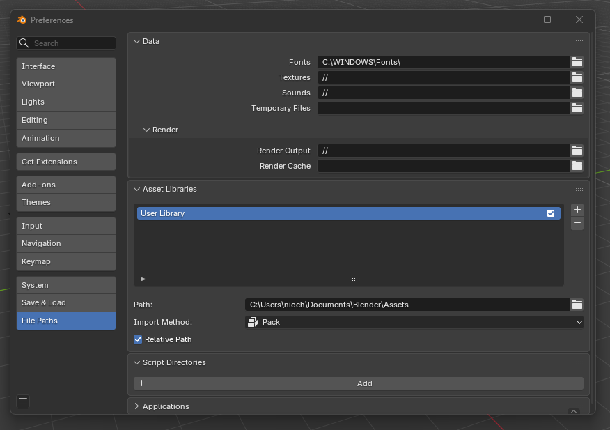
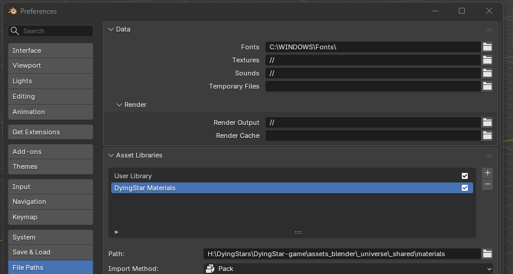
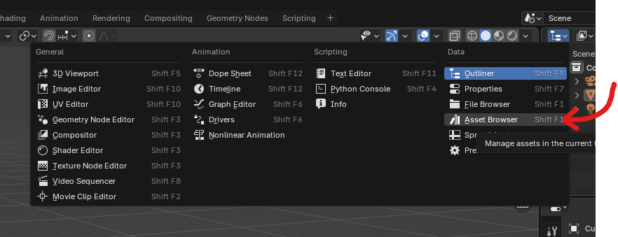
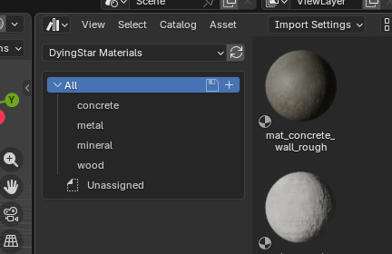

# Materials

This page covers the shared PBR material library: what it is, how to set it up,
and how a material travels from Blender to Godot.

It is written for two audiences. **Artists and modders** need the setup and the
publishing workflow. **Developers** need the pipeline internals, in
[How it works](#how-it-works) and after.

---

## The idea in one paragraph

Some materials are used by one model only. Others, like rusted hull plating,
concrete or raw ore, get reused across dozens of models. The second kind lives
in a shared library: authored once, published once, referenced everywhere.
Without it, every model that uses concrete ships its own copy of the concrete
textures.

## The moving parts

There is one Blender add-on, three Godot scripts and a few command-line tools.
None of them is an editor plugin you have to enable per project.

| Where | What | Job |
| --- | --- | --- |
| Blender | `tools/blender_scripts/addons/dyingstar_material_library/` | Reads a material's node tree and publishes it: renames the maps, writes `material.json`, renders `preview.jpg`, rebuilds the asset library. |
| Command line | `tools/validate.py` | Enforces the manifest schema, the tag vocabulary and the pixel-level rules. Runs in CI and inside the add-on. |
| Command line | `tools/build_asset_library.py` | Regenerates `materials_library.blend` from the manifests, so the Asset Browser always matches what is committed. |
| Godot | `addons/dyingstar/build_shared_materials.gd` | Turns each `material.json` into the `.tres` Godot renders, and pins that material's texture import settings. |
| Godot | `addons/dyingstar/shared_material_resolver.gd` | Given a material name, finds and loads its `.tres`. |
| Godot | `addons/dyingstar/post_import_shared_materials.gd` | Runs on every `.glb` import and applies what the resolver found. |

The list is this long because no single tool spans Blender and Godot.
`material.json` is what they agree on: the add-on writes it, everything
downstream reads it. Nothing else crosses the boundary, so nothing is
configured twice and nothing can disagree.

### A material's life, end to end

Publishing `mat_rock_granite_grey`, then using it on a model:

1. **Blender**: build the material, name it `mat_rock_granite_grey`, fill in
   the library panel, **Export to Library**. This writes
   `assets/_universe/_shared/materials/mat_rock_granite_grey/` with its maps,
   `material.json` and `preview.jpg`, then rebuilds the asset library.
2. **Command line**: `python tools/validate.py` tells you whether it would
   pass review, before anyone else has to look at it.
3. **Godot**: run `build_shared_materials.gd` (Ctrl+Shift+X). The folder gains
   `mat_rock_granite_grey.tres`.
4. **Blender**: a modeller drags the material from the Asset Browser onto a
   mesh, unwraps at 1 UV unit = 1 meter, and exports the `.glb` with
   **Materials: Export** and **Images: None**.
5. **Godot**: the `.glb` is imported. `post_import_shared_materials.gd` runs on
   its own, the resolver matches the name, and the `.tres` is assigned.

Steps 1 to 3 happen once per material. Steps 4 and 5 happen for every model
that uses it, and step 5 takes no configuration at all.

---

## Which flow to use

> **Could this material be used on another model?**
>
> - **No**: model-specific. Nothing special to do, keep working as usual.
> - **Yes**: it belongs in the shared library.

A cockpit panel painted onto one ship's UV layout is model-specific. Tileable
concrete is not.

### Flow 1, model-specific

The material is authored in Blender and exported inside the `.glb` with its
textures. Godot imports it as part of the scene. No setup, no library.

### Flow 2, shared library

The material lives in the library. The `.glb` carries the geometry and the
material **name** only; Godot assigns the shared resource at import time.

The difference is not marginal. A single cube textured with a 1K concrete
material weighs **3.7 MB** through flow 1 and **2.7 KB** through flow 2, because
flow 1 embeds a copy of every texture in every model that uses it. Twenty ships
sharing one hull plating: 74 MB versus 54 KB.

---

## Setup

Everything below is a one-time setup. You need it to **use** or **publish**
shared materials.

### 1. Clone the repository

The library is versioned in the [game
repository](https://github.com/DyingStar-game/DyingStar). Blender reads the
materials straight from your local clone, so you need one, even if you never
touch the code.

```bash
git clone https://github.com/DyingStar-game/DyingStar.git
```

### 2. Point Blender at the addon

*Edit → Preferences → File Paths → Script Directories* → `+` →
`<your-clone>/tools/blender_scripts`

Then **restart Blender**. Addons are only discovered at startup.

### 3. Enable the addon

*Edit → Preferences → Add-ons* → search for **Dying Star Material Library** →
tick the box.

Expand its entry and set **Repository Root** to your clone. The addon reads the
tag vocabulary and writes materials relative to that path, so nothing works
until it is set. The panel tells you if the path is wrong.



The check line under the field is the one to read: it shows the materials folder
the addon resolved to. If it is missing, the Repository Root is wrong.

### 4. Declare the asset library

*Edit → Preferences → File Paths → Asset Libraries* → `+` →
`<your-clone>/assets_blender/_universe/_shared/materials`



Name it **DyingStar Materials** in the Name column. Blender defaults to the
folder name, which is `materials`, and any second clone or sandbox gives you a
second entry with the exact same label. Two identically named libraries in the
same dropdown are indistinguishable, and you end up publishing into one while
reading the other.



This is what fills the Asset Browser.

### Requirements

- **Blender 4.0 or later.** The addon uses `ShaderNodeMix` and the
  `Emission Color` input, both introduced in 4.0.
- **No Python packages to install.** The addon only uses numpy, which ships
  with Blender.
- `validate.py`, used in CI and optionally on the command line, needs
  `jsonschema`, `pillow` and `numpy` in your system Python.

---

## Using a library material

1. Open an **Asset Browser** editor and pick the materials library
2. Set **Import Settings** to **Link**
3. Drag the material onto your object
4. Unwrap the model at **1 UV unit = 1 meter**

Any editor area can become an Asset Browser from the **Editor Type** menu in its
top-left corner:



Then pick **DyingStar Materials** in the library dropdown. The catalogs down the
left — concrete, metal, mineral, wood — are the families, and each material shows
its preview under its `mat_<family>_<name>` id:



New materials arrive with `git pull`. Nothing to install, nothing to rebuild.

**Link** makes the material read-only. That is deliberate: a model must not be
able to alter shared metadata, or every model would end up with its own variant
and the library would lose its point. To correct a published material, use
**Append** instead, fix it, and export again.

### Export settings

Models using a shared material need these glTF export settings:

| Setting | Value |
| --- | --- |
| Materials | **Export** |
| Images | **None** |

`Export` keeps the material names, which is what Godot matches against.
`None` leaves the textures out, which is the entire point.

Do **not** use `Placeholder`: it drops the materials altogether, names
included, and Godot has nothing left to resolve.

Save these as an export preset (the `+` at the top of the glTF export panel) so
nobody has to remember them.

To share one rather than have everybody rebuild it, Blender writes the preset as
a small `.py` beside its own configuration:

| System | Path |
| --- | --- |
| Windows | `%APPDATA%\Blender Foundation\Blender\<version>\scripts\presets\operator\export_scene.gltf\` |
| Linux | `~/.config/blender/<version>/scripts/presets/operator/export_scene.gltf/` |
| macOS | `~/Library/Application Support/Blender/<version>/scripts/presets/operator/export_scene.gltf/` |

Commit the file under `tools/blender_scripts/presets/` and copy it into that
folder. The version segment has to match the Blender you run.

---

## Publishing a material

Everything goes through the addon. There is no manual path: dropping a folder
of PNGs into the library is not supported, because a published material must
have been seen working in a shader graph at least once.

### Steps

1. Build the material in Blender, named `mat_<family>_<descriptor>`, with its
   textures wired into the Principled BSDF, see
   [Naming pattern](#naming-pattern), the family segment is required
2. Open *Properties → Material → **Dying Star Library***
3. Fill in display name, author, license, and at least one tag
4. **Detect Maps** reads the node tree and fills in the real-world tile size
5. If **Pack into ORM** appears next to it, the material still carries
   occlusion, roughness and metalness as three separate maps. One click merges
   them into one texture and rewires the graph. The button is absent when there
   is nothing to gain
6. **Export to Library** validates, writes the files, generates the preview,
   and rebuilds the Asset Browser library

Then commit: the new folder under
`assets/_universe/_shared/materials/`, and the regenerated
`materials_library.blend`.

The material is published at that point, but Godot cannot use it yet: its
`.tres` is generated separately, on the Godot side. See
[Building the resources](#building-the-resources).

### What the panel shows

**Library id**: the identifier that will be written. It comes from the
material name, not the display name. If they differ, the panel says so: fix the
material name before exporting.

**Detected maps**: every image the exporter will pick up, with its dimensions.
Surprises should happen here, not in review.

Maps are identified by **connection**, not by file name. Whatever is wired into
the Roughness input is the roughness map, whatever the file is called.
Supported chains: a direct image, an `ORM` split through Separate Color, ambient
occlusion multiplied into base colour, and a height map bumped on top of a
normal map.

The normal map is the one input that will not accept a direct image. It has to
reach the Principled through a **Normal Map** node, which decodes it into a
vector. Plugged straight in, its RGB values are read as a direction and the
surface renders wrong, in Blender as much as in Godot. The panel reports
`Normal input goes through an unsupported node` rather than publishing a
material that would look broken everywhere. The node lives under
*Add > Displacement > Normal Map*, or type its name into the Add search.

**The published albedo is the image, nothing else.** Only the images travel to
the library, never the operations laid on top of them. A base colour tinted by
a Mix node whose second input is a flat colour looks right in the viewport and
comes out of the library pale, because that colour lives in the node tree. The
panel reports `Base Color is tinted by a flat colour`. Flatten the tint into
the image before exporting: the file on disk has to be what the surface
actually looks like. The Mix node's second input is reserved for an occlusion
map, which is the one modulation the pipeline does carry.

### Tags

Tags come from a closed vocabulary in `tools/schema/tags.json`, offered as a
dropdown. The `family` category decides which Asset Browser catalog the
material lands in.

Adding a tag means editing `tags.json` in its own commit, so the change is
visible in review. Never invent one in a `material.json`.

### What the export reports

Every export ends on a line of the form
`mat_vegetation_bark_pine v2: 1 map(s) published, 2 already in the library`.

**Published** means the file was copied into the material folder. **Already in
the library** means the image node already reads the very file the export was
about to write, so there was nothing to copy. That is the normal state of a
material appended from the library, and it is also what an export looks like
when the artist corrected a file the material does not actually read. The two
are indistinguishable without this line, which is why it exists.

The version at the front moves only when the published bytes differ from what
was there. A re-export that only corrects metadata keeps its version.

### Correcting a published material

Append it from the Asset Browser (not Link), fix what needs fixing, and export
again. The manifest is overwritten.

Its image nodes read the library files directly, so an export reports every map
as already in the library. To replace a map's pixels, write the new image under
`assets_blender/_universe/_shared/materials/src/<id>/` and point the node at it
with the image node's folder icon. Publishing then goes through `export()`,
which stays the only writer of a material folder.

---

## How it works

### Naming is the join key

The same string appears in five places:

- the material name in Blender
- the `id` in `material.json`
- the folder name under `_shared/materials/`
- the material name Godot reads from the glTF
- the `.tres` file name

There is no lookup table and no configuration. A one-character mismatch breaks
the assignment silently, which is why the addon shows the id it will write and
warns when it diverges.

### Naming pattern

```text
mat_[family]_[descriptor]_[variant]
```

| Part | Rule | Examples |
| --- | --- | --- |
| `mat_` | Fixed prefix for shared materials | none |
| Family | **Required.** One value from the closed list below | `metal`, `rock`, `wood` |
| Descriptor | snake_case, most specific noun first, English | `hull_plating`, `granite`, `plank` |
| Variant | Optional: condition, colour, size, version | `rusted`, `dark_grey`, `lg`, `v2` |

Examples:

```text
mat_metal_hull_rusted
mat_rock_granite_grey
mat_concrete_wall_cracked
mat_wood_plank_dark
```

**Everything is in English**: descriptors, adjectives and colour names
included. `mat_metal_hull_rouille` and `mat_rock_granite_gris` are wrong.

### The family segment will drive footstep sounds

The family is not decorative. A runtime script will read the material name to
pick which footstep sound to play, so that walking on metal sounds like metal
and not like concrete.

That script does not exist yet. `player.gd` carries a single `sfx_footsteps`
array today and picks from it at random, with nothing reading a material name.
The convention is written down ahead of its consumer on purpose: the day the
script arrives, published materials already carry the family it needs, and
nothing has to be renamed after the fact.

This is why the family comes **immediately after** `mat_`, in a fixed position,
and why it is drawn from a closed list rather than free text.

The list is the `family` category of `tools/schema/tags.json`, which is also
what the addon offers as tags and what determines the Asset Browser catalog.
One vocabulary, three uses.

Adding a family means editing `tags.json`, and once the footstep script exists,
teaching it the new family in the same pull request. A family the script does
not know will be a silent failure.

### Texture files

Texture files follow `tex_[descriptor]_[map].png`, where `[map]` is one of
`albedo`, `normal`, `orm`, `ao`, `roughness`, `metallic`, `height`, `emissive`,
`opacity`. The addon writes them, so there is nothing to remember.

Shared materials sit alongside the prefixes listed in
[Files structure](./files_structure.md).

### Layout

Shared materials live game-side, because their maps are real game resources
referenced by `.tres` files and must survive the build, which wipes
`assets_blender/`.

```text
- assets/
  - _universe/
    - _shared/
      - materials/
        - mat_concrete_rough/
          - material.json
          - mat_concrete_rough.tres
          - preview.jpg
          - tex_concrete_rough_albedo.png
          - tex_concrete_rough_normal.png
          - tex_concrete_rough_orm.png
- assets_blender/
  - _universe/
    - _shared/
      - materials/
        - materials_library.blend
        - blender_assets.cats.txt
        - src/
          - mat_concrete_rough/
            - tex_concrete_rough_orm.png
```

`material.json` is the source of truth: everything else derives from it.

`src/` holds maps an artist produced while authoring, before any export: a
packed ORM, a re-exported normal, anything not yet published. It sits on the
Blender side because nothing there is a game resource, and the build wipes the
tree. Export is what moves a map from here into a material folder, and remains
the only writer of one.

`materials_library.blend` is **generated** by
`tools/build_asset_library.py`. Never edit it by hand, never resolve a merge
conflict on it, regenerate it instead. The addon does this automatically after
an export; the **Rebuild Library** button does it on demand.

### Tiling scale

`material.json` carries `physical_size_m`: the real-world size, in meters,
covered by one UV tile. A Mapping node in the material applies its inverse.

This only works because models are unwrapped at **1 UV unit = 1 meter**. The
material holds half of the contract, the model holds the other half. Unwrap at
a different scale and the field means nothing.

To change how a material tiles on one model, unwrap that model differently.
Never edit the material: it is shared, and the change would apply everywhere.

### Godot side

Two scripts live in `res://addons/dyingstar/`. Neither is an editor plugin:
there is nothing to enable in the project settings.

#### Building the resources

`build_shared_materials.gd` turns every `material.json` into the `.tres` that
sits beside it, inside the material's own folder. It is an `EditorScript`: open
it in the script editor and run it (*File > Run*, or Ctrl+Shift+X) after adding
or correcting a material. The resource is derived, so it is always rewritten,
like `materials_library.blend`, never edit it by hand.

It is deliberately kept out of the import pipeline. A glTF exported with
`Images: None` carries no textures, so an import has nothing to build a
material from, and writing into `res://` mid-import triggers a filesystem
rescan.

The same pass pins the import settings of every declared map. Left alone, Godot
guesses which texture is a roughness map by watching how materials sample it,
and the guess is unreliable: it has been seen wiring its roughness limiter
onto the occlusion and height maps while leaving the real roughness map on
`Detect`. `material.json` already states what each map is, so the setting is
written rather than detected.

Two maps are not translated literally, because a Godot slot does not always do
what the Blender node did:

| Map | Godot | Why |
| --- | --- | --- |
| `ao` | `ao_texture`, with `ao_light_affect = 1` | Blender multiplies occlusion into the base colour, so it darkens everything. Godot's default dims ambient light only, which leaves the surface markedly brighter than the viewport it was judged in. |
| `height` | not wired, reported as a warning | Godot's heightmap slot drives parallax mapping, which displaces UVs. In Blender the same map feeds a Bump node, which only perturbs the normal. Wiring one to the other makes the surface swim as the camera moves, and costs GPU for a look the material was never authored for. The map stays in the library for a use that genuinely wants displacement. |

Where a material's resource lives is defined once, in
`SharedMaterialResolver.resource_path()`. The generator writes through it and
the resolver reads through it, so the two cannot drift apart.

#### Assigning them at import

`post_import_shared_materials.gd` is the **Import Script** of every `.glb`. It
is set once as a project default rather than per model, in `project.godot`:

```ini
[importer_defaults]

scene={
"import_script/path": "uid://kgqqvfi5nd42"
}
```

Two things about that block are easy to get wrong.

**The value is a UID, not a path.** Godot stores the script by its identifier,
the one in `post_import_shared_materials.gd.uid`, and resolves it back to a
`res://` path when it writes each `.import`. A `res://` path written here is
silently ignored and every model imports with no script at all. Yours will
differ from the one above: read it from the `.uid` file in your own clone.

**Do not produce it with *Preset > Save as Default for 'Scene'*.** That command
copies every setting of the model you are looking at, its own `_subresources`
and its own `meshes/generate_lods` included, and turns them into project-wide
defaults. Write the two lines by hand instead: one key is all this needs.

A default only applies when Godot creates an `.import`. Models already imported
keep whatever their `.import` says, so an existing project needs its files
edited or deleted once. New models then arrive already wired, with nothing to
fill in.

Setting the field by hand on a single model has a catch worth knowing: the path
box only commits on **Enter**, or when you pick the file with the browse button
beside it. Clicking Reimport while the cursor is still in the box discards what
you typed, and the field comes back empty as though the script had been
rejected.

It runs on every reimport, which matters: Godot regenerates the imported scene
whenever the source file changes, so a material assigned by hand would be
silently lost at the next export from Blender. Doing it at import time makes
the assignment part of the import.

The script only touches materials whose name starts with `mat_`. Everything
else is left exactly as the glTF provided it, so both flows coexist without any
per-model configuration.

If the matching `.tres` does not exist, the glTF material is kept and a warning
is logged. An import is never broken by a missing library entry. A shared
material arriving *with* embedded textures also logs a warning: it means the
glTF was exported with the wrong settings.

Because the assignment is baked into the imported scene, **moving or renaming a
`.tres` invalidates every model already imported against it**. Godot then
refuses to open the scenes that use them, citing missing dependencies.
Reimporting the models fixes it, and is worth mentioning in any commit that
changes the layout.

---

## Validation

The same rules run inside the addon and on the command line, so a material
accepted at export cannot be rejected in CI.

```bash
python tools/validate.py                 # every material
python tools/validate.py <material_dir>  # one of them
```

Errors block; warnings inform.

| Check | Severity |
| --- | --- |
| Manifest matches the schema | error |
| Tags exist in the vocabulary | error |
| Folder name matches the id | error |
| `preview.jpg` present | error |
| Dimensions a multiple of 4 | error |
| Texel density close to the 1024 px/m target | warning |
| Normal map uses the OpenGL (+Y) convention | error |
| Grayscale maps stored in colour mode | warning |
| Constant map or dead alpha channel | warning |
| Height map below 16-bit | warning |

The texel density target is what keeps two materials looking alike when they
meet on the same wall. It is the resolution divided by `physical_size_m`, so a
1024 map covering one metre and the same map covering two are twice as fine as
each other. The target is **1024 px/m**: a 1 m tile wants 1024 px, a 2 m tile
wants 2048. A quarter off either way passes without comment, since art
direction sometimes has a reason.

The multiple-of-4 rule is not cosmetic: GPU block compression works on 4x4
blocks, so a texture that does not comply cannot be compressed in VRAM.

Square textures are **not** required. Bark stretched vertically, a trim sheet
twice as wide as it is tall, are sound authoring choices, and `physical_size_m`
already describes a non-square tile. A shape that really is wrong shows up in
the texel density check, which judges each axis on its own.

The normal map convention is detected by comparing the green channel to the
height gradient, so it only applies to materials that ship a height map.
AmbientCG and Poly Haven both offer an OpenGL variant, take that one.

### Where the rules live

`tools/map_rules.py` holds every rule and depends only on numpy. Two adapters
feed it: `tools/pillow_loader.py` reads files from disk for the command-line
validator, `bpy_loader.py` reads Blender images for the addon. A rule is
written once and enforced identically wherever it runs.

The panel runs them continuously in metadata-only mode, reading the pixel
buffer of a 4K map on every redraw would freeze the interface. The full check,
pixels included, runs once at export.

---

## Licensing

Every material declares its `license`, `author` and `ai_generated: false`. The
schema rejects any other value for the last one: **AI-generated art is not
accepted in this project**, and the manifest records that explicitly rather
than relying on people remembering.

For third-party materials, CC0 sources such as AmbientCG and Poly Haven are
safe. Anything else needs its license checked before publishing, an AGPL
project cannot absorb material of unknown origin.
