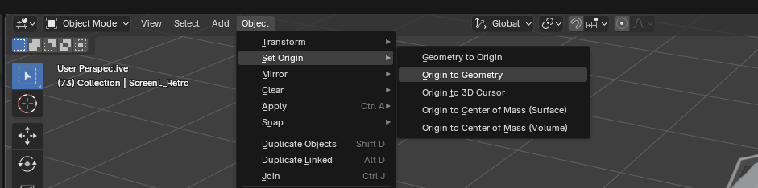
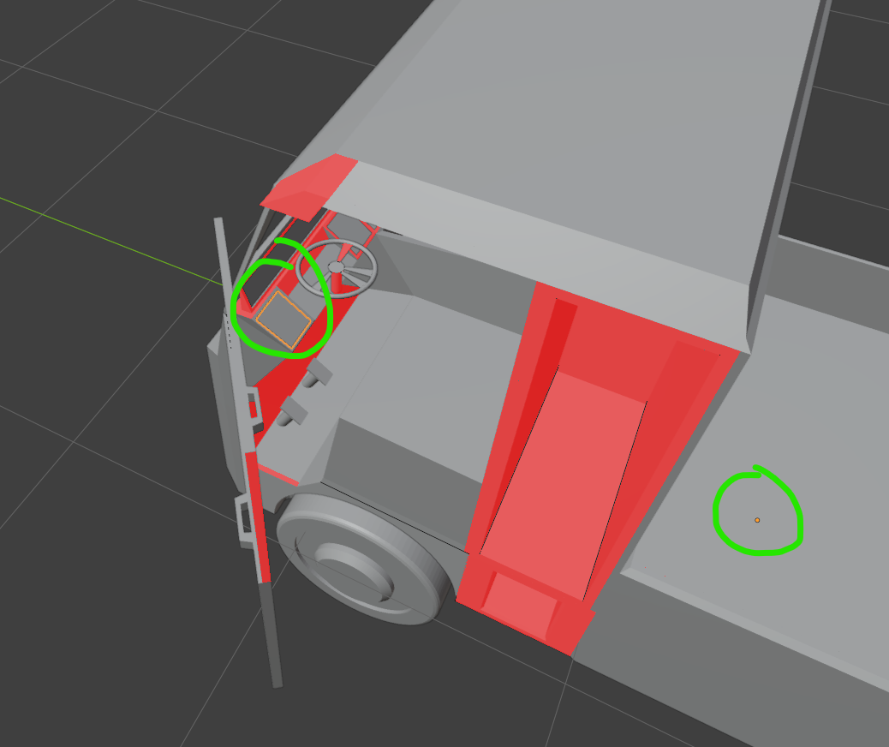
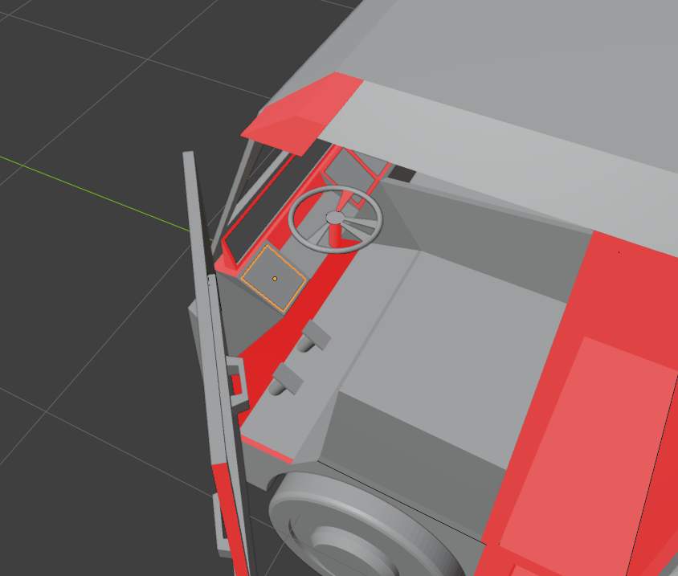
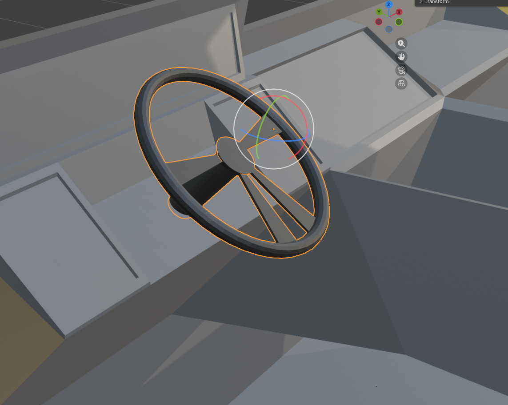
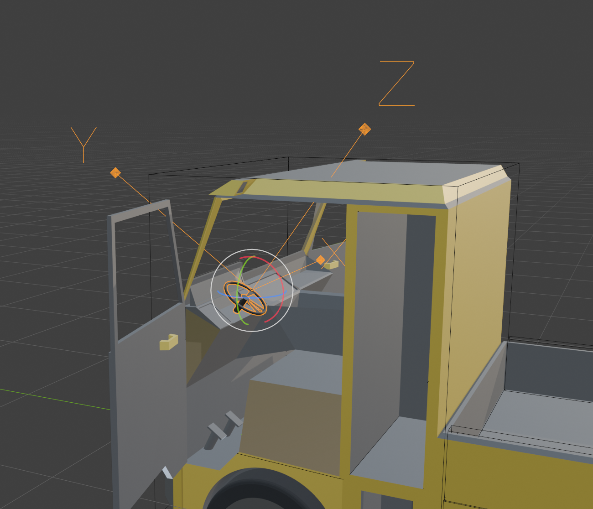
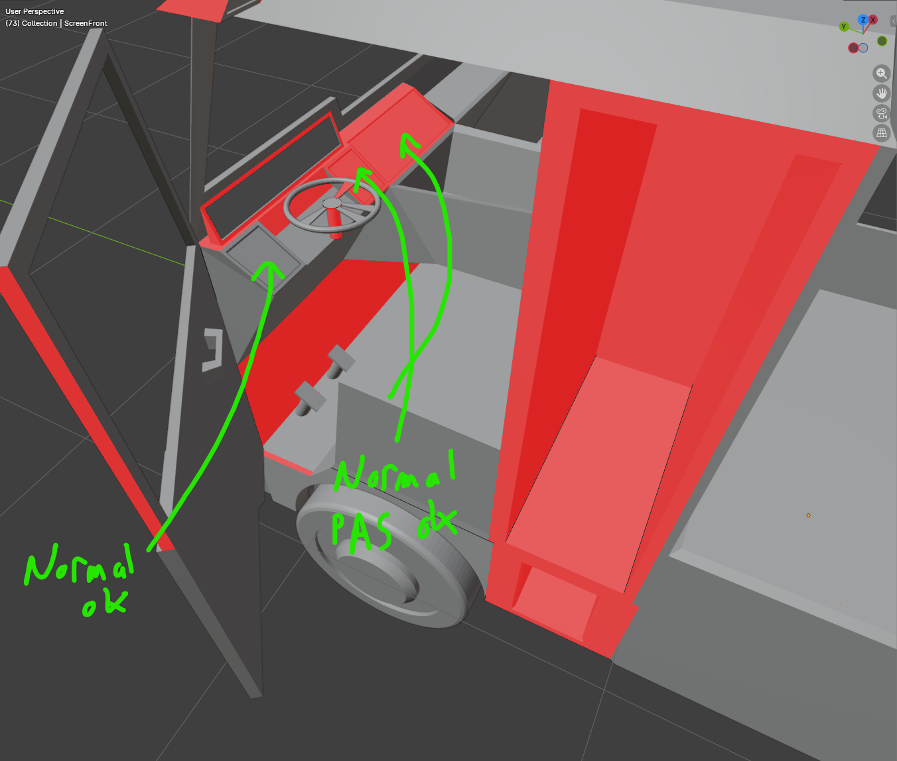
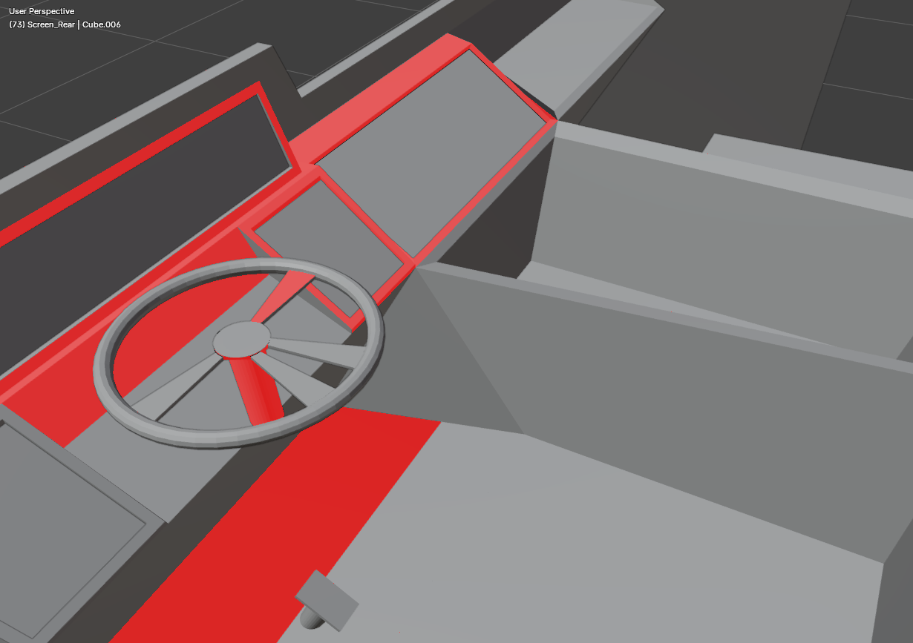
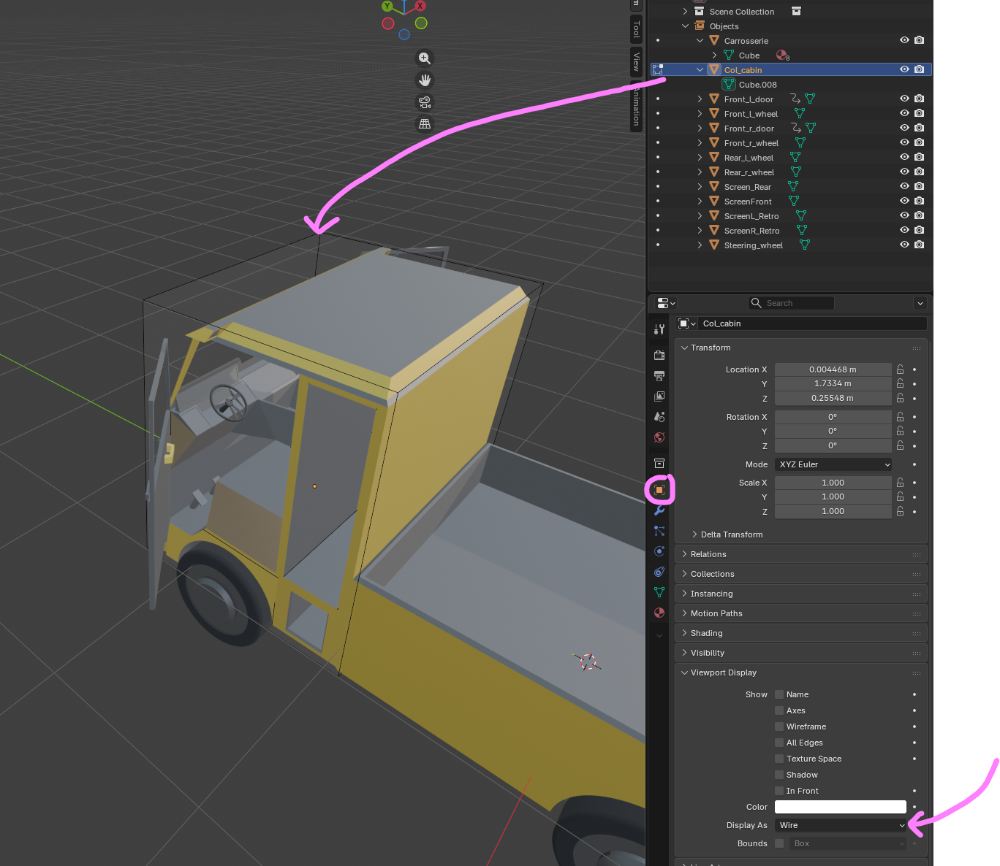

# Vehicle 3D models (for 3D modelers)

This page is for **3D artists** preparing a **vehicle** (truck, car, rover…) in Blender so the game
can make it work: wheels that turn, a steering wheel that follows the steering, doors that open, and
in-cab **screens** (reversing camera, mirrors, dashboard).

Read the general [3D models](./3d_models.md) page first (LODs, textures, export). This page only adds
the **vehicle-specific** rules.

## The big idea: you provide the visuals, the game adds the gameplay

A vehicle in the game is your **GLB model** + a small **rig** the developers build in Godot.

- **You (Blender)** provide: the body, the **wheels**, the **steering wheel**, the **doors** (with
  their open/close animations) and the **screen surfaces**.
- **The developers (Godot)** add the gameplay nodes: physics wheels, cameras, seats, cargo zones,
  door handles, etc.

So your job is to deliver **clean, well-named, well-pivoted parts**. The game finds them **by name**.

## Golden rule: one part = one object, correctly named, correctly pivoted

A part the game must move (a wheel, a door, the steering wheel) or target (a screen) must be a
**separate object** in Blender — not a face buried in the body mesh. And its **origin must be its
pivot**.

### Naming (case doesn't matter)

| Part | Name it… | Notes |
|---|---|---|
| Body | anything (e.g. `Carrosserie`) | the main shell |
| Wheels | contains `wheel` → `Front_l_wheel`, `Front_r_wheel`, `Rear_l_wheel`, `Rear_r_wheel` | `front`/`rear` + `l`/`r`. Any number of wheels works. |
| Steering wheel | `steering_wheel` | the volant |
| Doors | ends with `_door` → `Front_l_door`, `Front_r_door` | one object per door |
| Reversing-cam screen | `Recul_Screen` | a flat screen surface |
| Mirror screens | `RetroL_Screen`, `RetroD_Screen` | left / right mirror |
| Dashboard screen | `ScreenFront` | shows speed / RPM / load |
| Collision pieces | start with `col_` → `col_cab`, `col_bed_floor`, `col_bed_left`… | the physical shape (see **Collision** below). Several **convex** pieces. |

### Origins = pivots (critical for moving parts)

The **object origin** is the point a part rotates around. Set it with **`Object → Set Origin`**:

| Part | Origin must be at… |
|---|---|
| **Wheel** | the **center of the axle** (else the wheel wobbles when it spins) |
| **Door** | the **hinge** (else the door pivots through the air) |
| **Steering wheel** | the **steering column axis** |
| Screens / body | not critical — use `Origin to Geometry` for tidiness |

Set the origin from the **`Object → Set Origin`** menu:

❌ **Wrong** — the origin sits far from the part (here at the body center), so the part pivots through
the air:

✅ **Right** — the origin is on the part's pivot (the wheel axle / the door hinge):

:::tip Apply your transforms
Before export, **`Ctrl+A → All Transforms`** on every object (bakes scale/rotation/position). A wrong
or unapplied scale is the #1 cause of parts arriving twisted or offset in the game.

**One exception — the steering wheel of an angled column** (see below): apply Location + Scale, but
**keep its Rotation** (don't bake it), so its spin axis stays a clean local axis.
:::

:::tip The steering wheel — keep the disc flat, tilt with the object
The game spins the steering wheel around one of its **local axes**, so that axis must stay aligned with
the **column**. Model the disc **flat** (its face in the local plane, normal along **local Z**), then
angle the wheel using the **object's Rotation** (e.g. `35°` on X for a leaning column) — and **do NOT
apply** that rotation (`Ctrl+A`), or the tilt bakes into the geometry and the local axis no longer
follows the column. Check the **N-panel → Item → Rotation** shows your angle (not `0`). The dev then
sets the spin axis in Godot — usually **`(0, 1, 0)`**, because the glTF export turns Blender's Z-up into
Godot's Y-up so the disc normal (Blender `+Z`) becomes Godot `+Y`.
:::

**How to check it in Blender.** Select the steering wheel, then switch the **transform-orientation
gizmo** (top of the viewport header) between **Global** and **Local** to compare the two frames:

- In **Global**, the gizmo stays world-aligned (Z straight up). You can see the disc is **tilted** with
  respect to the world axes — that's expected for an angled column:

- In **Local**, the gizmo **tilts with the object** and follows the column. The disc normal is now a
  clean **local axis** — this is the axis Godot spins the wheel around. If the gizmo is *not* tilted in
  Local (it looks the same as Global), the rotation was baked with `Ctrl+A` and the local axis no longer
  follows the column — undo the apply and keep the Rotation instead:

## Separating a part into its own object (`P`)

If a screen (or any part) is currently a face of the body:

1. **Edit Mode** (`Tab`) → select the face(s).
2. **`P` → Selection** → the face becomes a new object.
3. Back in **Object Mode**, rename the **object** (double-click in the Outliner, or `F2`).
   ⚠️ Rename the **object** (top line), not just its *mesh data* underneath — the game uses the
   **object name**.
4. Set its origin and apply transforms (above).

## Screens — the part with the most rules

A screen (reversing cam, mirror, **or dashboard**) shows a live image (a camera feed or the
dashboard). The image is mapped onto the face through its **UVs**, so the UVs must be right.

### 1. One UV map only

A separated object often inherits **two** UV maps (e.g. `UVMap` **and** `CarteUV`). The export keeps
the one flagged **render** (the **camera icon** in *Object Data Properties → UV Maps*) — which may not
be the one you edited, so your work seems to "disappear" on export.

➡️ Keep **one** UV map: select the extra one → **`–`** to delete it. (When you `P`-separate a part it
drags along the body's UV maps — remove the duplicate every time.)

### 2. Fill the 0→1 square with `U → Reset`

For a flat quad screen, **don't** use `Unwrap` (it keeps the real aspect → leaves margins). Use:

**Edit Mode → select the face → `U → Reset`.**

This maps the 4 corners of the face to the 4 corners of the UV square → the feed fills the **whole**
screen. Check in the UV Editor: the rectangle must cover the **entire** `0→1` square (not collapse to
a point — that means no real UVs).

This works **even if your screen is rectangular** (16:9, 4:3…). The UV square is just the mapping
space; your face keeps its shape. The whole image simply fills the whole screen.

### 3. The front face must face the viewer (normals)

Screens are **one-sided** for performance: the image shows only on the face's **front**. If a screen
is blank, its front points the wrong way.

- Turn on **Overlays → Face Orientation**: **blue** = front, **red** = back.
- From the **driver's viewpoint**, each screen must be **blue**. If it's red → Edit Mode → select the
  face → **`Alt+N → Flip`**.

❌ **Wrong** — the screen face shows **red** (back) toward the viewer → it stays blank in game:

✅ **Right** — the screen face shows **blue** (front) toward the viewer → the feed displays:

### 4. If the image is rotated ("lying down")

The feed is upright along the UV's vertical. If it comes out rotated, rotate the **UVs**: Edit Mode →
select the face → UV Editor → **`R 90`** (or `180` / `-90`) until it's straight.

## Doors — animations

Doors open/close via **animations baked in the GLB**. In Blender, animate each door (opening on its
hinge) and put the clips on the **NLA editor** as **strips named** `<door>_open` and `<door>_close`,
e.g. `Front_l_door_open` / `Front_l_door_close`. The export turns NLA strips into named animations the
game plays on demand.

*(If a door has no animation, the game falls back to rotating it on its hinge — so the origin-at-the-
hinge rule still matters.)*

## Collision — the physical shape (so players don't pass through)

The visible mesh has **no collision** by itself. You provide the physical shape as **simple low-poly
volumes**, and the game turns each into a collider. Without them the game falls back to a rough box
that **won't match** your model.

### The one rule: each piece must be CONVEX

A moving vehicle can only use **convex** collision shapes (no dents/hollows in a single piece). The
game takes the **convex hull** of each collision mesh — so a single U-shaped mesh around a truck bed
would get **filled in** (you couldn't drop cargo in it). The fix: build the shape from **several
convex pieces**.

### How to do it in Blender

1. Add simple primitives (mostly **cubes**) and shape them to wrap the vehicle: one for the **cab**, a
   flat one for the **bed floor**, thin ones for the **bed walls** (left / right / front), one for the
   **hood**… Keep them low-poly — a collider needs no detail.
2. To keep a **hollow bed**, use the floor + wall pieces around the opening (never one big block over
   the bed).
3. **Name each piece `col_<something>`** — `col_cab`, `col_bed_floor`, `col_bed_left`,
   `col_bed_right`, `col_bed_front`, `col_hood`…
4. **Apply transforms** (`Ctrl+A → All Transforms`), like every part.
5. **Display them as wireframe** so they stop hiding your model while you work: select the piece →
   **Object Properties** (the orange square) → **Viewport Display → Display As → Wire**. This is only a
   Blender *display* setting — the mesh still exports normally.
6. No material / no UV needed.

Each `col_*` piece becomes one convex collider in game, placed where you put it, and **hidden** — in
the Godot editor **and** in game (the integrator checks placement with *Debug → Visible Collision
Shapes*). If you ship **no** `col_*` piece, the game uses a rough fallback box (only good enough for a
blockout).

### Why this approach (not auto-generated)

- **Hand-made convex cubes are the game-industry standard for vehicles** — clean, light and
  **predictable**. A handful of boxes is ~5 min of work and costs almost nothing at runtime.
- **Automatic convex *decomposition* (V-HACD & co.) tends to spit out many messy pieces** that need
  tuning — overkill for a vehicle, and heavier.
- A box is **already convex** — there is no "make it convex" button. You only avoid carving a
  **single** piece into a concave shape (a U / L / hollow): split it into several boxes instead, and
  the engine takes the **convex hull** of each.
- They are **collision-only**: no material, no UV, hidden everywhere — they exist purely so players and
  props can't pass through the body, while the **bed stays hollow** for cargo.

## Export checklist

Use the **`Godot_export`** preset (File → Export → glTF 2.0 → Operator Presets). It already sets:

- **glTF Binary (.glb)**, **+Y up**, **Apply Modifiers**, **NLA strips ON** (for door animations),
  **Draco OFF**.

Before exporting, per object:

- [ ] One **separate object** per moving/screen part, correctly **named**.
- [ ] **Origin = pivot** (axle / hinge / column).
- [ ] **`Ctrl+A → All Transforms`** applied.
- [ ] **One UV map** (no duplicate); screens **`U → Reset`** (fills 0→1).
- [ ] Screen faces **blue** (front) toward the driver.
- [ ] Door animations as **NLA strips** `<door>_open` / `<door>_close`.
- [ ] **Collision** as several **convex** `col_*` pieces (hollow bed = floor + walls, never one block).
- [ ] **No leftover modifier** on screen objects — `Apply Modifiers` bakes them on export and a stray
      modifier (Geometry Nodes, Weld…) can **wreck the UVs**. Apply or delete them first.

## Common pitfalls (things that actually bit us)

| Symptom in game | Cause | Fix |
|---|---|---|
| Screen is blank / one color | UVs collapsed to a point, OR front face away from driver | `U → Reset`; flip normals (blue toward driver) |
| UV edits "disappear" on export | **two** UV maps, export used the other (render/camera icon) | keep **one** UV map |
| Screen image rotated / "lying down" | UV orientation | rotate UVs `R 90` |
| Wheel/door pivots weirdly | origin not at the axle/hinge | `Set Origin` to the pivot |
| Part offset/twisted in game | transforms not applied | `Ctrl+A → All Transforms` |
| UVs reset to a point every export | a **modifier** baked on export | apply/remove the modifier (or recreate the screen as a fresh Plane) |

:::tip A screen that won't behave: rebuild it
A screen is just a quad. If one keeps fighting you (degenerate UVs, stray modifier), the fastest fix
is to **delete it and add a fresh Plane**: place it, name it, set the front face toward the driver,
`U → Reset`. A new Plane has one clean UV map and no inherited junk.
:::
