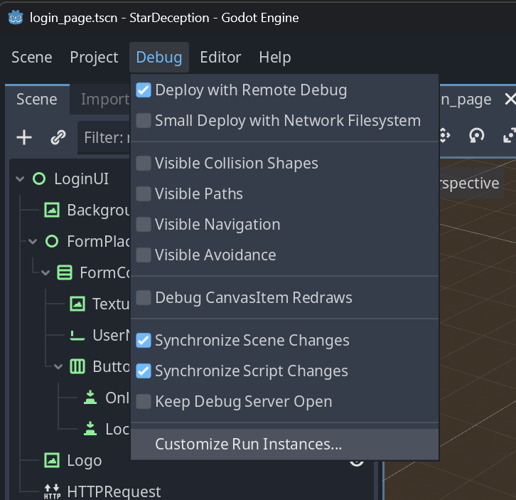
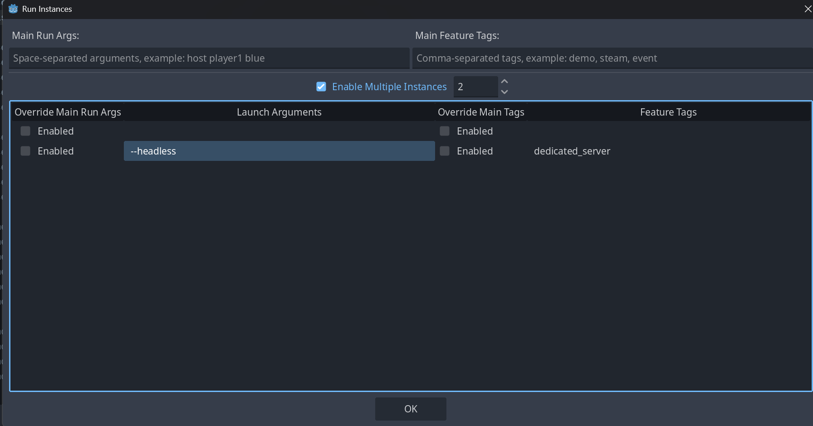
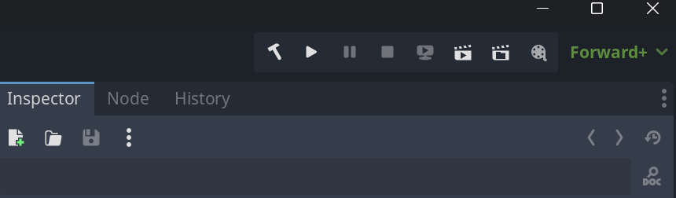
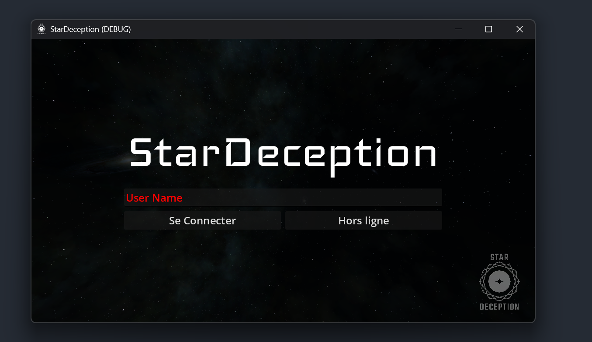

# Local dev setup

This guide helps you set up a local dev environment to play and connect the game to a local server.

We use **Godot with Mono and double precision**.

:::note Engine version
The engine version advances over time (the project has used 4.5.1, then 4.7). Always grab the
**current** custom build from the [godotandaddons releases](https://github.com/DyingStar-game/godotandaddons/releases)
— the double‑precision Mono build is required; stock Godot from godotengine.org will not work.
:::

## Install Godot

- 📦 Download Godot (custom double‑precision Mono build): [godotandaddons releases](https://github.com/DyingStar-game/godotandaddons/releases)
- 🔗 Clone the game repository: [DyingStar-game/DyingStar](https://github.com/DyingStar-game/DyingStar)

## Editor setup (devmode)

**Devmode** runs the Godot client and server **together** inside one editor, through an
abstraction layer. You don't need the Horizon server in this case — but of course many
server‑side parts won't work.

1. Create or use a test scene. It must live in `levels/devmode/`, in a folder and a scene with
   the same name — for example `levels/devmode/SimpleBoxTest/SimpleBoxTest.tscn`.
2. In the menu **Debug → Customize Run Instances…**, define **2 instances**. On the *Launch
   Arguments*, add `--devmode=SimpleBoxTest` for the test scene. The **second** instance is the
   server: give it the `dedicated_server` feature tag and, if needed,
   `--srvini=test/ini/srv1.ini --devmode=SimpleBoxTest`.

Run and enjoy!

### Start Horizon Server (dev only)

If you don't need to modify the Horizon server, you can skip to the next section.

To start a dev Horizon server, go to the [horizonserver repository](https://github.com/DyingStar-game/horizonserver)
and follow the *Local setup* section of the README.

### Start Infra

You need the infra running locally. Clone the services repository **somewhere else** (not inside
the DyingStar folder):

```bash
git clone git@github.com:DyingStar-game/services.git
```

Install **Docker** or **Podman**, then from the root of that repository run:

```bash
docker compose up -d
# or
podman compose up -d
```

The infra is now running.

To **reset the database**, run `docker compose down` and start it again with the command above.

## Godot configuration

Open Godot, click the **Import** button and select the folder where you cloned the game
repository, then open the imported project.

To launch the game you need a local server. Open **Debug → Customize Run Instances…**:



Check **Enable Multiple Instances** and set the number of instances to **2** (add more if you
need):



Leave the **first** instance as the client. Configure the **second** instance as the server by
filling its **Feature Tags** column with `dedicated_server`. To hide the server window, add
`--headless` to that instance's launch arguments.

Then open the `client.gd` file in the server directory and set `websocket_url` to
`ws://localhost:7040`.

## Launch

Launch the client and the server together with the **triangle** (play) button, top‑right:



To stop them, click the **square** (stop) icon:



Enjoy! 😎

:::note Kubernetes / Skaffold path
This page covers the **in‑editor** devmode (fast iteration on gameplay). There is also a
container‑based local environment (minikube + Skaffold + Helm) that deploys the full
microservice stack — see the [`kubernetes` repository README](https://github.com/DyingStar-game/kubernetes#local-development-skaffold--minikube).
:::
