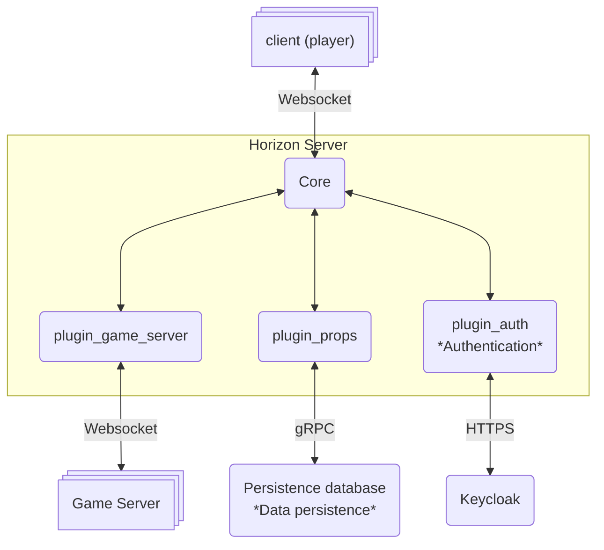
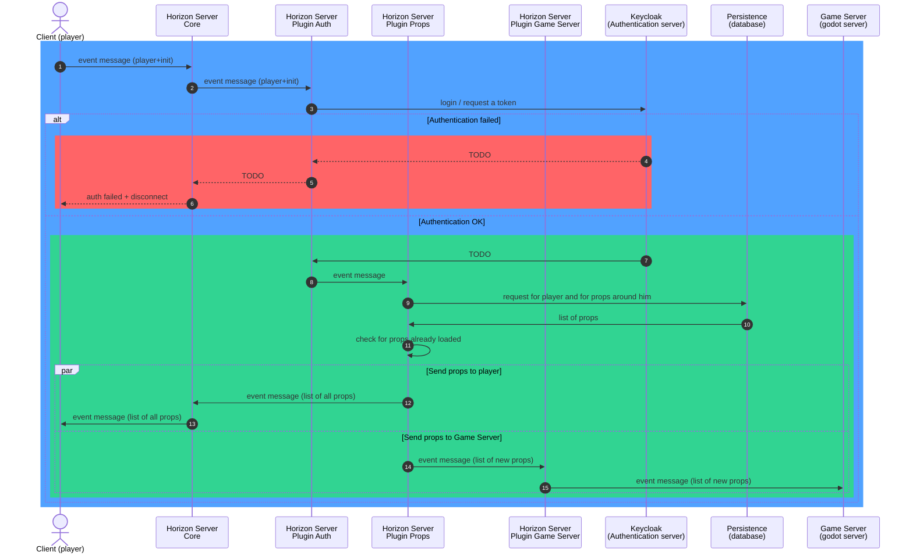
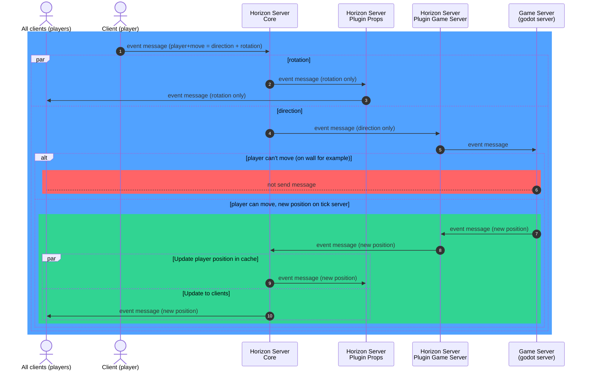
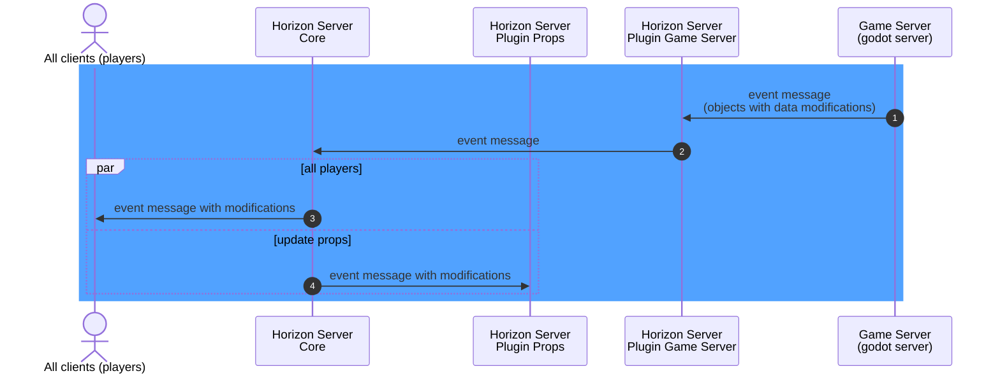
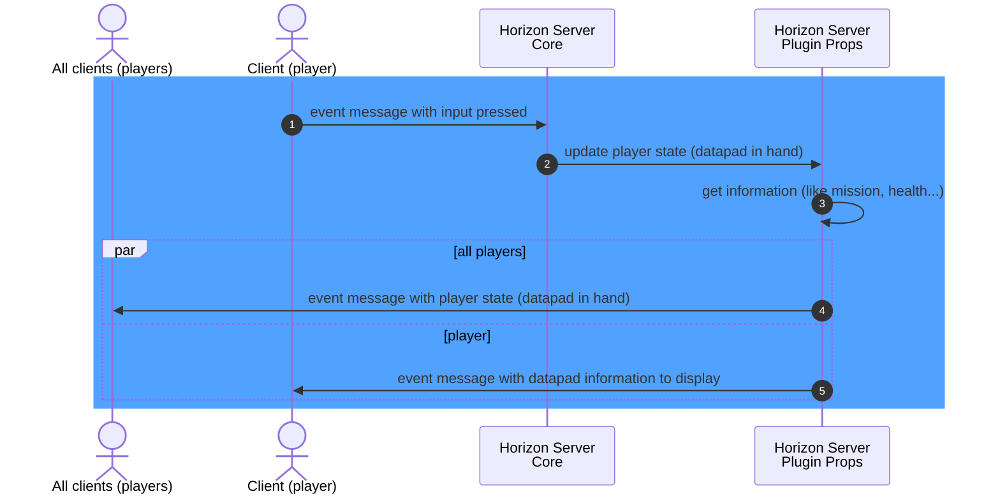
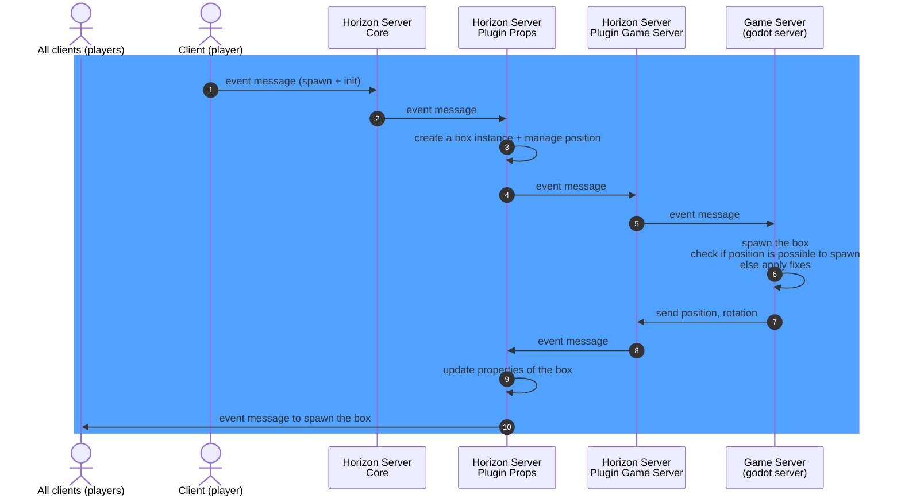
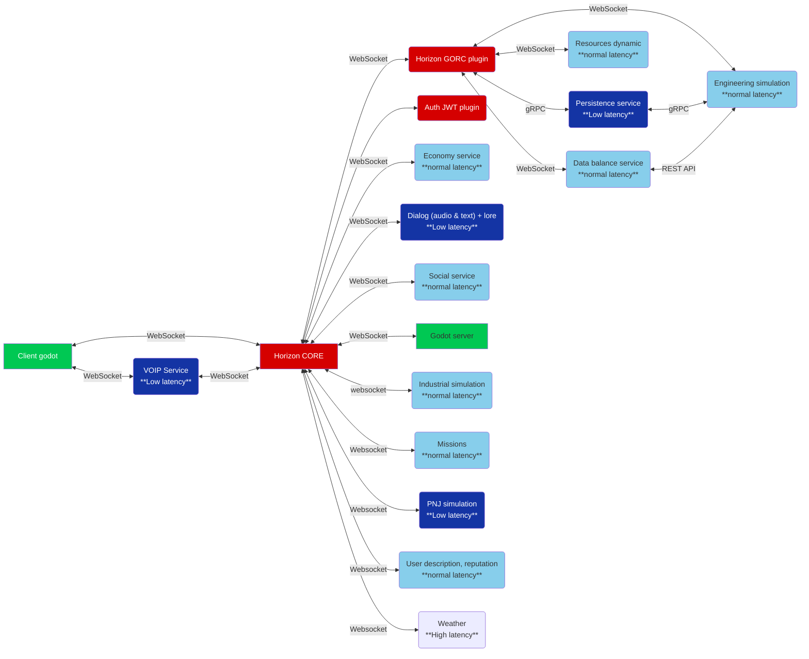
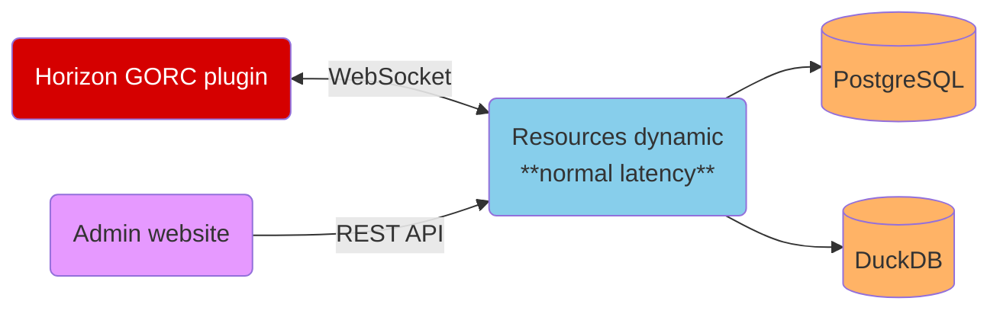

# Network system (draft)

This is the description of the network system used in the game.

:::warning Draft & known divergences from the current code
This page is a **design draft**. Several services below are **planned, not yet built**, and a few
details have moved on since it was written:

- **Persistence storage.** The draft shows **Dgraph** as the persistence database. The current
  persistence service (`service-persistence`, Rust) uses **ScyllaDB**. Treat "Dgraph" here as the
  original intent, not today's implementation.
- **Voice/video.** The "VOIP service" is implemented with **LiveKit** (SFU WebRTC + TURN).
- Ports and message shapes for the unbuilt services are **provisional**.

For the current, plain‑language explanation of how multiplayer actually works today, read
[Network Game → Introduction](../networkGame/intro.md).
:::

## Global schema



## Authentication of a player

Sequence when a player connects & authenticates into the game:



The client → Horizon Core init message looks like:

```json
{
  "namespace": "player",
  "event": "init",
  "data": {
    "login": "jdoe",
    "password": "pass"
  }
}
```

## Player movement

Sequence of player movement (forward, right, left, back, rotation):



## Update from Game Server

Each tick on the Game Server, some objects have a new rotation, a new position, perhaps other
things.



## Command sent by a player

Command sent by a player — here, a command to display the datapad (name not yet defined at the
time of writing):



## Player spawns a box

Player presses a key to spawn a box (`box50cm` in this example):



See the concrete client message in [Put a prop and spawn it](./put_prop_and_spawn.md).

## Schema with the services



## Message format from Horizon to services (WebSocket)

Between Horizon and a service (both directions) we use the same data structure. For each
`namespace` + `event` couple, the data values are defined:

```json
{
  "namespace": "service_mission",
  "event": "new_mission",
  "from": "client|plugin|core",
  "data": {
    "propxxx": "xxx"
  }
}
```

## Services specifications

:::note
Except where noted, these services are **planned**. Each one is described with its purpose, its
databases and its communication channels. Many features are still "to be written".
:::

### Service: resources dynamic

Delivers the position and rotation of planetary‑system items (planets and moons) and transports
(train and orbital elevator).

- **Databases:** PostgreSQL (list of items) + DuckDB (pre‑computed positions/rotations at a given
  time).
- **Communication:** WebSocket server, port **9200**, binary data — planet & moon initialization,
  item position for the next tick, item positions for the next *N* ticks. REST API (HTTP) — update
  planet/moon name, import a planetary system JSON.



### Service: persistence

Persists data. Stores objects (properties, positions…) in a graph database and returns them when
servers restart or when an object must become visible to a player.

- **Database:** graph database (draft says Dgraph; **current implementation uses ScyllaDB**).
- **Communication:** gRPC server with Horizon; REST API (HTTP) — features to be defined.

### Other planned services

Each of the following shares the same pattern — WebSocket server on port **9200** (binary) and a
REST API (HTTP) — with features still to be written:

- **Social service** — social interactions between players (friends, groups). Low latency.
- **PNJ simulation** — non‑player‑character simulation. Low latency.
- **Engineering simulation** — e.g. *N* battery modules + *N* engine components on a ship = a
  total, and *N* is consumed.
- **Data balance service** — tune game balance from a web admin (e.g. change an engine component
  from 10 kW to 8 kW).
- **Economy service** — money transfers between players, mission payouts…
- **Dialog (audio & text)** — in‑game dialogs (NPC↔player, NPC↔NPC…).
- **Industrial simulation** — industrial processes such as refining.
- **Missions** — mission management (connects to many other services).
- **User description / reputation** — user descriptions and reputation (players & NPCs).
- **Weather** — weather on planets. High latency.
