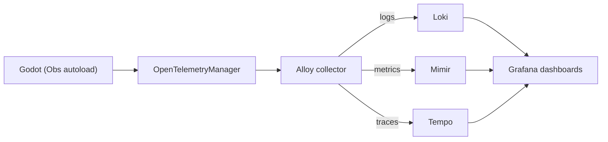

# Observability with Grafana Stack and Godot

This document explains how to integrate Grafana's observability stack with the Godot game using an
`Obs` autoload class that wraps **OpenTelemetry** for logs, metrics and traces.

## 1. Overview

The observability stack is based on Grafana OSS projects:

- **Loki** → log storage and querying
- **Mimir** (Prometheus) → metrics collection & storage
- **Tempo** → distributed tracing
- **Alloy** → OpenTelemetry collector (unifies ingestion of logs, metrics, traces)

On the game side, Godot exposes a single entrypoint (the `Obs` autoload) that talks to an
`OpenTelemetryManager` (C# implementation). Developers log, trace and emit metrics through this
class.

## 2. Architecture



- Godot emits telemetry via the OpenTelemetry API (wrapped in `Obs`).
- Alloy receives OTLP (gRPC/HTTP) data.
- Alloy routes logs → Loki, metrics → Mimir, traces → Tempo.
- Grafana visualizes and queries the data.

## 3. Godot autoload class (`Obs`)

The `Obs` autoload extends `Node` and provides helpers for **logs** (structured + colored in the
editor/console), **metrics** (counters, histograms) and **traces** (span start/stop with tags).

### Example usage

```gdscript
# Example in a Godot script
Obs.logs_debug("audio", "Sound initialized")
Obs.create_metric("player_login_total", "counter")
Obs.add_to_metric("player_login_total", 1, {"region": "EU"})
var traceid = Obs.start_trace("player_login", {"username": "hero42"})
Obs.stop_trace(traceid)
```

### Logging levels

| Level | Method | Console color |
|---|---|---|
| Trace | `logs_trace` | Grey |
| Debug | `logs_debug` | Blue |
| Information | `logs_info` | Green |
| Warning | `logs_warn` | Yellow |
| Error | `logs_error` | Red |
| Critical | `logs_crit` | Purple |

To update or add a color for a section or a log level, update the `obs.gd` class in `tools`.

## 4. Metrics

### Supported metric types & game examples

| Metric type | Description | Game example |
|---|---|---|
| Counter | A value that only increases (monotonic). Count events. | `player_login_total` → how many players logged in since server start. |
| UpDownCounter | A value that can increase or decrease. Track active counts. | `active_players` → +1 on join, −1 on disconnect. |
| Histogram | Records a distribution of values (latency, frame time, size). | `frame_time_ms` → duration of each frame. |
| Gauge (ObservableGauge) | Reports the current value at collection time. | `current_fps` → framerate every second. |
| ObservableCounter | A counter whose value is observed instead of incremented. | `gold_collected_total` → sum of all gold collected. |
| ObservableUpDownCounter | Like UpDownCounter but observed directly. | `current_npcs` → active NPCs read from the entity manager. |

### Examples in Godot (`Obs` autoload)

```gdscript
# 1. Counter: track logins
Obs.create_metric("player_login_total", "counter")
Obs.add_to_metric("player_login_total", 1, {"region": "EU"})

# 2. UpDownCounter: active players
Obs.create_metric("active_players", "updowncounter")
Obs.add_to_metric("active_players", 1, {"action": "join"})
Obs.add_to_metric("active_players", -1, {"action": "leave"})

# 3. Histogram: frame times
Obs.create_metric("frame_time_ms", "histogram")
Obs.add_to_record("frame_time_ms", 16.7, {"scene": "battle_arena"})

# 4. Gauge (ObservableGauge): FPS snapshot
Obs.create_metric("current_fps", "gauge")
Obs.add_to_metric("current_fps", Engine.get_frames_per_second())

# 5. ObservableCounter: total gold
Obs.create_metric("gold_collected_total", "observablecounter")
Obs.add_to_metric("gold_collected_total", player.gold, {"player": player.name})

# 6. ObservableUpDownCounter: NPC count
Obs.create_metric("current_npcs", "observableupdowncounter")
Obs.add_to_metric("current_npcs", world.get_npc_count())
```

Metrics are exported to Mimir/Prometheus via Alloy.

## 5. Traces

```gdscript
var traceid = Obs.start_trace("inventory_load", {"player": "123"})
Obs.add_tags_to_trace(traceid, {"items": 42})
Obs.stop_trace(traceid)
```

Traces are collected in Tempo and visualized in the Grafana Tempo UI or in linked dashboards.

## 6. Logs

Logs are:

- printed in the Godot console with colors (readable in the editor or on the server);
- sent to Alloy → Loki with structured metadata (section, level, tags).

## 7. Developer guidelines

- Use **sections** (`"audio"`, `"persistence"`, …) to group logs.
- Always add **tags** to metrics/traces to improve filtering in Grafana.
- Keep log levels consistent (`logs_info` for normal state, `logs_error` only for failures).
- For performance‑sensitive code, prefer **metrics** over verbose logging.
