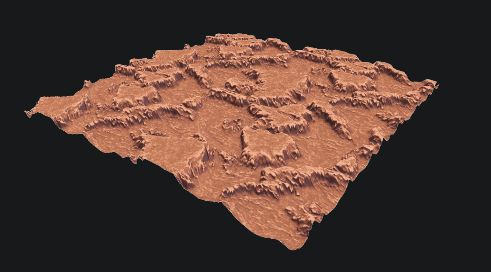
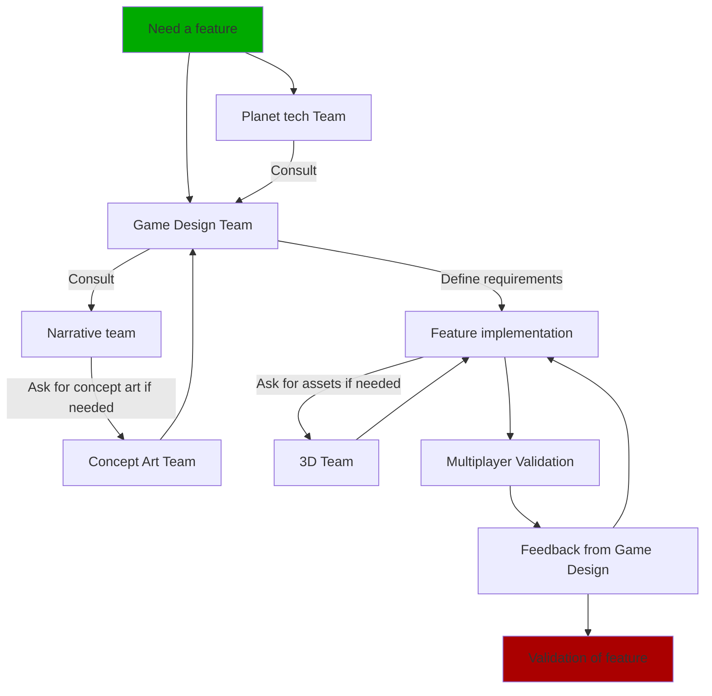

# Planet tech

How planets are generated procedurally in the engine. For the wider planet **pipeline** (QGIS
export, data workflow), see the [Planet Tech](../planetTech/1_intro.md) section.

## Parameters from automatic generation

The procedural generator produces a rich set of parameters per planet:

| Title | Data type | Values | Description |
|---|---|---|---|
| class | string | `Terrestrial` \| `IceGiant` \| `GasGiant` | the class of the planet |
| mass_Me | float | | mass in Earth masses |
| mass | float | in kg | mass in kilograms |
| radius_Re | float | | radius in Earth radii |
| density | float | in g/cm³ | average density |
| surface_g | float | in m/s² | surface gravity |
| final_albedo | float | 0.0 to 1.0 | estimated Bond albedo |
| orbit_center | string | `primary` \| `secondary` \| `barycentre` | orbital center |
| semi_major_AU | float | in AU | semi‑major axis |
| periapsis_AU | float | in AU | distance to periapsis |
| apoapsis_AU | float | in AU | distance to apoapsis |
| period_yr | float | in years | orbital period (Earth years) |
| inclination_deg | float | in ° | orbital inclination |
| ascending_node_deg | float | in ° | longitude of the ascending node |
| arg_peri_deg | float | in ° | periapsis argument |
| mean_anomaly_deg | float | in ° | mean anomaly at the epoch |
| tilt_deg | float | in ° | obliquity (axial tilt) |
| rotation_h | float | in h | sidereal rotation period |
| tidal_locked | bool | | gravitational (tidal) lock |
| T_eq | float | in K | equilibrium temperature (no greenhouse) |
| T_surface | float | in K | average surface temperature (with greenhouse) |
| Temperature | float | in K | alias of `T_surface` |
| TemperatureDay | float | in K | dayside temperature |
| TemperatureNight | float | in K | nightside temperature |
| atmosphere_pression_bar | float | in bar | surface pressure |
| atmosphere_epaisseur_km | float | in km | atmospheric thickness/scale |
| atmosphere_composition | dictionary | in % | gaseous composition (N2, O2, CO2, H2O, CH4, NH3, H2, He, …) |
| magnetic_field | float | relative | magnetic field strength (dynamo heuristic index) |
| liquid_ocean | string \| null | | surface liquid type: `H2O`, `CH4`, `CO2`/`CO2 (supercritical)`, `NH3‑H2O brine`, or null |
| ocean_fraction | float | 0.0 to 1.0 | fraction of surface covered by liquid |
| surface_ices | array&lt;string&gt; | | species present as surface ice (`H2O`, `CO2`, `CH4`, `NH3`, …) |
| ice_fraction | float | 0.0 to 1.0 | fraction of surface covered by ice |
| composition | dictionary | in % | standardized bulk composition (Oxygen, Silicon, Iron, Nickel, H2O, Nitrogen, Carbon, Ammonia, Methane, noble gases…) |
| layers | dictionary | | internal parameters (mass fractions / thicknesses) |
| core_mass_frac | float | 0.0 to 1.0 | [Terrestrial] core mass fraction |
| mantle_mass_frac | float | 0.0 to 1.0 | [Terrestrial] mantle fraction |
| water_mass_frac | float | 0.0 to 1.0 | [Terrestrial] total water fraction (oceans/ice) |
| ice_mass_frac | float | 0.0 to 1.0 | [Terrestrial] ice fraction (beyond the ice line) |
| crust_thickness_km | integer | km | [Terrestrial] crust thickness |
| core_radius_frac | float | 0.0 to 1.0 | [Terrestrial] core radius as a fraction of planetary radius |
| mantle_type | string | | e.g. olivine‑rich, Earth‑like, Si‑rich, or ices+rock under high pressure (giants) |
| core_type | string | | Fe‑Ni, Fe‑Ni‑S, etc. |
| resources | dictionary | % + meta | mineral resources by family (Iron, Nickel, Copper, Zinc, Titanium, Aluminum, Uranium, Thorium, Gold, Silver, Platinum, RareEarths, PGMs) + optional `accessibility` (`easy` \| `medium` \| `hard`) |

## Planet generation

The planet mesh is composed of **6 QuadTrees** — one for each face of a cube. Each vertex
position is normalized to form a sphere.

Each quadtree is subdivided based on the **player's distance** to each of its faces. From each
quadtree, mesh **chunks** are created with a fixed vertex count (currently a grid of **60 × 60**
vertices).

The elevation of each vertex is computed by `get_height()`, which takes a **normalized** point on
the sphere and derives an elevation from two `FastNoiseLite` generators sampled several times with
different parameters.

The **collision mesh** is generated from a slightly lower‑resolution version of the mesh and is
**only generated on the server**; there, the quadtrees are subdivided based on each player's
position.

:::note Server‑only terrain collision
Terrain collision exists **only on the server** — the client mesh is visual. This is why on‑foot
**client prediction** is currently blocked (the client can't simulate terrain contact). See
[Network Game → Player](../networkGame/player.md).
:::

## Planet tech V2

V2 builds on the first generation but changes both **terrain generation** and **texturing**.

Terrain elevation now comes from a list of **heightmap textures** produced with a procedural
texture generator (**Material Maker**).

Example of a generated texture (elevation + color + normal):

The heightmap **displaces** the terrain chunk vertices (on CPU). The generator loops through all
the heightmap textures and samples them using **cube mapping**.

## Workflow (WIP)

To implement a new planet‑tech feature, follow this process:

