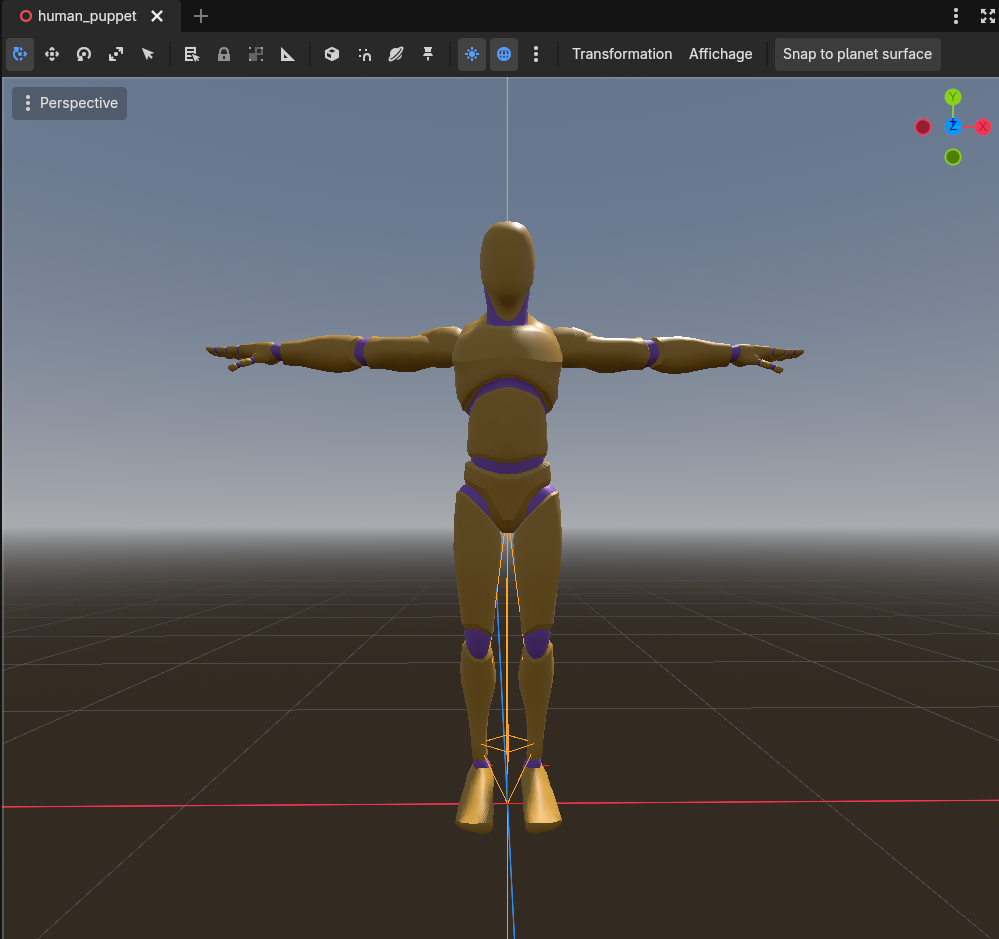
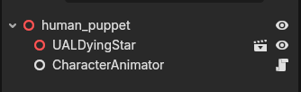

# Character animation

:::tip[New here? Read the overview first]
**[How DyingStar networking works](./intro.md)** explains the whole system in plain language.
This page is the hands-on guide to how a character body is **animated**, on your own screen and
on every other player's.
:::

The key idea: **no animation data ever travels the network.** The animated body (the *puppet*) is
driven entirely from state that is **already** there — the position it's being moved to, and the
handful of events already replicated for other reasons (a jump, an emote, a vault). So a remote
player's avatar animates from the exact same information your own body uses, with **zero** extra
bytes on the wire.

## The pieces

- **The puppet** — `human_puppet.tscn`: a skeleton + the shared animation clips (the Quaternius UAL
  library, merged into `UALDyingStar.glb`), plus one **`CharacterAnimator`** node.
- **`CharacterAnimator`** (`character_animator.gd`) — the controller. It picks and plays a clip every
  frame from the body's derived state. The **same** controller runs on the owner's first-person body
  and on every remote avatar (DRY) — both read state that already exists locally or is replicated.
- **`CharacterAnimationSet`** (`character_animation_set.gd`) — a **Resource**, data only: it maps each
  logical state (`idle`, `walk_fwd`, `jump_loop`, `vault`, `sit_driving`…) to the **clip name** on
  that puppet's `AnimationPlayer`. One set per skeleton, so a different model gets its own set while
  the same `CharacterAnimator` drives it. An empty slot means "not on this model" → the animator falls
  back to a sensible clip.

The scene tree is just the model and the controller under the puppet root:

## Where the animation state comes from

`CharacterAnimator` reads two things off the player, both already present:

1. **`player.locomotion_sample`** — a small dictionary recomputed every frame **from the body's own
   position change** (see `PlayerClient._sample_locomotion`): planar speed, body-frame move direction
   (forward / right), airborne, seated, stance (stand / crouch / prone), yaw rate, carrying. This works
   for the owner **and** for a remote avatar, which only has an interpolated position to read — exactly
   enough. The footsteps read the same sample, so one computation drives both (DRY).

2. **Replicated one-shot events** — carried on the whitelisted **`action`** field, the same channel the
   jump uses (see [Player network management](./player.md)). Each event is a string with a **counter**
   so an identical repeat is still a *new* value (delta-compression would otherwise drop it):
   `jump:<n>`, `land:<n>`, `emote:<key>:<n>`, `seat:<role>:<n>`, `unseat:<n>`, `vault:<key>:<height>:<n>`.
   `PlayerClient` parses these into `player.emote_key`, `player.seated_role`, `player.vault_key`, etc.,
   which the animator turns into the matching clip.

Because it all rides on state/fields that are **already replicated**, adding an animation almost never
means touching Horizon or the `player_def.json` whitelist.

## How a clip is chosen

Each frame `CharacterAnimator._select_clip` picks one clip, **highest priority first**:

1. **Seated** (driver / passenger sit pose)
2. **Vault / climb** (a fresh `vault:` event → the climb clip as a one-shot)
3. **Jump** (its own little state machine: start → loop/fall → land)
4. **Emote** (enter → hold → exit)
5. **Stance transitions** then the **crouch / prone** directional gait
6. **Carry** pose, else the directional **locomotion** (walk / jog / sprint tier, chosen by speed with
   hysteresis), else **idle** (with occasional idle variations for life).

The walk clip's playback speed is warped to the real ground speed so the feet don't slide.

## The animator's settings (Inspector)

All on the `CharacterAnimator` node in `human_puppet.tscn`, grouped by concern. Its **Anim Set** slot
holds the `CharacterAnimationSet`, whose clip families (Idle, Walk, Run, Climb, Carry, Sit, Emote…)
expand right in the Inspector:

| Group | What it tunes |
|---|---|
| **anim_set** | the `CharacterAnimationSet` resource (the clip-name map) — the one required assignment |
| **Rig** | `belt_bone` — the hip bone the shared tool holster (belt mount) follows |
| **Seated pose** | `seated_puppet_offset` — body-frame shift so the sit/drive pose lines up with the seat |
| **Vault pose offsets** | per **type** (SafetyVault / ClimbUp 1m / ClimbUp 2m): a `base` + a `per_m` (× obstacle height) body-frame shift, so each climb clip lines up on its obstacles |
| **Head look** | how far the head bone tilts to follow the aim (pitch always; yaw when seated), and the max deflection |
| **Head camera** | first-person camera follows the head bone's bob (position only), with amount + smoothing |
| **Turn in place** | yaw-rate threshold above which a standing, still player plays the in-place turn clip |

Defaults are sensible; everything is meant to be tuned live in the Inspector.

## Adding or changing an animation

You usually only touch the **`CharacterAnimationSet`** resource: point a slot at a different clip name,
or fill an empty one once the clip exists on the puppet. If a slot's clip name doesn't exist on the
model, the animator falls back rather than showing a bare T-pose.

:::note[glTF strips a trailing `_Loop`]
Godot's glTF importer removes a trailing `_Loop` from a clip's name (and marks it looping). So the
names in the set are the source names **without** `_Loop` (e.g. source `Idle_Loop` → `Idle`).
:::

:::tip[Root motion vs. scripted motion]
The traversal clips are the **in-place** (non-root-motion) versions on purpose: the **server** owns and
scripts the body's translation (it's the authority and it replicates the position), so a root-motion
clip moving the body client-side would fight that. See **[Traversal](./traversal.md)**.
:::
