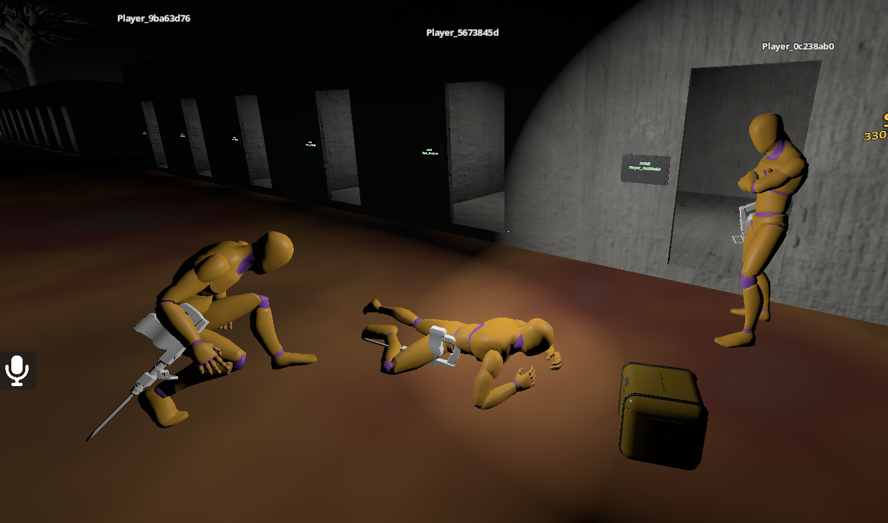
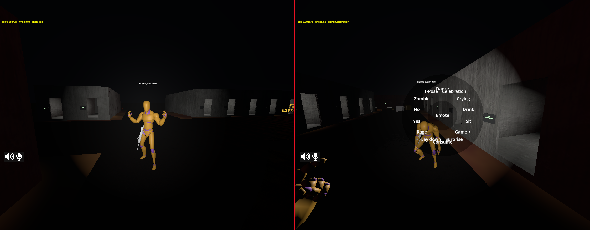
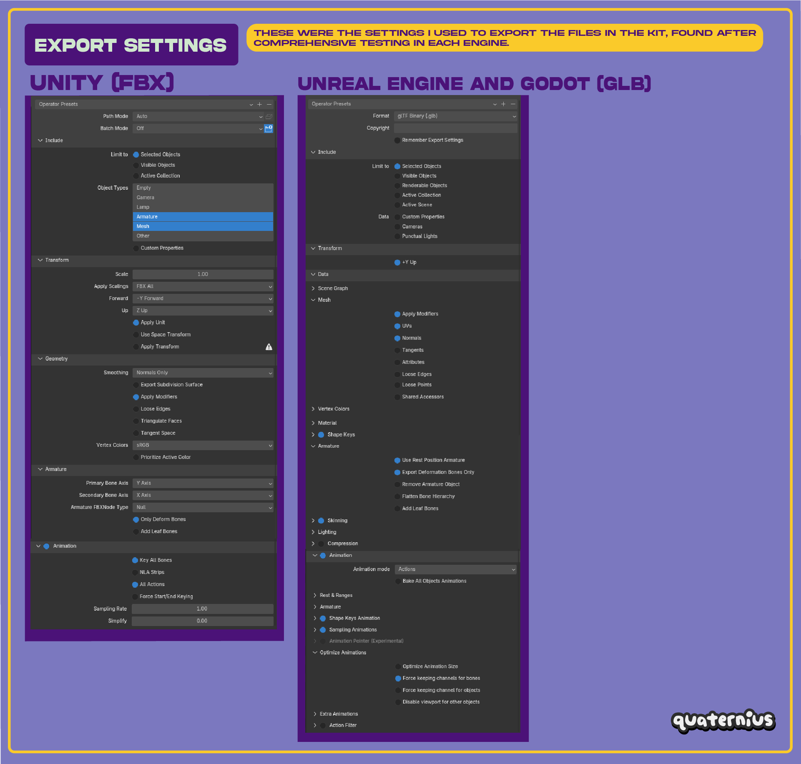

# Character animation

:::tip[New here? Read the overview first]
**[How DyingStar networking works](./intro.md)** explains the multiplayer basics in plain
language, and **[Player network management](./player.md)** covers how the player replicates. This
page is about the **animated body** that sits on top of that.
:::

Every player now has an **animated body**: you see your own arms and legs in first person, and other
players walk, run, jump, crouch, sit, carry and emote in front of you. The character uses the
Quaternius **Universal Animation Library** (UAL) rig.

## The one idea to remember: animation is *derived*, not sent

**No animation data ever travels the network.** We never send "play the walk clip" or a bone pose.
Instead, every client **re-derives** the animation from state that is **already replicated** for
other reasons:

- **walking / running** → from the body's own position change (speed + direction),
- **jump, landing, emote, sit, interact** → from the whitelisted **`action`** event field,
- **carrying** → from the `carrying` property,
- **crouch / prone** → from the `stance` property,
- **where the head looks** → from `head` / `head_yaw`.

The same controller runs on **your** body and on **every remote** avatar, because both sides read
the same already-present state. This keeps the wire cheap (only one small property was added for the
whole feature — the seated look yaw) and it means a new animation usually costs **zero** networking.

:::info[Why this matters]
If you add a gameplay state that should show as an animation, ask first: *is this already
replicated?* If yes, the animation is free — just read it. Only add a new replicated property when
the animation truly cannot be derived from existing state (see [Player](./player.md)).
:::

## The pieces

| Script / resource | Role |
|---|---|
| `scenes/_universe/characters/humanoids/human_puppet.tscn` | The visible body (the UAL model + skeleton). Child of the player body. |
| `character_animator.gd` (`class_name CharacterAnimator`) | The **controller**. One node, **same code for the owner and remotes** (DRY). Picks and cross-fades the clip each frame from the derived state. |
| `character_animation_set.gd` (`class_name CharacterAnimationSet`) | A **Resource** mapping each logical state (idle, walk, jog, crouch, jump, sit…) to a **clip name**. Data only — one set per model, so a different rig is retargeted by swapping the set, not the code. |
| `scenes/props/emote_catalog.gd` (`EmoteCatalog`) | The emote-wheel layout (which clip each emote plays). |

The animator reads a small **locomotion sample** (smoothed speed, direction, airborne, stance,
carrying, yaw-rate…) that `PlayerClient` computes once per frame and caches on the body, so the
footsteps and the animation share one computation.

:::warning[Clip names lose their `_Loop`]
Godot's glTF importer **strips a trailing `_Loop`** from clip names (and marks them looping). So the
source clip `Idle_Loop` becomes `Idle` — the names in the `CharacterAnimationSet` are the source
names **without** `_Loop`.
:::

### Where the clip names live (the `@export` fields)

The clip vocabulary is the resource
**`scenes/_universe/characters/humanoids/ual_animation_set.tres`** (a `CharacterAnimationSet`). Open it
in the Godot **Inspector** and you get **one `@export` field per state**, grouped by family
(**Idle · Walk · Run · Sprint · Crouch · Prone · Turn · Jump · Carry · Sit · Emote**). Each field holds
the **name of the clip** to play for that state:

| Family (group) | Example fields → clip name |
|---|---|
| Walk | `walk_fwd → "Walk"`, `walk_bwd → "Walk_Bwd"`, `walk_left/right`, diagonals |
| Run | `run_fwd → "Jog_Fwd"`, `run_bwd`, `run_left/right`, diagonals |
| Crouch / Prone | `crouch_idle → "Crouch_Idle"`, `crouch_fwd…`, `prone_idle → "Crawl_Idle"`… |
| Jump | `jump_start`, `jump_loop`, `jump_land` |
| Sit | `sit_driving → "Driving"`, `sit_passenger → "Sitting_Nodding"` |
| Emote | `emote_dance`, `emote_wave`, … (referenced by `EmoteCatalog`) |

An **empty field** means "this model doesn't have that clip" → the animator falls back to a sensible
one (nearest direction → forward → idle). The set is assigned to the `CharacterAnimator` node's
**`Anim Set`** slot in `human_puppet.tscn`. So pointing a state at a different clip is just editing a
**text field in the Inspector** — no code, and a different model gets its **own** set, same controller.

## What drives what

| You see | Derived from | Notes |
|---|---|---|
| Idle / walk / jog | Body position delta → speed + 8-way direction | Mouse-wheel walk speed (0.5–3) also warps the walk playback so the feet don't slide. Sprint (Shift) is a fast tier. |
| In-place turn | Body **yaw-rate** while standing still | Plays `Turn90_L/R`. |
| Jump start / loop / land | `action = "jump:<n>"` and `"land:<n>"` events | See [the event-field idiom](./player.md#the-action-field-one-shot-events). |
| Crouch / prone gait | `stance` (0/1/2) | Directional crouch / crawl clips, with enter/exit transitions. |
| Carrying | `carrying` (bool) | You can only carry **standing** (see [Player](./player.md#carry-is-standing-only)). |
| Sit / drive / passenger | Seat state (`seat:`/`unseat:` events) | See [Vehicles](./vehicles.md#seated-poses). |
| Emote | `action = "emote:<key>:<n>"` | Chosen from the emote wheel (T). |
| Head aim | `head` (pitch) + `head_yaw` (seated) | See below. |

## First person: your own body, without the seasickness

For the local player the puppet **is** the visible body (arms, legs, tool). Two tricks keep it
comfortable:

- **Your own head is hidden** — the head bone is scaled to almost nothing so the animated head never
  fills the camera. Remote players keep their head, of course.
- **The camera follows the head's bob** (position only, smoothed) so the animated body never clips
  through a fixed camera, while the mouse still owns where you look. The seat ride owns the camera
  while you're seated.

## Head-look

The head bone tilts to follow where the player aims, so others can read your gaze:

- **Standing** — only the **pitch** (up/down) is needed on the head, because the body already turns
  with the yaw. Pitch is the existing `head` property.
- **Seated** — the body is locked in the seat, so the head follows **both** yaw and pitch. The seated
  yaw is the one small property added for this whole feature: **`head_yaw`** (0 while standing).

Both are clamped so the neck never snaps to an impossible angle.

## Emote wheel

Hold **T** to open a radial menu of emotes (dance, wave, sit on the ground, rock-paper-scissors…).
Picking one sends the emote **to the server**, which validates it and replicates it as an
`action = "emote:<key>:<n>"` event, so **every** player sees it play.

 The emote clips live in the
`CharacterAnimationSet`; `EmoteCatalog` only says which set field each wheel entry uses.

## Adding or retargeting a character model

The controller works on **clip names**, not on a specific model, so a new character is mostly art:

1. Rig the model on the **UAL skeleton** (Unreal-style bone names: `pelvis`, `spine_01`,
   `upperarm_l`, `head`…). Same bone **names** = the animations map directly, no retarget.
2. Give it a **`CharacterAnimationSet`** (or reuse the UAL one) naming its clips.
3. Point `human_puppet.tscn` at the model and assign the set on the `CharacterAnimator`.

Because the whole system reads replicated state, the new model animates the same way in first person
**and** for remote avatars, with no code and no extra networking.

When you export the model (or new animations) from Blender to glTF, match the Quaternius kit's export
settings — most importantly **Animation mode = Actions**, **+Y Up**, **Use Rest Position Armature**, and
**Force keeping channels for bones** (so every bone track survives):

:::tip[One rig, many bodies]
The goal is that **creators only rig a model** on the shared skeleton; the code links the animation
library. Keep every humanoid on the same UAL bone names and everything downstream — locomotion,
stances, head-look, the belt holster — keeps working for free.
:::
