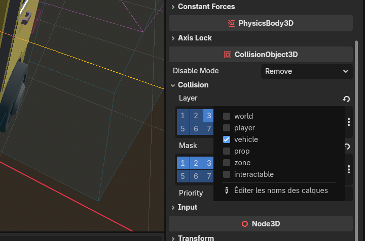
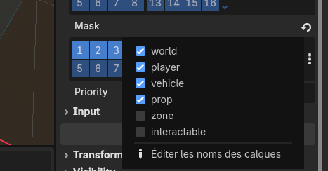

# Collision layers & masks

Every physical object in the game — a player, a vehicle, a box, a door handle, an invisible
trigger zone — lives on the **game server**, where the physics engine (**Jolt**) checks who
touches what. This page explains the small system we use to tell the engine **which objects are
allowed to touch which** — the **collision layers** and **collision masks** — and, just as
important, **why** we bother.

You don't need to be a physics programmer to read this. If you build or edit a Godot scene that
has a body or an area in it (a prop, a vehicle, a zone), you set these two values, and this page
tells you what to put.

## The idea in one picture

Each physics node answers **two** separate questions:

| Question | The field | Plain meaning |
|---|---|---|
| **What am I?** | **Layer** | The category this object belongs to. A player is on the `player` layer, a box on the `prop` layer, a vehicle on the `vehicle` layer. |
| **What do I want to bump into / detect?** | **Mask** | The categories this object *looks for*. A moving box looks for the ground, players, vehicles and other props. |

Two objects interact **only when one's Mask contains the other's Layer**. Think of it as:

> **Layer = the badge I wear. Mask = the list of badges I react to.**

## The one rule that surprises everyone: detection is one-directional

You do **not** need both objects to point at each other. **One side looking is enough.**

This is why a **static** object — the ground, a building, the fixed part of a scene — has its
**Mask set to empty (0)**. It wears its badge (`world`) but looks for nothing. It never wastes a
single check scanning the world. The **moving** objects (players, vehicles, props) carry the
`world` badge in *their* mask, so *they* find the ground. The result is identical — the player
stands on the floor — but only the player does the looking.

> 🔑 **Rule of thumb:** anything that never moves on its own should have **Mask = 0**. The things
> that move will find it.

## The six named layers

We renamed Godot's numbered layers (Project Settings → Layer Names → 3D Physics) so they read in
plain words instead of “Layer 1, Layer 2…”. There are six:

| # | Layer name | What goes on it |
|---|---|---|
| 1 | `world` | Static, never-moving geometry: terrain, buildings, the fixed collision of a scene. |
| 2 | `player` | The players' bodies. |
| 3 | `vehicle` | Vehicles (truck, rover…). |
| 4 | `prop` | Movable objects: boxes, rocks, carriables — anything physics can push. |
| 5 | `zone` | **Passive proximity zones**: seats, cargo areas, gravity fields, spawn areas. Invisible volumes that *don't* collide with anything — they just wait to be entered. |
| 6 | `interactable` | **Look-at targets**: door handles, consoles, carriable pick-up points. The things your view-ray can point at to interact. |

:::info Why split `zone` and `interactable`?
They feel similar (both are invisible volumes you "reach"), but they must be **separate layers**.
When you sit in a vehicle, your interaction ray must be able to hit the **door handle**
(`interactable`) to get out. If seats and handles shared one layer, the ray would hit the **seat
zone** you're sitting in first and you could never grab the handle. Keeping them apart lets each
ray look at exactly the right kind of thing.
:::

## Ready-made mask groups

Rather than re-ticking the same boxes by hand everywhere (and getting it subtly wrong), the code
defines three named masks in `globals.gd`. Set the mask **in the inspector** to match one of
these, and use the constant name in code:

| Constant | Includes | Used by |
|---|---|---|
| `MASK_SOLID` | `world` + `player` + `vehicle` + `prop` | Everything that **moves and collides physically**: players, vehicles, pushable props. "Bump into anything solid." |
| `MASK_PROBE` | `zone` | The single **player probe** that detects the passive zones around the player (which seat / gravity field / spawn area they're in). |
| `MASK_OBSTACLE` | `world` + `vehicle` + `prop` | **Line-of-sight and tool rays** — a ray that should be blocked by solid geometry but ignore other players and invisible zones. |

## The layer / mask matrix

Here is what the main object families actually use. This is the table to copy from when you build
a new scene:

| Object | Layer | Mask | Why |
|---|---|---|---|
| **Player body** | `player` | `MASK_SOLID` (world+player+vehicle+prop) | Walks on the ground, bumps vehicles/props/other players. |
| **Vehicle** | `vehicle` | `MASK_SOLID` | Drives on the ground, collides with players, props and other vehicles. |
| **Movable prop** (box, rock…) | `prop` | `MASK_SOLID` | Physics can push it against anything solid. |
| **Static geometry** (terrain, building, a scene's fixed collision) | `world` | `0` (nothing) | It never moves — the movers above find it. |
| **Passive zone** (seat, cargo area, spawn) | `zone` | `0` (nothing) | It doesn't chase anyone; the player's probe finds it. `monitoring` is **off**. |
| **Interactable** (door handle, console) | `interactable` | `0` (nothing) | It waits to be pointed at; the interaction ray does the looking. |
| **A detector that must catch one specific type** (e.g. a mining trigger that reacts to players) | `0` | just that one layer (e.g. `player`) | It only ever cares about one category — don't make it scan the rest. |

:::note Gravity zones are the exception to "zones have Mask 0"
A gravity field (planet gravity, an artificial grid) is on the `zone` layer, **but its mask is
`MASK_SOLID`**, not 0 — because it genuinely has to *find* the props and vehicles it should pull.
Give a gravity zone Mask 0 by reflex and everything inside it **floats**.
:::

## Rays and their masks

Rays are cast to "look" in a direction. A ray's **mask** decides what it can hit — so a ray only
ever reports the kind of thing it's meant to find:

| Ray | Mask | What it hits |
|---|---|---|
| **Interaction ray** (on the player camera) | `interactable` | Door handles, consoles, pick-up points — the things you press **E** on. |
| **Tool / line-of-sight ray** (mining tool, aiming, "can I see it?") | `MASK_OBSTACLE` (world+vehicle+prop) | Solid geometry and objects, while **ignoring** other players and invisible zones. |
| **Player probe** (proximity area, not a raycast, but same idea) | `MASK_PROBE` (zone) | The passive zones the player is standing in. |

In code, build these with the helper `Globals.make_camera_ray(camera, length, mask, ...)` so the
setup stays consistent.

## Worked example — the truck

Select the truck's `VehicleBody3D` in Godot and open **CollisionObject3D → Collision**. You set two
things.

**Layer — what the truck _is_:** just `vehicle`.

**Mask — what the truck _collides with_:** `world` + `player` + `vehicle` + `prop` (that's
`MASK_SOLID`). Notice `zone` and `interactable` are **off** — the truck body shouldn't physically
crash into invisible seat volumes or door-handle markers; those are handled by their own areas and
rays.

Its own sub-parts follow the matrix above: the **seat areas** are `zone` / Mask 0 with monitoring
off, and the **door-handle areas** are `interactable` / Mask 0.

## Why we do it this way

Two reasons — one about speed, one about correctness.

### 1. Speed: fewer pointless checks

The physics engine checks **pairs** of objects. Two objects form a pair to test only if their
layers/masks overlap. Early on, **everything sat on the same layer with the same mask**, so the
engine tested *every object against every other object* — with thousands of bodies that is
millions of checks per frame, and the server crawled (it dropped to ~2 FPS).

Giving each thing a precise layer and a mask containing **only what it truly needs** removes the
useless pairs: two boxes far apart on different concerns no longer get compared, static geometry
(Mask 0) never initiates a single check, and rays stop reporting things they should ignore.

:::caution Layers help, but they are not the whole performance story
Pruning pairs makes a real difference, but if you deliberately keep object-vs-object collisions on
(players can push each other, props pile up), the engine still has a lot of genuine pairs to solve.
The heavier server-side win comes from **not simulating distant, settled objects at all** — a
separate mechanism. Layers are the tidy foundation; they are not a magic FPS button on their own.
:::

### 2. Correctness: the right thing reacts

Layers also stop objects from reacting to the wrong things: your interaction ray hits the door
handle instead of the seat you're in, a mining trigger reacts to players and not to passing rocks,
a gravity field pulls props but a seat volume ignores them. Getting the layer/mask right is often
the difference between a feature that "sometimes works" and one that always does.

## When you build a scene: set the layer & mask

:::tip Fill these in **in the scene**, not in code
Set the **Layer** and **Mask** directly in the Godot inspector (they save into the `.tscn`), using
the matrix above. Keep code-side changes only for things that genuinely change **at runtime** (a
player sitting down, terrain generated on the fly). A prop that arrives on-screen with the wrong
layer/mask will fall through the floor, get ignored by tools, or silently tank the server's frame
rate — and it's invisible until someone notices in play. Two ticks in the inspector prevent all of
it.
:::

## See also

- [Props network management](./props.md) — building a movable object.
- [Adding a vehicle](./vehicles.md) — the truck, end to end.
- [Adding a tool](./tools.md) — tools that cast rays.
