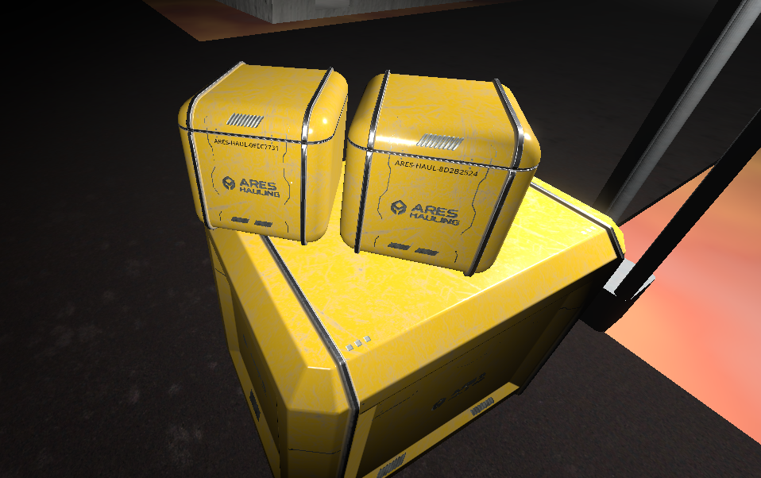
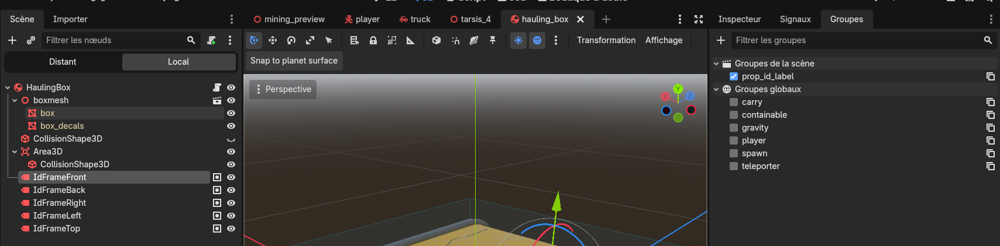
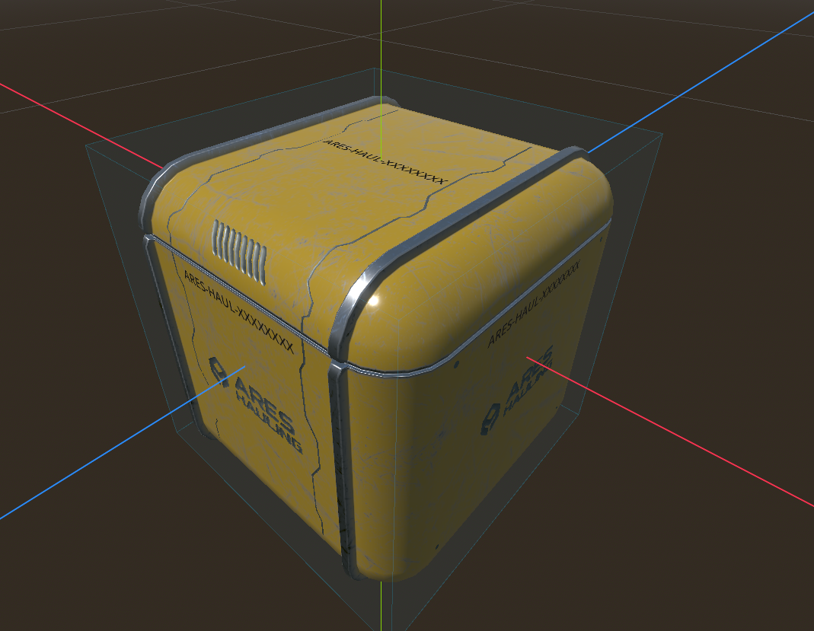

# Crate IDs — the serial printed on every box

Every hauling box, pallet and cargo box should be **identifiable at a glance**: crates live their own
life and are never destroyed, so each one carries a **unique ID** printed on its faces
(e.g. `ARES-HAUL-8C44B2F9`). This page explains where that ID comes from and how to add it to any crate.

## The ID is the prop's UUID (it already exists)

Every networked prop (anything extending `GenericProp`) already has a **UUID** — generated on the
server, **persisted in the ScyllaDB `items` table**, replicated to clients, and stable forever. That
UUID **is** the crate's unique identity: reload the world and the same crate keeps the same id.

So the ID system does not invent a parallel identifier — it just makes that UUID **visible**, with a
readable "company / type" prefix.

## The serial shown on the crate

The on-crate text is `COMPANY-TYPE-UUID`, for example `ARES-HAUL-8c44b2f9-…`:

- **`id_company`** and **`id_type`** are two **`@export` fields** on the prop (defaults `ARES` / `HAUL`),
  set **per scene** in the Inspector — a pallet could be `ARES` / `PAL`.
- The **UUID** is the real unique key. On a small face it is long, so **`id_short_display = true`** shows
  only its first block, uppercased (`ARES-HAUL-8C44B2F9`); the full UUID stays the identity.

The whole string is computed **locally from the UUID** (`GenericProp.serial()`), so there is **no extra
database column, no new network message and no service change** — the crate already carries its UUID.

## Displaying it: the `prop_id_label` group ("id-frames")

To show the id, drop a **`Label3D` node into the group `prop_id_label`** somewhere in the scene — an
"id-frame". `GenericProp` fills **every** node in that group with the serial as soon as the UUID arrives,
so you can put **one frame per face** and they all show the same id.

:::note[The group is the trigger — not the node name]
Detection is `is_in_group("prop_id_label")`, **not** the node's name. Name your frames however you like
(`IdFrameFront`, …); just make sure each one is in the group `prop_id_label`, or it will not be filled.
:::

## Adding IDs to a new crate

1. The crate's **root script extends `GenericProp`** — already true for `scenes/props/cargo/*` crates
   (they have a UUID). Static decor boxes (`scenes/props/StorageBoxes/*`, which `extends Node3D`) have no
   UUID and are out of scope.
2. Add one or more **`Label3D`** on the faces, each in the group **`prop_id_label`**, positioned and sized
   on the surface (non-billboard, oriented outward — one per face).
3. Set **`id_company`** / **`id_type`** on the root (or keep the defaults), optionally `id_short_display`.

No code per scene. Reference example: `scenes/props/cargo/hauling_box.tscn` (5 id-frames: front / back /
left / right / top).

