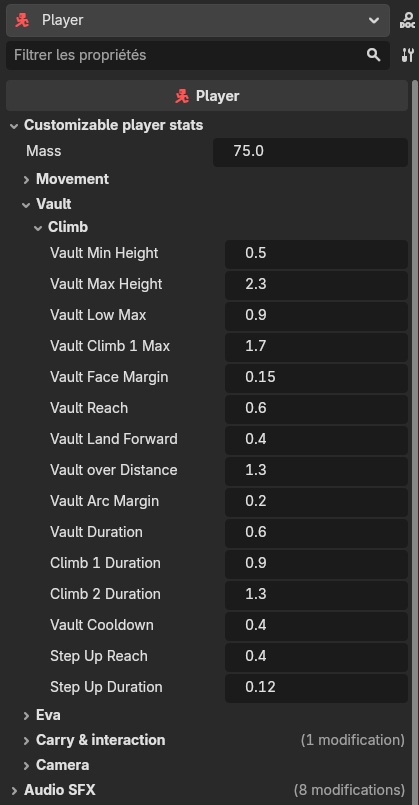

# Traversal — vault, climb & step-up

:::tip[Read the player page first]
**[Player network management](./player.md)** explains the server-authoritative loop this builds on.
Traversal is decided **on the server**, like every other gameplay action.
:::

Walk into an obstacle and the character crosses it **automatically** — no key press. Depending on the
obstacle's height it will **step up** a low kerb, **vault over** a waist-high crate, or **climb onto** a
chest- or head-high ledge. It is fully **server-authoritative** and replicated, and it reuses the
already-whitelisted **`action`** field (like the jump), so **no Horizon change is needed**.

## How the obstacle is detected — the trace (raycast) probe

Detection is a small, shared helper — **`VaultProbe`** (`vault_probe.gd`) — used by two callers (DRY):
the server, which **acts** on it, and the owner's debug HUD, which just **shows** it. It's the classic
"trace-based mantle" recipe used across the industry: a few line traces (raycasts) that answer *"is
there a climbable ledge right in front of me?"*.

From the body's feet, looking along the way it faces, it casts (all against solid obstacles —
`MASK_OBSTACLE` = world / vehicle / prop — ignoring the player's own body):

```
                        | (3) CLEARANCE ray, up: room to STAND on the ledge?
                        v
      +-----------------+--------------+
      |         ledge top   <----------+---- (2) TOP ray, down from above, a bit past the
      |                                |          face: the walkable surface + its height H
      |   ==>|  (1) FACE ray, forward just below the lip: a steep wall?
      |      |            (a walkable slope is rejected here)
   ___|      |___________________________
      feet
```

1. **Top ray** — cast **down** from well above, a little past the face, to find the **top surface** and
   measure its height `H` above the feet. Its normal must point roughly **up** (a walkable top, not the
   continuing face of a slope). This runs first, so the debug HUD can always show `H` even when the rest
   fails.
2. **Face ray** — cast **forward, just below the lip** (`H − vault_face_margin`), which must hit a
   **near-vertical face**. A gentle **slope** reads as walkable here and is rejected — you just walk up
   it. Probing near the lip (not at a fixed knee height) is what lets an **elevated** ledge — a platform
   with a gap under it — be detected too, not only ground-based obstacles.
3. **Clearance ray** — cast **up** from the ledge top: there must be head-room to stand on it.

If all pass, the measured height `H` picks the move.

## Height bands → which move

| Obstacle height `H` | Move | Feel |
|---|---|---|
| below `vault_min_height` (~0.5 m) | **step-up** | a low kerb — you just walk up it |
| `vault_min_height` … `vault_low_max` (~0.9 m) | **SafetyVault** | a vault-*over* — up, over, down the far side |
| `vault_low_max` … `vault_climb1_max` (~1.7 m) | **ClimbUp_1m** | climb *onto* the ledge |
| `vault_climb1_max` … `vault_max_height` (~2.3 m) | **ClimbUp_2m** | climb *onto* a tall ledge |
| above `vault_max_height` | *nothing* | too tall — a wall |

## How the move is performed

Because the **server owns the position** (it scripts and replicates it), the body is moved by a short
**scripted glide**, not by animation root motion (which would fight the replicated position). Each glide
eases the body from its start to a computed landing over a tunable duration, and replicates the pose
each tick like a normal move:

- **Step-up** — a short, *silent* glide (no clip): the body lifts onto the step **and** nudges forward
  past its edge, so it works **at any speed** (a plain lift stalled at a slow walk, waiting on momentum
  to clear the edge). No cooldown, so stairs climb freely; velocity is kept, so walking resumes with its
  momentum. This fills the gap Godot's `CharacterBody3D` leaves — it does **not** step up on its own.
- **SafetyVault** — a vault-*over*: the landing is on the **far-side ground**, and the path is an **arc**
  (up over the obstacle, back down), the trajectory a root-motion clip would bake, done server-side.
- **ClimbUp_1m / 2m** — climb *onto*: the landing is the ledge **top**.

The matching clip (from the animation set's **Climb** group) plays as a one-shot on every body — the
server sends `vault:<key>:<height>:<n>` on the `action` field; the client turns it into the clip. The
height lets the animator align the pose to the obstacle (per-type offsets — see
[Character animation](./character_animation.md)).

## Tuning

Everything is on `@export` knobs on the **Player** node, under **Customizable player stats → Vault /
climb**: the height thresholds, the detection reach (`vault_reach`), the face-check depth
(`vault_face_margin`), the vault-over distance and arc, per-clip glide durations, the step-up reach and
duration, and the cooldown. The per-type animation pose offsets live on the `CharacterAnimator`.



:::tip[Read the obstacle height live]
Turn on the movement debug (Settings) and the on-screen readout adds a second line —
`can vault: 1.05m -> climb_1m` (or `0.35m (slope)`, `— (clear)`, …). Walk up to any obstacle to see its
measured height and the decision in real time; it reads the **same** `VaultProbe` the server acts on.
:::

:::note[Thin obstacles]
The step-up probes the top **just past the face** it hit, so a shallow step works. The vault detection
still samples the top a fixed distance ahead, so a very **thin** elevated ledge is best approached by its
wide face.
:::
