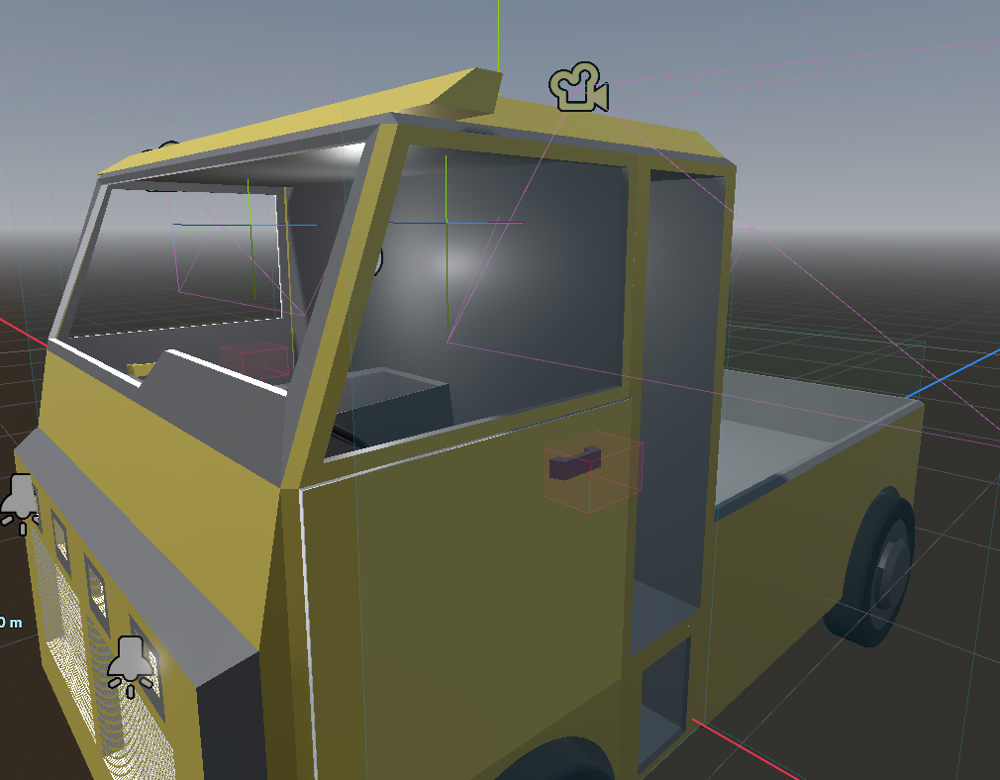
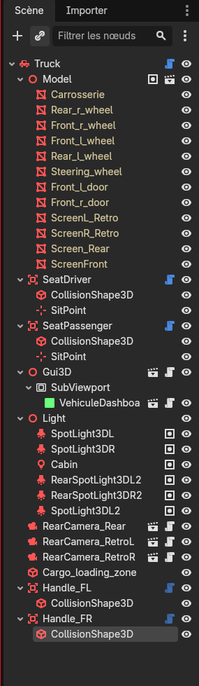
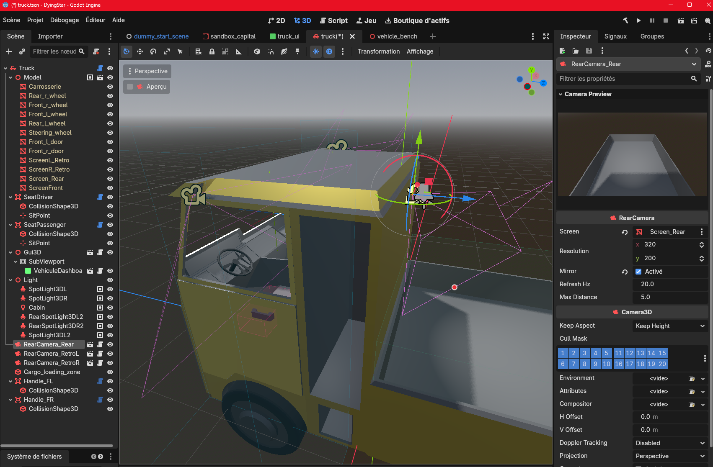

# Adding a vehicle

:::tip[New here? Read the overview first]
**[How DyingStar networking works](./intro.md)** explains the multiplayer basics in plain
language. This is a step-by-step build guide — but good news: most of the time a new vehicle is
just a **scene to assemble**, with little or no new code.
:::

This guide walks through creating a new drivable vehicle (truck, car, rover…). Vehicles are
server-authoritative networked props: the game server simulates the physics and replicates the
state to every client, exactly like the other props (see
[Props network management](./props.md)). A vehicle adds two things on top:
**driving** (a powertrain) and **seats** (driver / passengers).

All the moving parts already exist as reusable pieces — in most cases a new vehicle is just a
**scene** to assemble, not new code.

## The pieces

| Script | Role |
|---|---|
| `scenes/vehicles/vehicle.gd` (`class_name Vehicle`) | The vehicle base: body/wheels, physics, driving, networking, cargo. Put it on the scene root. |
| `scenes/vehicles/vehicle_powertrain.gd` | Engine math (electric / thermal gearbox). Owned by `Vehicle`, configured through its `@export`s — you don't touch it. |
| `scenes/vehicles/vehicle_seat.gd` (`class_name VehicleSeat`) | One seat zone (driver or passenger). You drop one per seat. |
| `scenes/vehicles/vehicle_debug_hud.gd` | Optional on-screen dashboard (speed, RPM, load). |

## 1. Where to put the files

- **Scene**: `scenes/vehicles/<category>/<name>.tscn` (e.g. `scenes/vehicles/trucks/truck.tscn`).
- **Assets** (3D model, materials, textures): follow the project conventions in
  [Files structure](../creativeConcept/files_structure.md) and
  [3D models](../creativeConcept/3d_models.md). Do **not** invent a new layout.

## 2. Build the scene

Create a scene whose **root is a `VehicleBody3D`** and attach `vehicle.gd` to it.

You have two options for the body:

- **Real 3D model (GLB)** — instance the artist's `.glb` as a child of the root and add it to the
  group **`vehicle_model`**. That switches the procedural blockout **off** automatically (no flag),
  and `vehicle.gd` wires the model's parts **by name** at runtime: wheels, steering wheel and doors.
  See **[Using a real 3D model](#using-a-real-3d-model-glb)** below, and the modeler-facing
  [Vehicle 3D models](../creativeConcept/vehicle_models.md) page for the naming / pivot / UV rules.
- **Parametric blockout (placeholder)** — with no real model, `vehicle.gd` generates a box-built
  body, chassis collision, four wheels, cameras and the cargo bay from its exported dimensions
  (`@tool`, so it rebuilds live in the editor). Tune it via the **Body / Cab / Bed / Wheels** export
  groups, and carve the cab opening with **Cab → Cab Cutout Size / Offset**.

:::tip[Use the blockout to prototype a vehicle *before* the 3D model exists]
The blockout is not just a leftover — it's the **"design without a GLB yet"** path. A developer can
create a new vehicle (rover, car, bike…) and test **driving, physics, seats and cargo** right away,
while the 3D artist is still making the model. When the GLB lands, drop it in the `vehicle_model`
group and the blockout visual switches off — no code change. So keep it: removing it would force
every new vehicle to wait for a finished model.
:::

Either way, collision, cameras and the cargo bay are still built; only the **visual** body and the
procedural tires are skipped when a real model is present. The generated nodes are transient (no
owner), so the `.tscn` stays minimal — only the root, its script and your designer-placed nodes (the
seats, the GLB instance, door handles…) are saved.

### Scene layout at a glance

The finished truck — the artist's GLB body wrapped by the Godot **rig**:



Its scene tree — the GLB `Model` plus the rig nodes you add around it:



- **`Model`** (group `vehicle_model`) — the GLB: body, `*_wheel`s, `Steering_wheel`, `Front_*_door`s
  and the screen meshes. Everything **below** it is the rig you add in Godot.
- **`SeatDriver` / `SeatPassenger`** (`VehicleSeat`) — the boarding zones (§3).
- **`Gui3D → SubViewport →` dashboard UI** — the in-cab screen (§Dashboard).
- **`Light`** — the `vehicle_light` lamps (head / brake / cabin).
- **`RearCamera_*`** — reversing camera + mirrors.
- **`Cargo_loading_zone`** — where dropping loads the bed.
- **`Handle_FL` / `Handle_FR`** (`VehicleDoorHandle`) — the door handles (§Doors).

Note the handles are placed at the **root** (siblings of `Model`), each on its door's visible handle.
At runtime the code re-parents each one **under its door mesh** so it swings with the door.

## 3. Add the seats

For each place, add a **`VehicleSeat`** node (an `Area3D` with `vehicle_seat.gd`) as a child of
the root, then give it two children:

```
Truck (VehicleBody3D, vehicle.gd)
├── SeatDriver      (Area3D, vehicle_seat.gd)   role = Driver
│   ├── CollisionShape3D (BoxShape3D)   ← the "press E here" box, beside the door
│   └── SitPoint (Marker3D)             ← where the occupant sits (driver: the camera eye)
└── SeatPassenger   (Area3D, vehicle_seat.gd)   role = Passenger
    ├── CollisionShape3D (BoxShape3D)
    └── SitPoint (Marker3D)
```

- **`role`** (inspector): `Driver` controls the vehicle (drive input + HUD); `Passenger` just
  rides along. Set this per seat.
- **The box** (`CollisionShape3D`): size and place it where a player on foot stands to board
  (e.g. left of the cab for the driver). It is the zone that enables **E**.
- **`SitPoint`** (`Marker3D`): where the occupant is seated. For the driver it is also the
  **camera eye**, so place it at head height inside the cab, facing forward (the vehicle's local
  `-Z`).

You don't wire anything: the `Vehicle` discovers its seats automatically. The seat box is
**passive** — it never monitors. Instead the **player's own detector** is the single monitor that
reports when it walks into a seat zone. This avoids every seat of every vehicle running a
broad-phase overlap test each physics frame, and it works identically on client and server.
Standing in a box shows `[E] Drive Seat` / `[E] Passenger Seat` at the crosshair; a taken driver
seat shows `Driver seat taken` instead. The driver gets free mouse look while driving and exits
with **Y**; the prompt is hidden while seated, and on exit you are dropped beside the seat you used.

:::tip[Seats are server-authoritative]
A seat refuses a second occupant, and if a seated player disconnects the server frees their seat
automatically. The driver/passenger logic lives in the **networked** path, so test seats in the
game (F5), not the standalone bench.
:::

## 4. Configure the powertrain

On the root `Vehicle`, open the **Drive** export group:

- **Propulsion Type**: `ELECTRIC` (single-speed, instant torque) or `THERMAL` (automatic
  gearbox). The inspector shows only the relevant sub-group (**Electric** or **Thermal gearbox**).
- Tune `engine_power`, `max_speed_kmh`, `reverse_max_kmh`, steering, brakes, and the wheel /
  suspension settings.
- **Mass** is the standard `RigidBody3D` mass; **Cargo** (`max_payload`, overload) drives the
  load limiter.

You never edit `vehicle_powertrain.gd` — the `Vehicle` copies these settings into it each frame
(so you can tune them live while driving the bench).

## 5. Register it on the network

A vehicle only replicates if the network layer knows it:

1. **Spawn registry** — add the scene path to `props_scene` in **both** `server/client.gd` and
   `server/server.gd`:

   ```
   'scenes/vehicles/<category>/<name>.tscn':
       preload('res://scenes/vehicles/<category>/<name>.tscn'),
   ```

   (These are plain string paths — if you ever **move** the scene, update them by hand; Godot's
   UID rename does not touch string paths.)

2. **Replication definition** — vehicles use the `vehicle` prop type, defined in
   `horizonserver/ds_genericprops/props/vehicle_def.json` (whitelisting `position`, `rotation`,
   `scenename`, `parent_id`, `pilot_uuid`, `steering`, `speed`, `cargo_mass`, `handbrake`, `mass`,
   `headlights`, `doors`). If you reuse the `vehicle` type, there is nothing to add. A brand-new type
   needs its own `<type>_def.json` — see
   [Replication definition files](./props.md#replication-definition-files).

:::warning[Rebuild Horizon after touching a def]
A property (or a whole type) that is not whitelisted is dropped silently → the vehicle appears on
the server but is **invisible** to clients (`Object definition not found for type: …`). Add it to
the def and **rebuild Horizon**.
:::

## 6. Test

- **Bench (F6)** — `scenes/vehicles/vehicle_bench.tscn` drives the vehicle locally (no network):
  good for tuning the body, suspension and powertrain feel. The bench boards as driver only.
- **In game (F5)** — the full flow: spawn the vehicle, walk into a seat box, **E** to board as
  driver or passenger, drive, **Y** to leave. This is the only place seats and passengers are
  faithful.

## Using a real 3D model (GLB)

Instance the artist's `.glb` under the `VehicleBody3D` root and add it to the group
**`vehicle_model`**. The blockout visual turns off and `vehicle.gd` wires the parts **by name** at
runtime — every part is **optional** (one that isn't there is simply skipped). The naming / pivot /
UV rules the artist follows are on the [Vehicle 3D models](../creativeConcept/vehicle_models.md) page.

:::warning[Disable node-type name suffixes on the model import]
Godot's glTF import treats trailing tokens like `_wheel` / `-wheel` (also `-col`, `-rigid`…) as
**node-type suffixes**: a part named `Steering_wheel` is silently turned into a `VehicleWheel3D` and
**renamed** `Steering` (you'll see "VehicleWheel3D should be a child of a VehicleBody3D" warnings).
Our code builds the physics itself, so this is unwanted. On the `.glb` → **Import** tab, untick
**Nodes → Use Node Type Suffixes** (and **Use Name Suffixes**) and **Reimport**, so parts stay
plain `MeshInstance3D` with their full names.
:::

### Wheels (any number)
The game finds the wheel parts in the model — nodes already typed `VehicleWheel3D`, **or** plain
meshes whose name contains `wheel` — reads each position, and creates a **real physics wheel as a
direct child of the vehicle** there, reparenting the visual mesh onto it (so it rides the suspension,
steers and spins). Front vs rear comes from the name (`front`/`rear`), else the axle nearest the cab
steers. Tune in the **Wheels** + **Real 3D model** groups: `wheel_radius`, `suspension_rest`, and
`real_wheel_spin_axis` (flip it if wheels spin around the wrong axis).

### Steering wheel
A mesh named `steering_wheel` turns with the steering angle — cosmetic, it reuses the already-
replicated `steering` (nothing new on the wire). Tune `steering_wheel_axis` (column axis) and
`steering_wheel_ratio` (lock-to-lock feel). Absent → no-op.

### Doors (server-authoritative) + handles
**State** — open/close is decided by the **server** and replicated to everyone via the `doors`
property (a `{door_id: open}` map), so it **must be whitelisted** in `vehicle_def.json` (step 5
above). On a change every client plays the Blender clip `<door_id>_open` / `<door_id>_close`; a door
with no clip falls back to a code hinge-swing on the mesh named `door_id` (about `door_hinge_axis`).

**Handles are placed in Godot** (like seats), not in the model. Per door:
1. Add a **`VehicleDoorHandle`** node (an `Area3D`) under the vehicle, on the door's **visible handle**.
2. Give it a small **`CollisionShape3D`** there (that's what the player looks at).
3. Set its exports:
   - **`Door Id`** — the door's mesh / clip prefix (e.g. `Front_l_door`).
   - **`Open Angle Deg`** — fallback swing angle (used when the door has no Blender clip).
   - **`Reverse`** — swing the other way (fallback) / play the clip backwards (anim). Two doors that
     should open outward need **opposite** `Reverse`.

The handle sits on the interact layer, so the player **looks at it** and presses **E** to toggle the
door — no proximity zone, no per-vehicle wiring. Prompt: `[E] Open door` / `[E] Close door`.

:::tip[The handle rides the door automatically]
Place each handle where the door's handle is **when the door is shut**. At runtime the code re-parents
it **under its door mesh** (matched by `Door Id`), so the handle **swings with the door** — you can
look at it and press **E** whether the door is open or closed. (Without this, a handle left on the
body would stay at the shut position and the look-at ray would miss it once the door swings open.)
:::

**Door-gated seats — open the door before you can get in *or* out.** Set the **`Door Id`** export on
the **`VehicleSeat`** to the door that guards it (e.g. the driver seat → `Front_l_door`). Then:
- **Open/close** the door (look at the handle + **E**) from that seat's **boarding zone** (on foot)
  **or while seated** — so a driver/passenger can close it from inside.
- **E boards only once that door is open.** A closed door shows *"Open the door first (aim at the
  handle)"* instead of the board prompt.
- **Y leaves only once that door is open** — symmetric with boarding, so you can't step out through a
  shut door.
- A seat with an empty `Door Id` boards / leaves directly (no gating).

Both gates are **server-authoritative**: the client checks them for the prompt, but the server
re-checks on `enter_vehicle` / `exit_vehicle` and refuses through a shut door.

### Collision (from the model)
The collision is **generated by code**, never hand-placed in the `.tscn`. Two sources, in order:
1. **`col_*` meshes in the GLB** (preferred) — the artist ships low-poly **convex** volumes named
   `col_cab`, `col_bed_floor`, `col_bed_left`… (see the modeler page). Each becomes one convex collider
   (`create_convex_shape()`) placed where it sits, and the source mesh is **hidden** (editor *and*
   game); several pieces keep the bed hollow. This matches the real shape — a parametric box can't.
   We use **hand-authored convex pieces** rather than automatic convex *decomposition* on the body mesh
   on purpose: a few cubes are clean, cheap and predictable, whereas decomposition spits out many messy
   shapes. Check them at runtime with **Debug → Visible Collision Shapes**.
2. **Fallback boxes** — if the model has no `col_*` mesh, `vehicle.gd` builds the parametric chassis +
   bed boxes from the **Body / Cab / Bed** exports. With a real model these now **follow the model's
   placement** (so they sit under the body, not at the origin), but they remain a rough approximation —
   good for a blockout, not a finished model. Tune them with **Debug → Visible Collision Shapes**.

So: for a finished vehicle, author the collision in Blender (`col_*`); the boxes are just the
no-model-yet safety net.

:::note[col_ carry no weight, and don't shift the balance]
Collision pieces have **no mass** — in Godot a collision shape never adds weight (and the *visual*
meshes never affect physics at all; only collision shapes do). The vehicle's mass is `mass` (empty)
**+ occupants + cargo** only (`_refresh_mass`), so `col_*` never inflate the load.

They *would* normally affect the **center of mass** (a RigidBody auto-derives its COM from its
collision shapes — a big `col_cab` at the front would pull the COM forward and the truck would
nose-dive). To prevent that, `vehicle.gd` **pins the COM** to the **wheelbase centre** (average wheel
position) plus the **`Center Of Mass Offset`** export — so handling stays balanced no matter how the
collision was modeled. Lower its Y for roll stability, or shift Z for a front/rear weight bias.
:::

:::tip[See the collision — Debug → Visible Collision Shapes]
The generated colliders are invisible by default. To check them:

1. In the editor top menu: **Debug → Visible Collision Shapes** (FR: *Déboguer → Formes de collision
   visibles*) — a checkbox, leave it ticked.
2. **Run** the scene (**F6** bench or **F5**). It's a *runtime* overlay, so it must be enabled
   **before** running and only shows while the game runs.
3. The colliders draw as **cyan wireframes** over the truck. You should see your `col_*` shapes hug the
   body (and **no** oversized fallback box) — proof the model collision is in use. If you instead see
   one big box overhanging the model, your meshes aren't named `col_*` (so the fallback kicked in).
:::

### First-person view = the driver SitPoint
The in-cab camera sits on the **driver seat's `SitPoint`** (the same eye point used in game), so it
follows the real model — no blockout dependency. Place that `SitPoint` at head height in the cab,
facing forward (`-Z`). The bench (F6) now enters in this first-person view like in game; **F4**
toggles to the chase camera.

## Cargo — loading the bed

Two **designer-placed** zones drive cargo (no per-vehicle code):

- **`cargo_bay`** — where cargo *sits*. Tune it via the **Cargo** export group (`cargo_bay_size`,
  `cargo_bay_offset`, `max_payload`, `overload_immobilize`). It is also the passive zone the player's
  detector overlaps to count their weight while standing in the bed.
- **`Cargo_loading_zone`** — where dropping is *allowed to load* (it sticks). Add a `CollisionShape3D`
  with a `BoxShape3D` named `Cargo_loading_zone` (or assign it to the `Vehicle`'s **Cargo loading
  zone** export), sized a bit larger than the bay so reaching over the wall counts. Its physics
  collision is turned off at runtime — it is only a zone marker. If unset, the `cargo_bay` box is
  used as a fallback.

The load counts toward `max_payload`, the overload limiter shown on the dashboard.

- **Loading** — carry a prop (a crate, a mined rock) and **drop it inside the loading zone** —
  whether you stand in the bed *or* reach over from outside; the zone (not your position) decides. The
  `[E]` prompt reads **`[E] Cargo`** when dropping would load it (it sticks) and **`[E] Drop`**
  otherwise. The carrier hands it to the truck: the prop is frozen, parented to the vehicle so it
  rides along, and its mass is folded into the load. The bed never polls — loading happens on drop.
- **Placed in the bay** — a loaded item is tucked **entirely inside** the `cargo_bay` (using its real
  collision bounds, so any size or off-centre pivot fits) and rested on the bed floor, even when
  dropped from far / over the rim.
- **A held prop passes through vehicles** while carried, so a held box can't shove or flip a much
  heavier truck — you load by dropping, not by ramming.
- **Retrieve** — aim at a loaded item and press **E** (`[E] Carry`); it leaves the load and goes
  into your hands, like any [carriable](./props.md#carriables-carry--drop).
- **What counts as load**:
  - the props locked in the bed — each prop's weight is its `RigidBody` **mass**;
  - **on-foot players** standing in the bed (their body mass), **plus whatever they hold** in their
    hands.
- **A mining rock's mass scales with its size**: a whole rock keeps the mass set on its scene
  `RigidBody` (the GameDesigner value); a cut piece weighs that scaled by its volume ratio (a half
  ≈ half, a quarter ≈ a quarter), so smaller pieces load the bed less.
- Over `max_payload` the HUD shows `OVERLOADED`; past `max_payload × overload_immobilize` the
  vehicle won't move. Another **vehicle** is never loaded as cargo (no swallowing a truck with a
  truck).
- **Rollover** — if the vehicle tips past `cargo_unlock_tilt_deg` (default 65°), the bed unlocks and
  spills its whole load (GDD: the lock releases past a certain inclination).

:::note[Riding a moving bed]
Standing in the bed adds the weight, but **walking** in a *moving* bed (riding it on foot) is not
supported yet — it needs client-side prediction. A moving truck currently leaves a walker behind.
:::

### How the load rides the truck (freeze mode)

A loaded crate must follow the truck **rigidly** — and it is a `RigidBody3D`, which the physics engine
places in **global** space, *not* by inheriting its parent's transform. So parenting a crate under the
truck is **not enough**; how it is frozen matters.

:::warning[Use FREEZE_MODE_KINEMATIC for a body riding a moving parent — never STATIC]
A frozen `RigidBody3D` has two modes:

- **`FREEZE_MODE_STATIC`** (the default for a frozen body) behaves like a `StaticBody`: the physics
  server keeps **rewriting its world transform every physics frame**. Under a moving parent it stays
  put in the world while the truck drives off — the *"cargo left behind at speed"* bug.
- **`FREEZE_MODE_KINEMATIC`** is *animatable*: the body **follows its node's transform**
  (`parent_global × local`), so as the truck moves, the crate rides with it.

The crate is set **KINEMATIC** on both sides: the server does it when it locks the crate, and each
client does it for the replica **derived from the parent** — when a prop is reparented under a
`Vehicle` it switches to KINEMATIC, and back to STATIC when it returns to the world (`PropNet.apply_ride_freeze_mode`). Nothing extra is replicated for this: the client reads it from `parent_id`, which already travels.
:::

On top of that, two pins keep it perfectly stuck:

- **Server pin** — each physics frame the vehicle re-asserts every locked crate's **constant local
  pose** in the bed (`_pin_locked_cargo`), so a KINEMATIC body can't drift relative to the moving
  truck. The replicated local position therefore stays constant.
- **Client pin** — each render frame the prop re-asserts that same local pose
  (`PropNet.ride_pin`), so the crate tracks the **render-interpolated** truck without stepping at the
  physics rate (which would jitter). A direct set, not a lerp.

:::note[Cargo debug envelope]
Turn on **Settings → General → Cargo debug** to draw a green envelope around every crate that is
*really* locked in a bed (i.e. reparented under the vehicle). An item merely resting loose in the bed
gets none — a quick way to tell "stuck" from "just sitting there".
:::

## Hand brake

The driver toggles a parking **hand brake** with a **long press of Space under 3 km/h** (released by
throttle). It holds the vehicle still on flat ground and slopes — once stopped it is **frozen** so
it can't creep — and **stays engaged after the driver leaves**. Shown on the HUD and on the
dashboard.

## Head lights

Head lights are a **drop-in** like seats: add any **`Light3D`** (e.g. a `SpotLight3D` at the front
facing the vehicle's local `-Z`) to the group **`vehicle_light`** anywhere under the scene — no
code. The driver toggles them with **L**; the state is server-authoritative and replicated, so every
client sees them. Shown on the HUD (`[L] lights`) and on the dashboard. The truck ships with two
front SpotLights as the example.

`L` is **contextual**: it drives the **head lights** while seated as driver, and the player's
**flashlight** on foot — the two never fire at once.

## Dashboard — optional in-cab screen

Show live data (speed, RPM, load…) on a screen in the cab using the generic 3D-screen pattern —
see **[GUI on a 3D screen](./in-3d-screen.md)** for the setup (SubViewport, ViewportTexture, and
the Local-to-Scene / viewport-path gotchas).

:::tip[Use a screen mesh from the model]
Point the `Gui3D`'s **`node_quad`** at a screen mesh in the GLB (e.g. `ScreenFront`, via *Editable
Children* on the model). `Gui3D` now applies its `SubViewport` as a texture **by code** when the mesh
has no `material_override` — so a model screen "just works", no hand-made ViewportTexture material.
The mesh still needs clean `0..1` UVs and its front face toward the driver (see the
[Vehicle 3D models](../creativeConcept/vehicle_models.md) screen rules). The dashboard is read-only,
so `node_area` (touch) is optional.
:::

The **vehicle-specific** part is only the UI script: put `vehicle_dashboard.gd`
(`VehicleDashboard`) on your UI scene's root. It finds its owning `Vehicle` in the tree and shows
the generic Vehicle data each frame (speed, RPM, load, overload, powertrain, transmission) — so it
is reusable by any vehicle, and the Vehicle knows nothing about it. Name the Labels `speed`,
`RPM`, `Load`, `Overloaded`, `Elec_THerm`, `Transmission`, `hanbreak`, `Light` (or adjust them in
the script).

## Rear-view camera & mirrors

A live camera feed on an in-cab screen — a **drop-in** (`scenes/vehicles/rear_camera.tscn`),
reusable and **client-only** (no render on the headless server). Use it for a reversing camera and
for side / rear-view mirrors (the GDD allows "mirrors **or** relayed cameras"). Godot has no cheap
real reflective surface, so a mirror is just a camera too.

Setting one up in the editor — select the `RearCamera`, frame it with the **Camera Preview**, and
drag the model's screen mesh into its **`screen`** slot:



**Setup** (no code):

1. Instance `rear_camera.tscn` under the vehicle.
2. `RearCamera` **is** a Camera3D — place and frame it in the editor (gizmo / **Preview**), at the
   back looking behind (or at a side mirror, looking back/outward). It never renders to the player's
   view; a twin camera inside its `SubViewport` (sharing the main `world_3d`) copies its pose + fov
   and renders the feed.
3. Set the `RearCamera`'s **`screen`** to the surface that shows the feed. Use either a local
   `MeshInstance3D` with a **`QuadMesh`**, **or a screen mesh from the GLB model** (e.g.
   `Recul_Screen`, `RetroL_Screen`, `RetroD_Screen`) — select it via *Editable Children* on the model
   and drag it into `screen`. The feed material is applied at runtime and is **one-sided** (shows on
   the front face only). A blank screen = the face points the wrong way → fix the **normals in
   Blender** (front face toward the driver — see the
   [Vehicle 3D models](../creativeConcept/vehicle_models.md) screen rules), and ensure clean `0..1`
   UVs. (The `mirror` flag below flips left/right; it does **not** fix a wrong-facing or rotated face.)
4. **`mirror`**: off = a reversing camera (true view); on = a mirror (reverses left/right).
5. **`resolution`**: match its aspect to the screen quad to avoid stretching.
6. **`max_distance`** / **`refresh_hz`**: see Performance below.

:::warning[Performance — each feed is a second full render]
Each `RearCamera` renders the whole world again, so a rear cam + two mirrors = three extra renders.
Two built-in limiters keep this cheap on weak GPUs (the screens still stay live for everyone):

- **`max_distance`** — beyond this distance from the viewer the feed stops rendering (keeps its last
  image; it is unreadable from afar anyway). `0` disables the distance cull.
- **`refresh_hz`** — how many times per second the feed re-renders (default 20, not the full frame
  rate). `0` renders every frame.

Also keep `resolution` small.
:::
