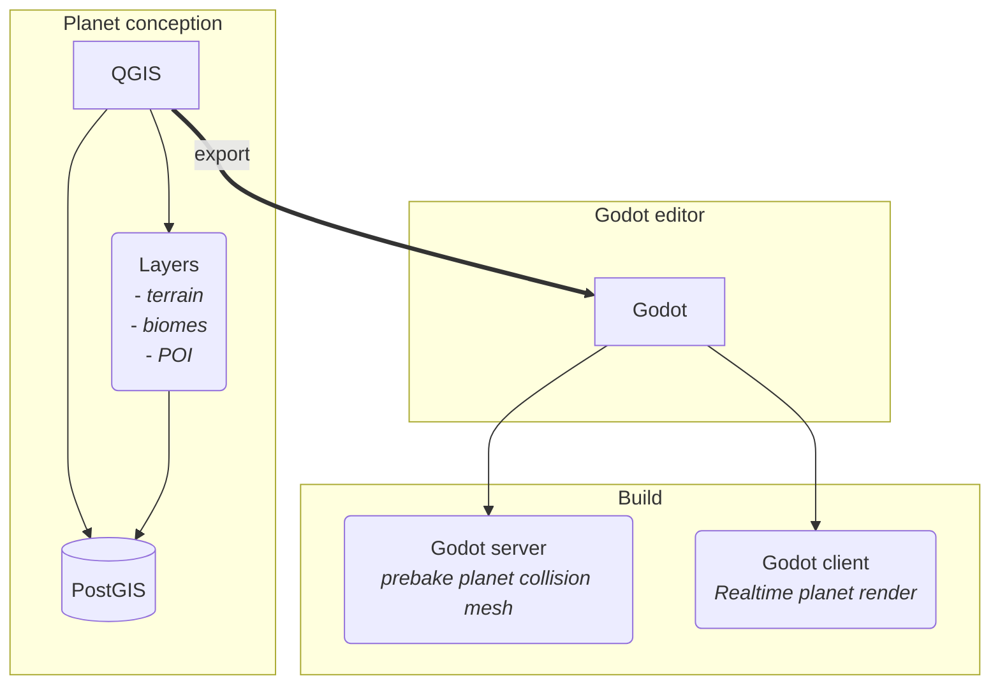

# QGIS - planet creation

## Introduction

To design the biomes of a planet, we use the QGIS open-source tool.

This tool will help us to define forests, roads, POI, craters...

### Schema

This is the schema of how it works

### Prepare QGIS

Before use QGIS, you need to configure it.

#### Database source manager: postgis

:::info[requirements]
You need an account on the postgis database to draw planet.
For this, request an account on the Discord channel *Planet tech* (you need have the role)
:::

Add the database 

1. go in menu *Layer* -> *Data Source Manager*
2. click on *PostgreSQL*
3. click on *new* button
4. fill the following fields:
    - *Name*: DyingStar Postgis
    - *Host*: *postgis.dev.dyingstar-game.space*
    - *Database*: *planets*
    - in *Authentication* part, click on `+` button and fill the fields:
        - *Username*: it's the login you have requested
        - *Password*: it's the password you have requested
5. check the following checkboxes in *Database details* on the right of window:
    - *Also list tables with no geometry*
    - *Allow saving/loading QGIS projets in the database*
    - *Allow saving/loading QGIS layer metadata in the database*

#### Display scale bar

It's easier to see the number of km in the view, so activate a scale bar.

1. go in menu *View* -> *Decorations* -> *Scale Bar...*
2. Check the *Enable Scale Bar*
3. you can choose diaply options like the position of the scale bar
4. click on *OK* button

### Load a planet

Now you can load a planet.

:::note
The available planets are defined by the rights you have on the postgis database.
:::

Go in menu *Project* -> *Open From* -> *PostgreSQL...*

In *schema*, select the planet you want to open.

The convention is: 
  * for a planet: *system*_*planet number*
  * for a moon: *system*_*planet number*_*moon number*

Once you have selected the schema, the project will select the same value. **In case the project has no value, the reason is that you don't have the rights to open it.**

### Define a biome

#### How edit and save layer

When you want to edit a layer (add, update or delete a part of layer), right click on the layer and select *Toggle Editing*. You have an icon in the tool bar on top of QGIS to do the same thing.

Once yous have finished modify the layer, save it. To save it, do the same thing, the *toggle Editing* will be disabled.

#### List all objets of layer

You can have a table of all objects of layer.

To do this, click right on the layer, and click on *Open ATtribute Table*.

You will have a table with all lines and the properties of each object.

#### Layers types

We use 3 types of type of layers.

##### Point type

For POI, craters, fumerols... you can place a point on the map. Each type can have properties.

##### Line type

:::danger
Not use *Stream Digitizing* we it will create very many points and wil take too many space on the game.
:::

Create line, do right click to end the draw. Each type can have properties and will invite you to fill then when end the line.

#### Polygon type

:::danger
Not use *Stream Digitizing* we it will create very many points and wil take too many space on the game.
:::

Create polygone, do right click to end the draw. Each type can have properties and will invite you to fill then when end the line.

## FAQ

### Can we work to multiple users on same planet? same layer?

Yes, the goal to have PostGIS is to be able to work at many users on the planets.

### Do you have tutorial for learning use QGIS?

Yes you can check the link [docs.qgis.org](https://docs.qgis.org/3.44/en/docs/training_manual/index.html)