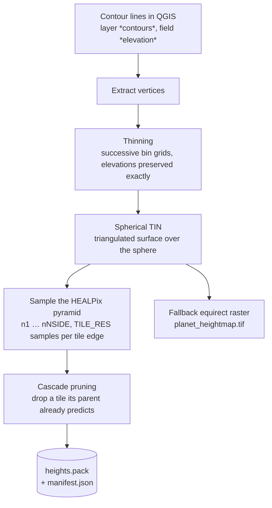

# Elevation — from contours to a pack

How the relief of a planet gets from contour lines drawn in QGIS into a single file the game
can read. This page is for whoever authors or re-exports a planet. It assumes you can already
open a planet project and draw a layer — see [QGIS - planet creation](./2_qgis.md) for that.

Elevation is **not** authored in Godot. You draw contour lines in QGIS, an exporter turns them
into a height pyramid, and the game samples that pyramid. Nothing in the engine invents relief.

## What the export produces

One file, plus its manifest:

```text
assets/qgis/export/<planet>_chunks/
    heights.pack      every height tile of every pyramid level
    manifest.json     radius, tiling, elevation range, data_version
```

`heights.pack` holds a **pyramid**: the same planet at n1, n2, n4 … up to the finest level.
A chunk near the camera reads a fine tile, a chunk on the horizon reads a coarse one, and
neither pays for the other's resolution.



The fallback raster on the right matters more than it looks: it is what the game samples when
a tile is missing, and it is a flatter surface. See
[the failure table](./6_elevation_runtime.md#when-something-looks-wrong).

## Before you export

:::info[requirements]
- A planet project open in QGIS with a **`contours`** layer carrying an `elevation` field, in
  metres. Elevations are read exactly as drawn — no smoothing, no rescaling.
- `numpy` available to the QGIS Python interpreter.
- The planet radius, either in `PLANET_RADIUS` or as the QGIS project variable
  `planet_radius_m`.
:::

Contours are the only elevation input. Draw them as ordinary line features, one elevation per
line. Density matters more than precision: the exporter builds a triangulated surface between
your lines, so a slope with two contours is a flat ramp whatever values you give it.

:::danger
Do not use **Stream Digitizing** for contours. It emits thousands of vertices per line, and
while the thinning pass will discard most of them, the ones it keeps are arbitrary — you lose
control of where the ridge actually sits.
:::

## Choosing the tiling

Two numbers decide everything: `NSIDE` (how many HEALPix tiles cover the sphere) and
`TILE_RES` (samples along a tile edge). Their product is what the player feels.

| Tiling | Ground sampling | Tile covers | Pyramid tiles | Use |
|---|---|---|---|---|
| `n64 × tr25` | 4 065 m | 102 km | 262 k | every body without worked relief |
| `n256 × tr32` | 794 m | 25 km | 1.05 M | a playable planet, first pass |
| `n1024 × tr32` | **198 m** | 6.3 km | 16.8 M | the playable planet, final |

The sampling distance is `R × sqrt(π/3) / (NSIDE × TILE_RES)`. Note the two right-hand columns
are 32 apart: a *tile* is much bigger than a *sample*, which is why so few tiles are needed to
cover a horizon.

The choice lives in a table at the top of `export_elevation.py`, so exporting one planet after
another never means editing the script in between:

```python
PLANET_TILING = {
    "tarsis_3": (1024, 32),     # 198 m — the playable planet
}
DEFAULT_TILING = (64, 25)       # everything else: 4 065 m
```

:::warning
Getting this wrong costs a whole export. tarsis_3 at 198 m takes about seven hours. The
exporter prints a **plan banner** before doing any work — read it and stop if it disagrees
with what you meant.
:::

```text
================================================================
  Planet     : tarsis_3  (R = 6356000 m)
  Tiling     : n1024 × tile_res 32
  Spacing    : 198 m
  Pyramid    : n1…n1024, 16777212 tiles, 1.72e+10 TIN samples
  Encoding   : uint16, 2048 B/tile, dense max 34.4 GB
  Sparse     : epsilon 1.0 m
  Est. time  : ~6.8 h of TIN sampling (+ a few minutes of fixed cost)
================================================================
```

## Running it

From the QGIS Python Console, with the planet project open:

```python
from pathlib import Path
exec(compile(
    Path('/path/to/DyingStar/tools/planettech/qgis/export_elevation.py').read_text(),
    'export_elevation.py', 'exec'))
```

It prints the plan, then progresses level by level, coarse first. Levels are reported as they
complete, with how much each one pruned.

## Why the pack is small: cascade pruning

A dense pyramid at 198 m would be 34.4 GB. The real pack is **9.75 GiB**, because most fine
tiles carry no information their parent does not already have.

For every tile the exporter compares the real heights against what the client would
*reconstruct* by upsampling the parent. If the two agree within `SPARSE_EPSILON_M` (1 m), the
tile is dropped and the client will do exactly that reconstruction at runtime.

The comparison is against the **reconstruction**, not against the real parent. That is what
keeps the error bounded at epsilon no matter how many levels in a row get dropped — a chain of
"close enough" steps would otherwise drift.

Measured on tarsis_3 at 198 m:

| Level | Tiles | Kept | Pruned |
|---|---|---|---|
| n16 | 3 072 | 3 070 | 0.1 % |
| n32 | 12 288 | 12 206 | 0.7 % |
| n64 | 49 152 | 46 029 | 6.4 % |
| n128 | 196 608 | 153 138 | 22.1 % |
| n256 | 786 432 | 459 161 | 41.6 % |
| n512 | 3 145 728 | 1 309 964 | 58.4 % |
| n1024 | 12 582 912 | 3 125 345 | **75.2 %** |
| **total** | **16 777 212** | **5 109 933** | **69.5 %** |

Pruning rises with depth, which is the whole point: the finer you go, the more of the surface
is already predicted by the level above. Coarse levels keep everything — they have no parent
worth speaking of.

:::tip
Set `SPARSE_EPSILON_M = 0` to disable pruning and get a dense pack. Only worth it when
diagnosing a suspected pruning artefact.
:::

## The pack format, at reader level

| Piece | What it is |
|---|---|
| Header | magic `DSHP`, version, tiling, flags, offsets |
| Manifest | the same JSON as `manifest.json`, embedded |
| Presence bitmaps | one bit per tile per level — does this tile exist? |
| Tile blobs | `TILE_RES²` heights, `uint16` normalised over the elevation range |

Heights are `uint16` normalised over `[elev_min, elev_max]`, not float32. At a 10 700 m range
that is a 0.16 m quantum, well under the 1 m pruning epsilon, and it halves the pack.

Decoding is `elev = value / 65535 × max_height + height_offset`.

:::note
`manifest.json` sits **next to** the pack as well as inside it, and the loose file wins. They
can disagree — a retired slot-swapping tool once rewrote the loose manifest and never the
header, so packs from that era still announce the wrong `planet_name` in their header. Harmless
while the loose file exists, wrong the moment it goes missing.
:::

## Checking the result

```bash
python3 tools/planettech/analyze_pack_sparsity.py <pack> --sample 200
```

It reports, per level, how much a given epsilon would prune, and flags a header/manifest name
disagreement. `--sample` is not optional on a fine pack: a dense n1024 has 16.8 M tiles.

The exporter also writes `data_version` into the manifest — a hash of the input points. It is
what the whole publication chain keys on, so two exports of the same contours produce the same
version and two different ones never collide.

## What comes next

The pack is not what the game downloads. It gets split into individual tiles and served over
HTTP — see [Publishing tiles and promoting versions](./5_publication_channels.md).

## See also

- [QGIS - planet creation](./2_qgis.md) — setting up the project and drawing layers
- [Publishing tiles and promoting versions](./5_publication_channels.md) — what happens to the pack
- [How the game reads elevation](./6_elevation_runtime.md) — client, server and editor
