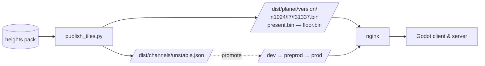
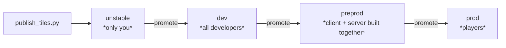

# Publishing tiles & promoting versions

How a `heights.pack` becomes millions of small files served over HTTP, and how a given export
reaches players one rung at a time. This page is for whoever deploys. You do this far more
often than you re-draw a planet.

The game never downloads the pack. It downloads **individual tiles**, on demand, as the player
moves — a few kilobytes at a time. Publishing is what makes that possible.

## The chain



Two things travel separately: the **tiles**, which are immutable and named by their version,
and the **channel manifests**, which are pointers saying which version each body currently uses.

## What gets published

```text
dist/<planet>/<version>/
    manifest.json                the pack manifest
    floor.bin                    levels n1..n8 in a single object
    n<nside>/f<shard>/f<ipix>.bin    one tile
    n<nside>/f<shard>/present.bin    which tiles of this shard exist
dist/<planet>/latest.json        per-body pointer (fallback only)
dist/channels/<channel>.json     which version each body uses
```

| Piece | Why it exists |
|---|---|
| One file per tile | The URL is pure arithmetic on `(nside, ipix, version)`. No manifest to fetch, no indirection — the client already knows which tile it wants. |
| Sharding, 4 096 tiles per directory | n1024 alone has 12.58 M tiles. Twelve face directories would mean a million files each. |
| `present.bin` | A sparse pack does not publish every tile. 512 bytes of bitmap per shard tells the client which ones exist, so it never asks for a 404. |
| `floor.bin` | Levels n1–n8 are 1 020 tiles for 1.88 MiB — seconds of bandwidth but **1 020 round trips**. One object makes it one request. |
| CRC32 in every tile header | Covers exactly what TLS does not: a corrupted local cache, or a wrong object served by a CDN. |

## Publishing

```bash
python3 tools/planettech/publish/publish_tiles.py \
    assets/qgis/export/tarsis_3_chunks/heights.pack \
    --out /var/www/dist --compress
```

| Flag | Effect |
|---|---|
| `--out` | Publication root. Required. |
| `--compress` | Deflate each tile. Roughly halves the served bytes. |
| `--channel` | Which channel this publication feeds. Defaults to `unstable`, and you should leave it there. |
| `--planet` | Override the body name from the manifest. |
| `--verify` | Do not publish: re-read the tree and compare it to the pack. |
| `--verify-http URL` | Do not publish: compare the tree **as served** to the pack. |
| `--samples` | Tiles drawn per level for `--verify-http` (default 40). |

Measured on tarsis_3 at 198 m: **5 109 933 tiles, 4.8 GiB served, about 20 minutes**.

:::warning
`--verify-http` is the one that catches real problems, because it goes through nginx. A
sharding mistake or a mis-served content type looks fine on disk.

```bash
python3 tools/planettech/publish/publish_tiles.py <pack> \
    --out /var/www/dist --verify-http http://127.0.0.1/dist --samples 60
```

It also prints the response headers of a sample tile, so you can confirm the cache policy at
the same time.
:::

Serve versioned paths as immutable, and never cache the pointers:

```text
dist/<planet>/<version>/    Cache-Control: public, max-age=31536000, immutable
dist/channels/*.json        Cache-Control: no-cache
dist/<planet>/latest.json   Cache-Control: no-cache
```

## Channels

A channel is a manifest saying which version each body uses. The tile trees live under
`<planet>/<version>/` and carry no channel name, so **promoting copies no bytes** — the version
served on `dev` is literally the one that reaches `preprod`.



This is also the entire version handshake. Client and server negotiate nothing: they resolve
the same channel name, read the same manifest, and get the same versions **by construction**.
One manifest fixes every body at once, so a promotion mid-session cannot hand out one planet at
one version and its moon at another.

**Publishing only ever feeds the first rung.** The others fill by promotion, so no version
reaches players without passing through the ones in between.

```bash
# where things stand
python3 tools/planettech/publish/stream_channels.py --dist /var/www/dist --list

# move one body up one rung
python3 tools/planettech/publish/stream_channels.py --dist /var/www/dist \
    --to dev --planet tarsis_3

# say what would move, without writing
python3 tools/planettech/publish/stream_channels.py --dist /var/www/dist --to dev --dry-run
```

Three guarantees, each covered by a test:

| Guarantee | Why |
|---|---|
| The tree must exist | You promote a *pointer*. If it names an incomplete tree the upper channel breaks silently, and the first to notice is a player standing where terrain should be. The manifest, the announced `floor.bin` and the finest level are all checked. |
| All or nothing | A half-promoted channel mixes two exports without saying so — worse than not promoting. |
| One body at a time | `--planet` promotes only that body. Re-exporting one planet must not drag along eighteen nobody retested. |

### Which channel a process uses

Same cascade as the rest of the streaming, first match wins:

1. `--tile-channel=<name>` on the command line
2. `DS_TILE_CHANNEL` in the environment
3. `channel` in the `[stream]` section of `client.ini` / `server.ini`
4. the **build stamp**, `res://stream_channel.json`
5. `dev`

The build stamp is the answer for preprod: client and server are built together there, so
writing the channel into the build ties them without either being configured at deploy time.

A name outside the ladder is treated as a typo and falls back to `dev` with a warning, rather
than silently asking for a manifest that does not exist.

:::tip
Both processes print `[StreamChannel] canal=preprod corps=19 empreinte=ec05a72a` at startup.
The same line in both logs means the same versions everywhere. Different lines mean a channel
mismatch — check that before debugging anything else.
:::

## Deleting old versions

A tarsis_3 version at 198 m is 5.1 M files and about 20 GiB. The volume fills after a few
publications, so collecting is not optional.

The criterion comes from the channels, and it is the only one: **a version no channel cites is
dead.** All four rungs count, `unstable` included — a freshly published version nobody has
promoted is work in progress, not rubbish.

```bash
python3 tools/planettech/publish/stream_channels.py --dist /var/www/dist --gc --dry-run
python3 tools/planettech/publish/stream_channels.py --dist /var/www/dist --gc
```

:::danger
Always `--dry-run` first. Deleting five million files does not replay.
:::

`latest.json` is deliberately ignored. It follows the last publication, so if it were
authoritative a version published then abandoned would be immortal.

:::warning
The collector and the ladder answer each other. While `prod` still cites the old version it is
protected — and **it is the rollback**. Promoting all four rungs at once makes it collectable
immediately and removes that rollback. Promote `unstable → dev → preprod`, leave `prod` behind
for as long as confidence takes, and only then collect.
:::

## The filesystem underneath

This is metadata storage, not byte storage: the files are tiny and there are millions of them.
`tools/planettech/publish/zfs_tiles_dataset.sh` creates a suitable ZFS dataset and documents the
reasoning; the essentials:

| Setting | Why |
|---|---|
| `ashift` | The one **irreversible** choice, fixed when the vdev is created. No tile reaches 4 KiB, so a 1 106-byte tile takes one 4 KiB sector or three 512 B ones: **19.5 GiB versus 6.4 GiB per version**. |
| `atime=off` | Without it every HTTP read of a tile writes metadata, turning a read-only workload into a write one. The one whose absence is visible. |
| `compression=lz4` | Gains nothing on already-deflated tiles, costs nothing thanks to early abort, and does gain on the presence bitmaps and JSON around them. |
| `quota` | A publication writes five million files without ever asking permission. |

:::info[How many versions fit]
On a fixed inode table it is the **files** that run out before the bytes: 5.1 M per version.
ZFS allocates dnodes dynamically, so there the limit goes back to being space. Either way, size
for the four channels plus one being published.
:::

## Runbook

1. **Publish** — writes to `unstable` only.
   `publish_tiles.py <pack> --out <dist> --compress`
2. **Verify as served** — `--verify-http http://.../dist --samples 60`. Expect zero
   disagreements; confirmed absences returning 404 are normal on a sparse pack.
3. **Promote to `dev`** — `--to dev --planet <body>`. Developers pick it up.
4. **Promote to `preprod`** — client and server move together.
5. **Leave `prod` behind** until you are confident. It is your rollback.
6. **Promote to `prod`**.
7. **Collect** — `--gc --dry-run`, then `--gc`.

## See also

- [Elevation — from contours to a pack](./4_elevation_export.md) — where the pack comes from
- [How the game reads elevation](./6_elevation_runtime.md) — what the client does with the tiles
