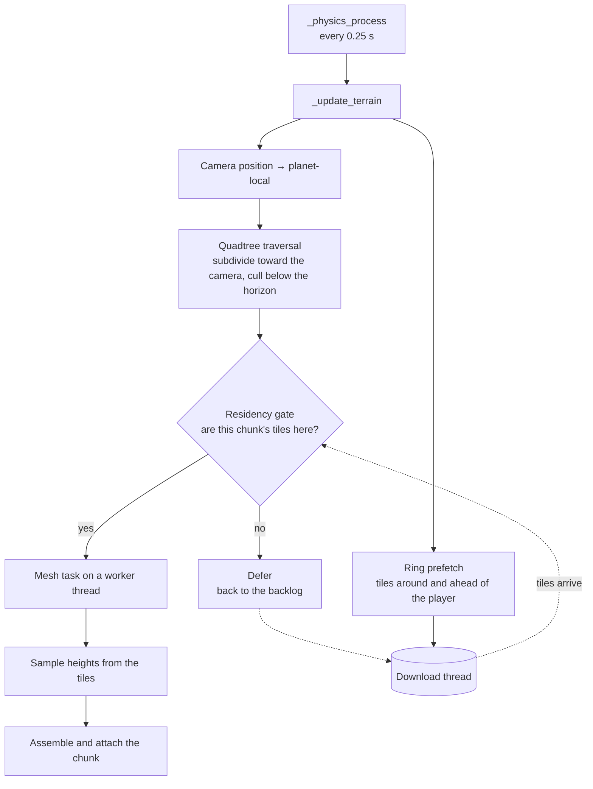
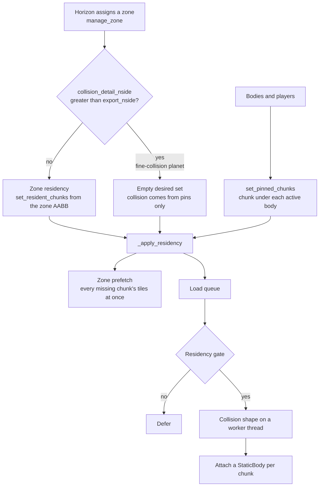

# How the game reads elevation

What happens between a published tile and a triangle under the player's feet — on the client,
on the server, and in the editor. Read this when terrain is missing, sits at the wrong height,
or a player falls through the ground.

The rule that explains most of it: **nothing waits on the network on the main thread.** Every
fetch happens on a download thread, and anything that needs a tile which has not arrived yet is
*deferred* rather than served wrong.

## Common to everyone

Three things happen on any process that reads a streamed planet — client, dedicated server, or
the editor.

| Step | What it does |
|---|---|
| Channel resolution | At planet open, one request reads `channels/<channel>.json` and fixes the version of **every** body at once. Falls back to the per-body `latest.json` if no channel is served, with a warning — that fallback carries no consistency guarantee. |
| Floor fetch | `floor.bin` — levels n1–n8, 1 020 tiles, 1.88 MiB — is queued as soon as the source is built, so it lands while you are still approaching. It is what makes the planet visible from far away without a request per tile. |
| Download thread | One thread, three job kinds: fetch a tile, fetch a shard's presence map, fetch the floor. It keeps a single HTTP connection open across tiles. |

Tiles land in `user://tile_cache/<planet>/<version>/`. Changing version writes to a different
directory and the old one is dropped whole, so a re-export never leaves a mixed cache.

The cache is bounded by an LRU, **counted in files rather than bytes**: no tile reaches 4 KiB,
so each occupies one filesystem block whatever it contains, and a byte budget would quietly use
three times what it advertises. Levels n1–n16 are **pinned** and never evicted — that is the
whole planet at 12.7 km per sample for 16 MiB, so an orbital view costs no requests once it has
been seen.

## Client



**Quadtree.** The traversal starts at the twelve HEALPix base faces and subdivides toward the
camera, so nearby chunks are small and distant ones large. Chunks below the horizon are culled.
It runs every 0.25 s, not every frame.

**The residency gate** is the piece that keeps the terrain honest. Before a mesh task is
submitted, the chunk's tiles — its own plus its eight neighbours, because the sampler blends
across edges — must be in the cache. If they are not, the chunk goes back to the backlog and
the missing tiles are queued. It never blocks: it consults the presence maps already downloaded
and never asks the network from the main thread.

**Ring prefetch.** Waiting for a chunk to ask for its tile means paying a round trip before any
terrain can appear. So every update also asks for the tile under the player and its eight
neighbours **at every pyramid level**, and when the camera is moving, the same ring around a
point ahead of it. That is what makes terrain arrive before you do.

## Server

The server does not build meshes. It builds **collision**, and it does so through one of two
regimes — which one surprises people, so it is worth stating plainly.



**Two regimes.** On an ordinary planet the server keeps collision resident for its authoritative
zone, converted from Horizon's AABB into HEALPix keys. On a **fine-collision** planet — one
whose `collision_detail_nside()` exceeds its `export_nside`, which is the case for tarsis_3 —
the zone set is deliberately left **empty** and every collision shape comes from the per-body
pin system instead. Blanketing the zone with coarse chunks *as well* would put two floors within
capsule height of each other wherever a coarse facet crosses the fine surface, and bodies would
be pushed between them forever.

Both regimes converge on the same code, so the gate and the prefetch apply either way.

**The gate matters more here than on the client.** A missing tile does not make sampling fail —
it falls back to the global equirect map, a flatter surface off by hundreds of metres. Without
the gate the server would build a collision shape on that fallback, **write it to its disk
cache**, and attach it. The player then falls through onto the safety net.

**Zone prefetch.** The gate only examines four chunks per tick, so a fresh zone would request
its tiles a trickle at a time. When the desired set becomes known, every missing chunk's tiles
are requested at once, deduplicated — neighbouring chunks share edge tiles, and without that a
zone of several hundred chunks would ask for each tile nine times.

:::info
A server with a local `heights.pack` streams nothing and none of this applies: the gate returns
true immediately. Streaming only engages when the pack is absent and `[stream] tiles_url` is
configured.
:::

## Editor

The editor has no preview of its own. It runs the **same** quadtree, the same LODs, the same
async pipeline and the same streaming as the client, simply around the editor camera instead of
the player. There are no editor chunk settings: a depth and a ring count set by hand never
showed what a player would see.

Consequences worth knowing: the editor reads its channel and tiles URL from **`client.ini`**
(resolved against the project root, wherever you launched it from), and it shares
`user://tile_cache/` with the game — what you download while editing serves the next play
session and the other way round.

## When something looks wrong

| Symptom | Cause | Where to look |
|---|---|---|
| Terrain sits hundreds of metres below the props | A tile was missing at sample time and the sampler used the equirect fallback | `[PlanetData][DBG] height fallback → equirect map` in the log |
| Player falls through onto a floor far below | Collision built before its tiles landed, then cached | Was the server streaming with an empty cache? The shape is persisted, so purge the collision cache after fixing |
| Planet invisible or blocky from orbit | `floor.bin` not fetched — the server may not advertise `floor_nside_max` | Check the version was published with a current `publish_tiles.py` |
| Chunks never appear at all | Client and server on different channels, or an unreachable tiles URL | Compare the `[StreamChannel]` fingerprint in both logs |
| Terrain appears with a visible delay when moving fast | Normal — the ring prefetch aims ahead, but a fast enough camera outruns it | `[TerrainProf]` reports gate accepts versus defers |
| Everything is fine locally and broken in preprod | Local has a `heights.pack` and never streams | Rename the pack to force the streaming path locally |

The `[TerrainProf]` block also reports the download volume and the cache state:

```text
[TerrainProf] réseau: 53 tuiles (58.3 Kio) + 2 cartes (1.0 Kio) = 59.3 Kio en 56 requêtes, 0 échecs
[TerrainProf] cache tuiles: 402 fichiers, 1.6 / 128 Mio disque, 0 évincées
```

Request count matters more than volume on a real network: the tiles are tiny, the round trips
are not.

## See also

- [Elevation — from contours to a pack](./4_elevation_export.md) — where the data comes from
- [Publishing tiles & promoting versions](./5_publication_channels.md) — how it gets served
