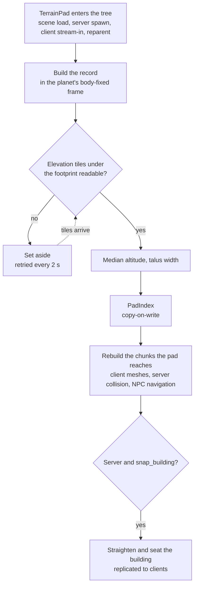

# Terrain pads — levelled ground under buildings

A **terrain pad** flattens the ground under a building. You drop a `TerrainPad` node into the
building's scene, size a box to the building's footprint, and the terrain answers wherever that
building ends up — placed by hand in a planet scene, spawned by the server, or streamed to a
client. The pad makes a level platform under the box, a flat apron around it, then a slope that
joins the natural relief.

This page has two parts. **Using a pad** is for anyone who builds or places buildings. **How
it works** is for whoever maintains the terrain code or debugs a pad that misbehaves.

## Using a pad

### Add one to a building

1. Open the building's scene (for example `cargo_depot.tscn`).
2. Add a **`TerrainPad`** node anywhere under the building's root. It shows with its own snap icon.
3. Add a **`CSGBox3D`** as a **direct child** of the pad, and name it `Ground`. A pad with no
   box named `Ground` uses the first `CSGBox3D` child it finds.
4. Size and move the box with the handles in the 3D view:
   - its **width and length** (local X and Z, scale included) are the area to level;
   - its **position and heading** say where;
   - its **top face** is the ground height the building expects (it's better to have a marge, like 10 cm).
5. Sink the box until its top face disappears into the building's floor. **If you can still see
   the box, the ground is still above the floor.**

That is all. No number to type, no script to call.

:::info[Why the top face and not the node's origin]
A building's floor is a slab. The cargo depot's floor is 1 m thick with its top at `y = 0`, so
levelling the ground to the origin would put the terrain in the very plane the player walks on
and bury the slab whole. The box's top face avoids that arithmetic: you see where the ground
goes.
:::

The box is an **editor marker**. Outside the editor the pad reads it once and deletes it, so it
never appears in the game.

### What the ground looks like

```text
        natural relief                                        natural relief
   ╲                                                                  ╱
     ╲  talus (slope 1:2, ≤ 120 m wide)                             ╱
        ╲______________ ___________________________ ______________╱
               apron     │   footprint (the box)   │   apron
              (8 m)      │   levelled platform     │   (8 m)
```

| Part | What it is | Default |
|---|---|---|
| **Footprint** | The box's area. Level, at the platform altitude. | the box |
| **Apron** | Flat ground past the box, at the same altitude, to walk around the building and park a vehicle in front of it. | 8 m (`apron_m`) |
| **Talus** | A slope from the apron back to the natural ground. It **cuts** into higher ground and **fills** lower ground. | slope 0.5 (≈ 27°), at most 120 m wide |

The talus slope is walkable and drivable: 27° is well under the character's 45° limit, and a
truck climbs onto the apron from any side.

### Where the platform sits

You do not choose the platform's altitude: the pad takes the **median** of the natural relief,
sampled on a 9 × 9 grid over the footprint and its apron. On a regular slope that splits cut and
fill evenly. Unlike an average, a single crack or boulder under one corner does not move it.

The same rule applies to a building placed by hand and to one spawned at runtime, where no
designer is there to adjust it.

### Settings

All on the `TerrainPad` node, in the inspector.

| Property | Default | Use it when… |
|---|---|---|
| `apron_m` | 8 | the building needs more (or less) flat room around it. |
| `height_offset` | 0 | the platform should sit higher (+) or lower (−) than the median. |
| `snap_building` | on | turn **off** for a building meant to stand off its platform (on stilts, a gantry): the ground is still levelled, the building is not moved. |
| `enabled` | on | turn off to keep the node but give the ground back its natural relief. |

The slope, the 120 m cap and the other numbers live in `PadSettings` and are shared by every pad
on purpose (see [Constants](#constants)).

### Putting the building on its platform

The platform is at the median of the relief, which is usually **not** the altitude the building
was placed at. Two tools bring them together:

- **In the editor.** Select the building and use **Planet Tools ▸ Snap to planet surface**
  (**Ctrl+Shift+G**). It stands the building upright on the local vertical, then lowers or raises
  it so the box's top face lands on the platform. The action can be undone.
- **At runtime.** A building spawned by the server keeps the position it was stored with, which
  may predate the pad. With `snap_building` on, **the server** straightens it and lays it on its
  platform once, then replicates the corrected position like any other movement. Every client
  sees the fix, and Horizon persists it.

### Inspector warnings

The pad node shows a warning triangle when something is wrong.

| Warning | Meaning | What to do |
|---|---|---|
| *Ajoutez un CSGBox3D enfant…* | No box under the pad. | Add a `CSGBox3D` named `Ground` as a direct child. |
| *La boîte est plate en X ou en Z…* | The box has zero width or length. | Resize it. |
| *La portée du pad dépasse la demi-largeur d'un chunk fin…* | The pad plus its talus reaches further than one terrain chunk can guarantee. Neighbouring chunks would disagree and leave a seam. | Make the footprint or apron smaller, or move the building to gentler ground. |
| *Le terrain varie de N m sous ce pad : le talus est écrêté…* | The ground under the pad varies too much. The talus hits its 120 m cap and leaves a step. | Move the building to flatter ground or reduce its footprint. |

A building scene edited on its own (not inside a planet) shows **no** terrain-related warnings:
it has no planet to check against until it is placed.

## How it works

### The pad record

The node is only the authoring surface. When a pad registers, everything the geometry needs is
flattened into a small **pad record**:

```text
{ uuid, lon, lat, yaw, hx, hy, apron_m, z_off, z, talus_m }
```

`lon`/`lat` place the box centre, `yaw` its heading, `hx`/`hy` its half size, `z_off` the
`height_offset`. `z` (the platform altitude) and `talus_m` (the talus width) are computed from the
relief when the pad registers.

The mesh workers, the collision builder, the server's surface catch and the editor snap only
ever see records, never nodes. The geometry itself is in `PadBed`, pure functions with no scene
access.

**Quantisation.** A record is snapped to fixed steps before use: 1e-7° for position (about
1 cm on a planet), 1e-4 rad for heading, 1 cm for sizes. The server owns the building's
transform and the client receives it as float32 through Horizon; without this step the two
would sample the relief a few microns apart and build a mesh and a collision shape that
disagree.

**Identity.** A networked building uses its Horizon uuid (`prop:<uuid>`), the same on the client
and the server. A building placed in a planet scene uses its path from the planet
(`scene:<path>`), which is identical in both builds.

### Registration



- **Enter tree, not `_ready`.** Networked props are *reparented* (under the universe first, then
  under the planet), which fires exit/enter tree but not `_ready` again. Registering on enter
  tree is what makes a streamed-in building level its ground.
- **Not reparented yet.** A pad more than 50 km (or 1 % of the radius, whichever is larger) off
  the planet's surface refuses to register:
  that is a building still in universe coordinates, not yet moved under its planet. The reparent
  calls it back.
- **Waiting for tiles.** If an elevation tile under the pad has not been downloaded, the pad is
  not registered with a guessed altitude: client and server would then level to two different
  heights. It waits, and the terrain stays natural until the tiles arrive.
- **Planet spin.** On clients the planet is re-placed 3 times per second, which notifies every
  node on it. A pad compares its pose **relative to the terrain** and does nothing when it has not
  moved. `register_pad` also returns early for an unchanged record. Without these two checks,
  25 pads re-sampled their relief on every spin and the client dropped to 2–5 fps.
- **The index.** `PadIndex` buckets pads by HEALPix pixel. A chunk applies the pads of its own
  pixel and its eight neighbours. Workers read a published copy of the index; a registration
  edits a clone and swaps it in one assignment.
- **Rebuild.** The chunks under a pad that appears, moves or goes are rebuilt **as a swap**: the
  old mesh and its collision stay until the replacement is ready, so the ground never opens
  under the player. A mesh task started before the change is dropped at assembly and queued
  again.

### Which terrain grid is carved

The pad is carved **only into the finest terrain grid**, with the same gate and refinement as a
railway cutting (`GradeBed.carve_enabled`, `GradeRefine`). A chunk that holds both a railway and
a pad carves both or neither. Coarser, distant chunks cannot hold a platform at their vertex
spacing. They only **shave** the terrain down so it never pokes through the platform seen from
far away. Collision is always built on the finest grid, so what the player walks on is the
carved platform.

When a railway cutting and a pad overlap, the cutting is applied first and the pad levels what
is left.

### Roads

A road is **cut** where it crosses a pad's footprint (plus 0.5 m), the same way it is cut under
a bridge deck. The road ribbon is a slab laid on the terrain, so across a pad it would sit ~10 cm
above the platform: a strip of asphalt through the building's floor. The **apron is not cut**:
that is where vehicles park, and a road across it is fine.

### Constants

All in `scenes/planet/pad/pad_settings.gd`:

| Constant | Value | Why |
|---|---|---|
| `APRON_M` | 8 m | Default flat room around the footprint. |
| `TALUS_SLOPE` | 0.5 | Walkable and drivable (≈ 27°). |
| `TALUS_MAX_M` | 120 m | Safety cap: a pad's whole reach must stay within half a finest HEALPix pixel (198 m on tarsis_3), or two chunks would disagree about it. |
| `SAMPLE_N` | 9 | Grid of relief samples for the median. |
| `ROAD_CUT_MARGIN_M` | 0.5 m | How far past the footprint a road stops. |
| `Q_DEG`, `Q_RAD`, `Q_M` | 1e-7°, 1e-4 rad, 1 cm | Quantisation steps. |

`PadSettings.signature()` is part of the terrain cache key: changing any of these re-bakes the
cached meshes and collision instead of serving a stale pad.

## Troubleshooting

Every pad writes one line to the log when it registers, and again only if what it says changes:

```text
[TerrainPad] pad 'prop:bb51…' : emprise 14.7 × 53.3 m + 8 m de tablier, plateau à 5632.4 m,
bâtiment à 5632.5 m (écart +0.11 m, inclinaison 0.31° → +0.14 m au bout) — lon -39.55313
lat 24.85764, n8192 p214960188
```

| Symptom | Look at | Likely cause |
|---|---|---|
| Building floats above its platform or sinks into it | `écart` (gap) in the pad line | The building was placed before the pad existed. Snap it in the editor, or check `snap_building` for a runtime building. |
| One end of a long building is buried | `inclinaison` and the drop `→ … au bout` | The building is tilted. One degree over 97 m is 1.7 m. Snap it. |
| Ground not levelled at all | a line `pas de pad : …`, or `EN ATTENTE des tuiles` | No box, a flat box, a building not yet under its planet, or elevation tiles not downloaded yet. |
| A step at the edge of the talus | the inspector warning *le talus est écrêté* | The ground varies more than the 120 m talus can absorb. |
| Levelled on screen but the player walks on the slope | chunk LOD vs finest grid in `[PlanetTerrain] … refait(s) … d'un pad de bâtiment` | The pad is carved only on the finest grid; check that collision chunks around it are rebuilt. |

To reproduce a pad offline, `test/parity/pad_probe.tscn` builds the chunks around a pad on the
real planet data and checks that the platform is flat, that the mesh and the collision agree,
and that neighbouring chunks meet. Point it at the spot from a log line with `PAD_PROBE_LONLAT`,
and set `PAD_PROBE_PLANET` / `PAD_PROBE_SIZE` as needed. Results go to `user://pad_probe.txt`.

## Files

| File | Role |
|---|---|
| `scenes/planet/pad/terrain_pad.gd` | The node: box reading, record building, registration, server snap, inspector warnings. |
| `scenes/planet/pad/pad_bed.gd` | Pure geometry: record, quantisation, median altitude, platform and talus. |
| `scenes/planet/pad/pad_index.gd` | Pads bucketed by HEALPix pixel for the chunk builders. |
| `scenes/planet/pad/pad_settings.gd` | Every shared constant. |
| `scenes/planet/planet_data.gd` | `register_pad`, `unregister_pad`, `pad_altitude`, tile waiting. |
| `scenes/planet/planet_terrain.gd` | Chunk rebuilds when a pad changes, warm-up of the pads already in the scene. |
| `test/unit/test_terrain_pad.gd` | Unit tests. |
| `test/parity/pad_probe.tscn` | Offline bench on the real planet data. |

Related: [How the game reads elevation](./6_elevation_runtime.md) for chunks, tiles and the
residency gate; Mountains for the other runtime change
to the relief.
