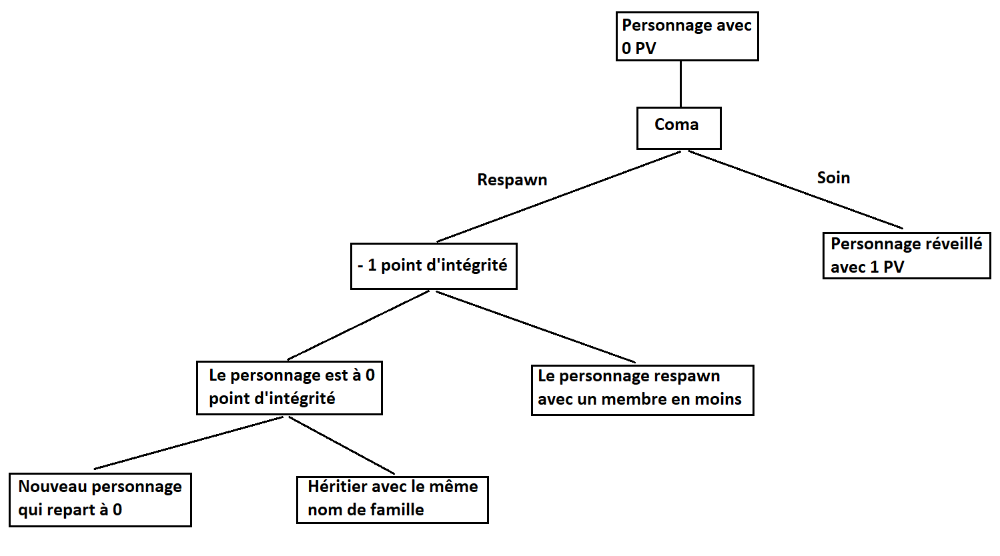

# Gameplays

Le jeu offre un ensemble de boucles complémentaires ou concurrentes.

Les Gameplays prioritaires sont indiqués **en gras**.

## Liste des gameplays

### Industrie

**Extraction**, Agriculture, **Transport**, Réparation, Entretien, **Fabrication**, **Raffinage**, Housing

### Economie

**Achat**, **Vente**, **Location**, Trading

### Illégalité

Infiltration, Vol, Contrebande, Piraterie, Assassinat, Mercenaire, Maintient de l’ordre, Chasse à la prime

### Survie

Médecine, **Gestion du personnage (Faim, soif, santé, endurance, oxygène, intégrité…)**, Gestion de l'environnement (Danger environnementaux, Meteo), Gestion de l’adversité (PNJ, Créature, Joueurs).

### Exploration

Cartographie, Prospection, Scientifique et recherche, Enquête, Découverte de l’histoire

### Divertissement

Course, EVA Ball, Jeux de carte, Casino, Échecs, Jeux 2D, Journalisme

### Social

**Gestion de guilde**

## Mort du personnage

Le joueur possède une barre de PV et X points d'intégrité, si la barre de PV atteint zéro, le personnage passe en coma, il peut soit recevoir du soin par un tiers ou respawn.

Si le joueur respawn, il perd 1 point d'intégrité et il obtient une prothèse, implant, ... 

Si les points d'intégrité atteignent 0, la personne est morte définitivement.

En cas de mort définitive, le joueur doit recréer un nouveau personnage avec le même nom de famille et hérite de Y% des possession en valeur monétaire + Z% de réputation du précédent personnage

option possible : le joueur recrée un personnage avec un autre nom de famille et repart de zéro.

## Economie

Une monnaie unique en banque sécurisé (soumis à l'impôt, taxe, taxe bancaire paiement via la banque, surveillée…)

Et un système de portefeuille physique (token) plus libre avec possibilité de vol/loot de celui-ci. 
Il faut pouvoir hacker ce token à la suite du loot. (“biométrie”)

Certains endroits n'acceptent que les paiements par token.

Par exemple :
Les systèmes nul sec, hors la loi, n’accepte pas de paiement bancaire

## Un univers dynamique

- La météo dynamique (ajoute de la profondeur aux déplacement en fonction de la météo et du moyen de transport utilisé)
- La construction d’habitat ou d'infrastructures modelant l’univers (construction de base ou d’habitat).
- La dégradation des objets et environnements. (Les lieux et objets non entretenus se dégradent, possibilité de réparation, jusqu’au stade de ruine)
- Événement scripté dynamique (exemple: attaque de créature ou de bandit)
- Événement scénarisé globalisé qui sculpte l’univers du jeu, évolution du jeu en fonction des missions remplies (construction progressive d’une porte TOR). Apparition d’une route pour faciliter l'accès, carte d’un lieu inexploré devenue disponible à tous… 

Cet univers dynamique influe sur les gameplay, les déplacements…

## PVP / PVE (joueurs / PNJ)

Il existe 3 types de zones dans le jeu (lié aux combats), ces zones sont contrôlées par le lore.

Les PNJ peuvent tous être tués (excepté en zone High Secure). Un PNJ de mission tué pourra être remplacé ou si un groupe est complètement tué, il disparaîtra. Les PNJ ont les mêmes contraintes que les joueurs.

Les PNJ n’ont pas de points d'intégrité, mais ils ont les PV quand même.

### Zone high secure

C’est la zone la plus sécurisée (exemple de lieux : villes, villages, stations). La rapidité des services de sécurité et des services de santé permettent d’éviter la mort dans ces zones.

### Zone low secure

C’est une zone peu sécurisée (exemple de lieux :  certaines routes, forêts, villes abandonnées…). Les joueurs sont autorisés à tuer des joueurs et PNJ. Il y a des conséquences via l'autorité proche.

### Zone non secure (null sec)

C’est une zone aucunement sécurisée. Les joueurs sont autorisés à tuer des joueurs et PNJ. Pas de conséquence pour les attaquants.
