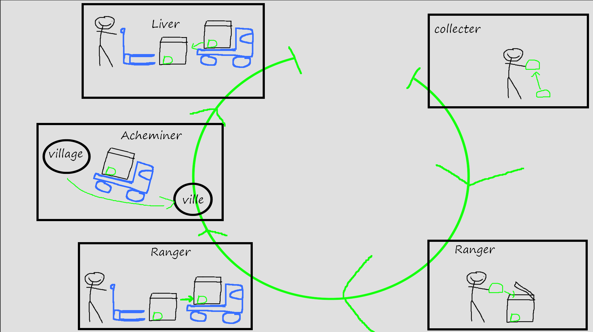
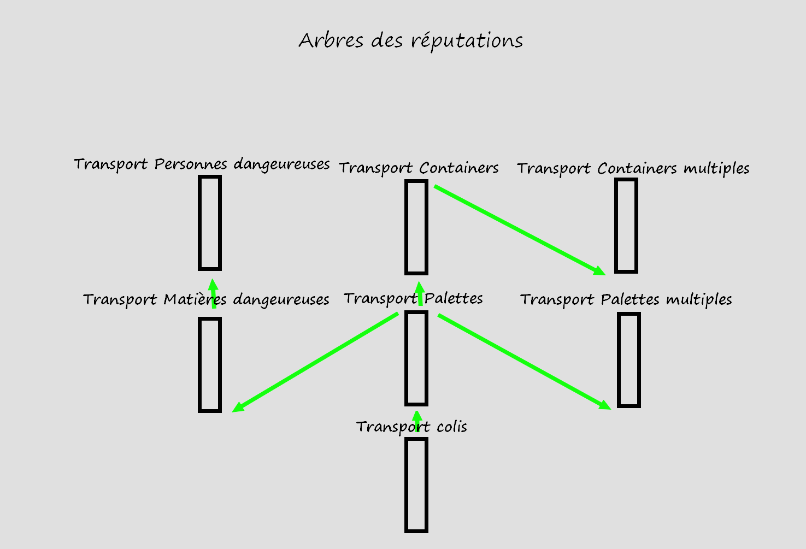

# Transport — vue d'ensemble

Le gameplay **transport** regroupe toutes les activités de déplacement des ressources et des personnes dans l'univers. Le transporteur prend en charge les marchandises, optimise son chargement, achemine les marchandises jusqu'au point de livraison et les décharge.

> Cette page reprend le game design du transport (boucle, progression, économie, feedback). Le détail des conteneurs est dans [Inventaire / Caisses & conteneurs](./1_Inventaire/0_Inventaire.md) ; le matériel véhicule dans [Composants](./Composants/0_Composants.md), [Modules](./Modules/0_Modules.md), [Outils](./Outils/0_Outils.md) et [Véhicules de transport](./Vehicules/0_Vehicules.md) ; les boucles de mission dans [Missions](./Missions/0_Missions.md).

## Activités et actions principales

**Collecter / Récupérer → Ranger → Acheminer → Livrer.**

Les deux « Ranger » désignent la même action à des échelles différentes : le chargement, l'optimisation de la place, et le rangement fin.

## Objectif et récompense

Le joueur peut accomplir une ou plusieurs activités :

- **Sous contrat** : il est récompensé par de la **réputation** auprès du demandeur et une **rémunération financière**.
- **Sans contrat** : il répond à un besoin ou à un objectif personnel (approvisionner son propre stockage, par exemple).

## Commandes

> ⚠️ **Écarts wiki ↔ code.** Le tableau ci-dessous liste ce que **le code fait réellement aujourd'hui** (source de vérité). Le game design d'origine prévoyait d'autres associations (klaxon sur `K`, molette pour lever un transpalette, sangles) — voir « Divergences » plus bas.

Périphériques visés : clavier/souris, manette, HOTAS (en véhicule). Toutes les touches joueur sont des **actions InputMap** remappables dans Réglages > Contrôles.

### À pied

| Action | Touche (code actuel) |
|---|---|
| Se déplacer | Z Q S D |
| Sauter | Espace |
| Sprint / accroupi | Maj / C |
| Interagir — prendre / poser un objet, ouvrir une porte, prendre un siège | **E** |
| Tourner l'objet porté (sur la verticale, par crans) | **molette** |
| Lampe torche | **L** |

### En véhicule (camion)

| Action | Touche (code actuel) |
|---|---|
| Entrer / sortir | **E** |
| Conduire | Z Q S D |
| Démarrer / couper le moteur (à l'arrêt pour démarrer) | **I** |
| Frein à main | appui long **Espace** à basse vitesse |
| Phares | **L** |
| Klaxon / klaxon spécial | **H** / **Alt+H** |
| Remettre sur les roues | **R** |
| Vue cabine / poursuite | **F4** |

### Divergences avec le game design d'origine (wiki)

- **Klaxon** : le GDD prévoyait `K`, le code utilise **`H`** (et `Alt+H` pour un klaxon spécial).
- **Molette** : le GDD la réservait au **lever d'un transpalette** ; dans le code elle fait **tourner l'objet porté**.
- **Transpalette** et **sangles** (« sangler » au clic droit) : **pas encore implémentés**.
- Ajouts du code non prévus au GDD : **ignition** (`I`), **remettre sur roues** (`R`), **vue** (`F4`), **frein à main** par appui long.

## Systèmes et progression

**Contenu à débloquer** — de nouveaux véhicules pour :

- prendre **plus** (quantité) ;
- **plus facilement** (efficacité) ;
- aller **plus loin** (zone de jeu élargie, ressources plus diverses).

**Rythme.** Le joueur doit passer plusieurs heures avec son véhicule pour s'y attacher ; en changer ouvre une nouvelle façon d'aborder le transport. La **location** et le **prêt** permettent d'essayer d'autres véhicules sans obliger à l'achat ; ils se débloquent avec la réputation. Prendre des contrats de bas niveau fait aussi monter la réputation, plus lentement.

**Limite** : au plus **5 contrats simultanés** (ordre de grandeur).

## Économie

- **Dépenses** : maintenance, consommables (carburant), achat/location d'outils et de véhicules, entrepôts, péages.
- **Gains** : fin de contrat, ventes directes, ressources versées au stockage du joueur.

Répartition des ressources : l'**offre et la demande** influeront sur les missions et les récompenses. Dans un premier temps, la disponibilité des contrats n'est **pas limitée** ; pour le hors-contrat, seule l'offre et la demande régissent les possibilités.

## Difficulté et équilibrage

La difficulté se règle sur plusieurs axes combinables :

- **Quantité** : colis → palette → plusieurs palettes → conteneur → plusieurs conteneurs.
- **Diversité du fret** : solide, liquide, dangereux, passager.
- **Distance** (avec estimation de durée) : transport local, entre villes, entre capitales, entre planètes, entre systèmes.
- **Dangerosité** : calme, chemin compliqué (terrain / intempéries), zone dangereuse (attaque possible PNJ/joueurs), zone hostile (attaque PNJ/joueurs).

Plus la réputation est haute, plus le joueur accède à des missions risquées ; les missions militarisées relèvent d'une **branche spéciale** de l'arbre de réputation transport.

## Retours d'information (feedback)

- **Visuel** : traces de pneus/pas, particules au passage (sable/terre) et au décollage/atterrissage, animation « prendre un objet ».
- **Audio** : sons de prise/pose d'objets, **encrage** des palettes/conteneurs sur la grille, ouverture/fermeture des caisses, sons véhicule (frein, moteur, frottement, choc, klaxon, portes), prise et validation de contrat, voix du donneur de contrat.
- **Interface** : validation/acceptation de mission à la borne ou au tableau ; message, avancement et informations de mission sur le pad ; notifications sonores d'alerte.

## Rejouabilité

- **Génération procédurale** des missions, ressources et personnes à transporter, selon les besoins de l'univers.
- **Collection & succès** : la réputation débloque des zones privées/sécurisées, des cosmétiques et des composants (et schémas) de véhicules.
- **Liberté du joueur** : il est libre de prendre un contrat ou non. Un contrat non rempli entraîne des malus ; en hors-contrat, il peut perdre la cargaison, et plus.
- **Social** : classements par compagnie / organisation, partage des missions et des tâches ; alignement possible sur le joueur à la meilleure réputation pour aider les débutants.

## Tutoriel et prise en main

Commandes voulues intuitives. Touches affichées en surbrillance ou dans un coin de l'écran (à la façon de certains simulateurs), désactivables par une touche ou un réglage. Un **manuel** est consultable sur le pad ; un scénario de formation avec un instructeur (PNJ ou joueur) est envisagé.
