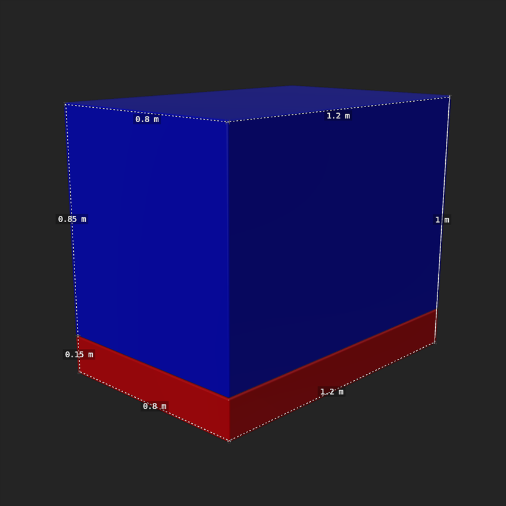
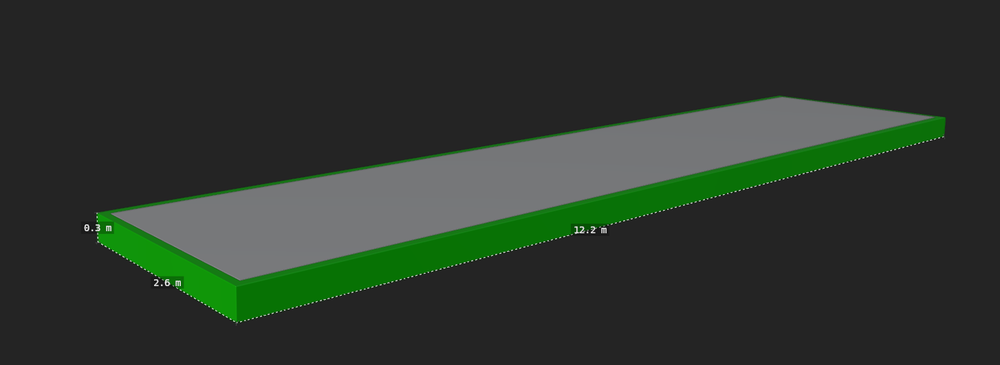
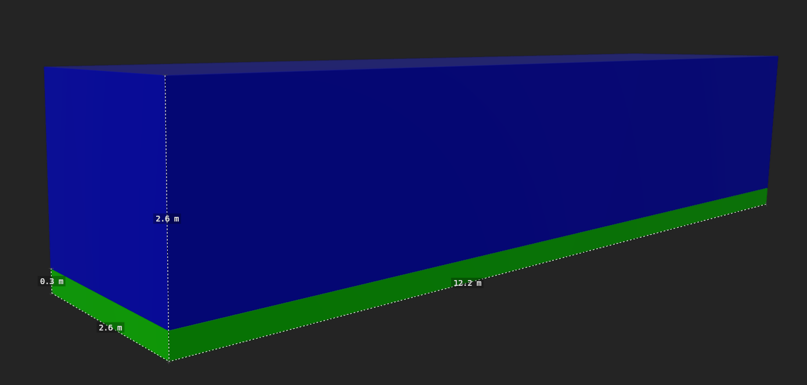
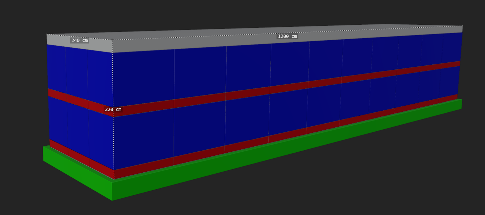
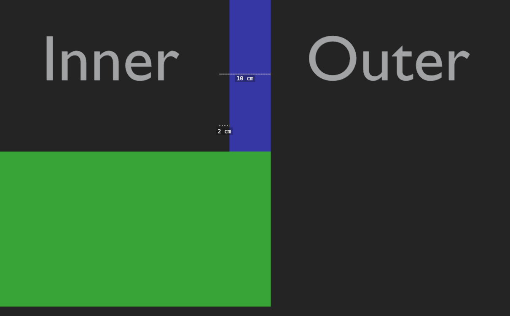

## Inventaire physique

L'inventaire et la gestion des objets sont physiques. Tous les objets sont déplaçables manuellement en limitant les automatisations, une action du joueur doit être nécessaire pour en faire un gameplay vivant et complet.

Les objets sont déplacés à l'aide de contenants (sacs, caisses, etc). Le contenant fermé permet de figer les objets pour éviter les problèmes de collision.
Certains objets peuvent être placés sur des supports spécifiques (rack,holster, armoires, grille magnétique, etc). L'objet est alors figé, évitant les collisions.

## Interaction 
Passage en mode interaction : alt
Le mode interaction permet de récupérer et poser les objets avec clique gauche.
Pour prendre et poser un objet rapidement sans passer par le mode, il faut cliquer sur la molette.

## inventaire personnel
L'inventaire personnel dépend de l'équipement porté. Ils offrent des emplacements pour les outils, les recharges et d'autres objets définis suivant les équipements. 
Changement d'équipement touches 1.2.3.4.5.6.7.8.9.0
Pour recharger : R
Pour changer la munition de l'ouil il suffit d'interagir avec sur l'outil.

### Sac à dos 
Pour accéder au sac, il faut cliquer sur I. Le personnage place alors le sac devant lui et permet d'accéder au contenu du sac et aux poches extérieures

Les poches extérieures sont des emplacements comme pour les équipements.

L'intérieur permet de stocker en vrac. Cependant, des sacs peuvent être organisés pour les besoins de certains gameplay.

Les sacs sont essentiellement de petites tailles pour éviter la surcharge, leur port doit être temporaire. Le joueur pour augmenter les quantités doit utiliser des outils et des véhicules.

### Caisses & conteneurs
Les caisses permettent de déplacer de grosses quantités ; elles figent leur contenu une fois fermées, et une information lisible dessus permet d'en connaître le contenu.

Pour le déplacement, on utilise un système d'**aimants** qui permet d'accrocher les caisses et de les plaquer sur une **grille**. Une fois plaquées, elles sont **empilables** (hauteur max définie par la grille). Les aimants sont situés sur les coins : il est possible de prendre les caisses sur toutes les faces. Des outils et véhicules permettent de déplacer les caisses plus facilement et en plus grande quantité. La caisse a un **poids** (le sien plus celui de son contenu) qui influence son déplacement.

Pour transporter des ressources ou des objets d'un point A à un point B, le joueur utilise des conteneurs de stockage déclinés en **3 tailles** :

- **Colis** — transportable à la main ;
- **Palette** — déplacée au chariot ou par un petit véhicule ;
- **Conteneur de fret** — déplacé par des véhicules spécialisés, des grues ou de gros chariots.

#### Matériaux
Un conteneur peut être fait d'un ou plusieurs matériaux ; certains sont préconisés selon la taille. Communs aux trois : **métal**, **plastique**, **composites**. En plus : le **colis** peut être en carton ou papier ; la **palette** peut être en bois. La couleur des matériaux est libre.

#### Marquages et indicateurs
Tout conteneur possède :

- un **numéro de colis** visible (sur les 4 parois pour les conteneurs de fret) ;
- un **symbole E-INK** visible (sur les 4 parois pour les conteneurs de fret), défini par le **type de chargement** (explosif, périssable, médical, …).

Les palettes et conteneurs de fret disposent en plus d'**indicateurs lumineux** de statut : **blanc = vide**, **bleu = chargé**, **éteint = inutilisé depuis un certain temps**.

#### Colis
Le colis est le plus petit conteneur. Il n'a pas de dimensions fixes : il est considéré comme un colis tant qu'il reste **transportable à la main** par le personnage. Il peut contenir des matériaux bruts, des médicaments, des aliments, du liquide, du gaz, etc. Selon sa taille et son chargement, il doit prévoir des **poignées ergonomiques**.

#### Palette
La palette est le conteneur de taille moyenne ; elle se déplace au chariot ou en petit véhicule et peut recevoir plusieurs colis. Elle doit pouvoir **s'empiler** et prévoir des **espaces traversants sous sa base** pour être soulevée par un transpalette.

Dérivés :

- **caisse** — matières premières / vrac ;
- **réfrigérée** — dérivée de la caisse, volume interne réduit par l'unité de réfrigération ;
- **benne** — sans couvercle, pour le vrac ou les chargements encombrants ;
- **citerne** — cylindre au centre d'une armature, pour liquides/gaz, avec indicateur (manomètre gaz, niveau liquide).

*Dimensions* : base au sol **120 × 80 cm**. Palette standard haute de **15 cm** ; les dérivés font au maximum **100 cm** ou **200 cm** de hauteur.

#### Conteneur de fret
Le plus grand conteneur ; il peut recevoir plusieurs palettes.

Dérivés :

- **plat** — transport de palettes et petits véhicules, chargement **sanglable** ;
- **standard** — le plus polyvalent (palettes, cartons, fournitures électroniques…) ;
- **standard réfrigéré** — volume réduit par l'unité de réfrigération, à l'extrémité opposée à l'ouverture ;
- **benne** — ouvert sur le dessus, chargement/déchargement par le haut de marchandises volumineuses ou lourdes ;
- **citerne** — cylindre pour liquides/gaz, avec indicateur ; deux valves (dessus et dessous) pour charger/décharger.

*Dimensions* : base au sol **1220 × 260 cm**. Conteneur plat haut de **30 cm** ; les autres dérivés font au maximum **260 cm**. Volume de chargement interne **1200 × 240 × 220 cm**. Les parois du standard ont **8 cm** d'épaisseur (soit 2 cm de marge entre le bord des palettes et la paroi). Les conteneurs doivent pouvoir **s'empiler**. Le mécanisme d'ouverture du standard doit être atteignable de l'extérieur, de l'intérieur (si un joueur s'y retrouve enfermé) et lorsqu'il est placé le long d'un mur ; la porte doit faire au moins **220 cm** de haut pour laisser entrer une palette de 200 cm.

:::note Implémentation actuelle (code)
Ces conteneurs existent déjà en jeu comme props réseau **carriables** :

- Type réseau `box` pour les colis/caisses de test et les palettes ; type `palette_container` pour le conteneur « Ares » (le seul dont le canal réseau transporte `content`, le volume de minerai). Voir [Props](../../../../../networkGame/props.md).
- Les propriétés répliquées (`box_def.json`) portent déjà les marquages du GDD : `parcel_number` (numéro), `symbol` (symbole E-INK), `qrcode`, `led_state` (voyant), `weight` (poids), `opened` (ouvert/fermé).
- Les scènes GLB confirment les dimensions : `pallet_*_120x80x100`, `container_*_1200x240x240`.
- Le **poids** est bien géré : une caisse chargée dans la benne d'un camion ajoute sa masse au véhicule (et depuis peu, un objet qui **tombe** dans la benne est aussi pesé). Une caisse gelée « colle » au camion et le suit.
- **Pas encore implémentés** : les aimants/grille d'empilage, les indicateurs lumineux visuels, le transpalette, les sangles, la réfrigération et les citernes.
:::