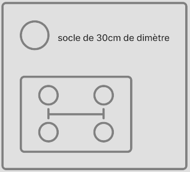

Tous les véhicules sont équipés de composants qu'ils soient modulables ou non. Les non modulables seront spécifiquement créés pour un véhicule. La modularité permet aux joueurs de s'investir dans leurs matériels et de créer un attachement. Les composants nécessitent un entretien régulier pour assurer le bon fonctionnement du véhicule. Les composants possèdent 3 tailles et sont dotés de connexion avec les véhicules par leurs socles. Pour augmenter les possibilités, les composants peuvent posséder des sous-composants.

Les composants des véhicules leur donnent leurs capacités. Il est nécessaire de faire des choix, les véhicules ne pourront posséder tous les composants. Les propulseurs acceptent tous les moteurs de vol et de saut, cependant certains sont plus efficaces que d'autres suivant les moteurs utilisés. Le véhicule est fourni avec des composants de base.

Liste des composants:
Réservoir
Autopilote
Module de vie
Générateur
Batterie
Refroidisseur
Radar
Communication
Gravité
Moteur terrestre électrique
Moteur vol tatoué
Moteur de vol spatial
Moteur de saut système
Moteur de saut interstellaire

## Tailles
Les composants ont des tailles différentes, plus la taille est grande, plus les composants sont performants. Cependant, il nécessite plus d'entretien, est plus coûteux, est plus compliqué à déplacer et remplacer.

Les tailles sont au nombre de 3, chacune prend un 2 fois la taille et le nombre de socles que le précédent.

Taille 1 : 60x40x30 cm
Taille 2 : 60x80x30 cm
Taille 4 : 120x80x30 cm

Les composants de taille 1 sont changeables à la main. Les tailles 2 nécessitent une assistance et les tailles 4 avec un véhicule s'il est trop lourd.

## Connection

Pour se connecter, les modules utilisent un socle de 30cm de diamètre pour savoir s'il est possible de mettre une taille 2 ou 4. Les liaisons entre les différents ports indiquent les possibilités des grilles

Il est impossible de mettre une taille 2 horizontalement

Pour changer de module, il faut un temps au système pour le prendre en compte et éviter les changements trop rapides. 
Le socle permet de passer les fluides, les gaz et l'énergie.

## Sous-composant

Les sous-composants permettent d'augmenter les performances d'un composant. De la maintenance est à prévoir dessus, pour y accéder, il suffit d'ouvrir le comportant par la face opposée au socle. Les sous-composants sont limités à 5 par composant. Tous les composants ne possèdent pas le même nombre de sous-composants, cela dépend de chaque composant. Les sous-composants ont tous la même taille.

## Entretien

L'entretien des composants et des sous-composants permet d'assurer leur bon fonctionnement. Si un entretien n'est pas effectué régulièrement, alors le véhicule aura des baisses de performances suivies de pannes. Les composants mal entretenus demanderont des réparations conséquentes qui ne pourront s'effectuer que dans des lieux prévus à cet effet.