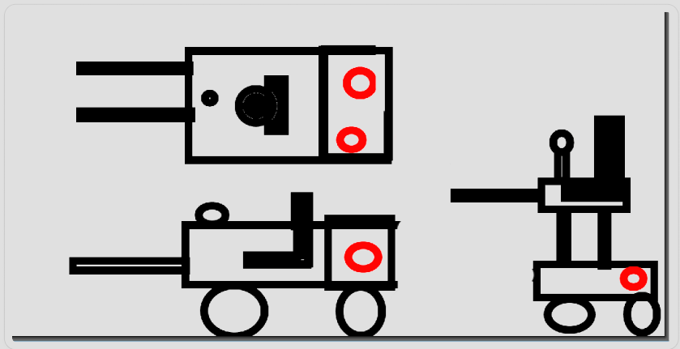
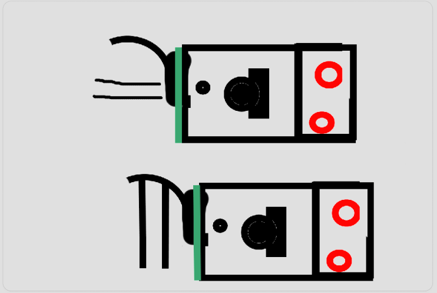
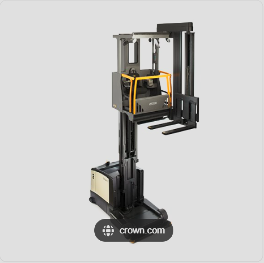
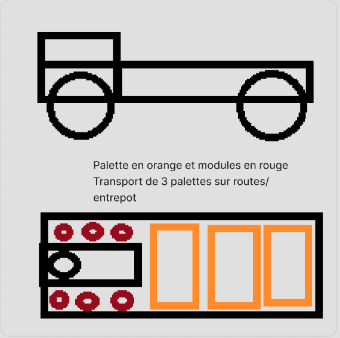
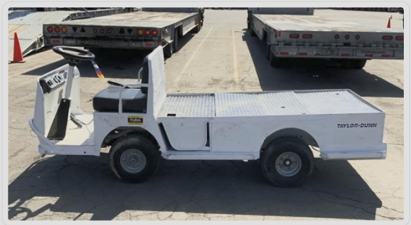

# Véhicules de transport

Les véhicules de transport déplacent les caisses et conteneurs (voir [Inventaire / Caisses & conteneurs](../1_Inventaire/0_Inventaire.md)). Leur matériel modulaire — **composants** (moteurs, batterie, refroidisseur…), **modules** intérieurs et **outils** extérieurs — est décrit dans les pages dédiées : [Composants](../Composants/0_Composants.md), [Modules](../Modules/0_Modules.md), [Outils](../Outils/0_Outils.md). Cette page ne couvre que les **véhicules spécifiques** au transport.

## Chariot élévateur

Un chariot dont la **cabine se lève** avec les broches **en face** du conducteur, pour mieux voir la manœuvre. Il accueille **2 modules de taille 1** ; modules de base : batterie, moteur.

- **Hauteur de levée** (pour récupérer les caisses) : **3,10 m**.
- **Encombrement** (indicatif, à ajuster) : 1 palette en long (120 cm) + un poste (assis ou debout) + 1 module en largeur (40 cm).

Variante envisagée : une **fourche amovible** montée sur un système de déplacement latéral (barre), la fourche pouvant pivoter pour se présenter de face ou sur le côté.

*Inspiration (chariot élévateur à cabine levante) :*

## Camion palette (3 palettes)

Petit véhicule pour déplacer **3 palettes** sur surface plane (entrepôt, routes). La place du siège et des modules peut être réarrangée tant qu'ils restent accessibles. Existe en version à cabine, avec toit mais sans porte ni fenêtre.

- **Modules de base** : moteur terrestre ×2, refroidisseur, batterie, module de vie, communication courte portée.
- **Dimensions** : longueur **360 cm** (120 module/habitacle + 240 pour 3 palettes de large) ; largeur **120 cm** (30 épaisseur module + 60 habitacle, la charge occupant 120) ; hauteur **120 cm** (module 60 / palette 100 / habitacle 100 / roue 30).

*Inspiration (petit utilitaire à plateau) :*

:::note Implémentation actuelle (code)
Un **camion** est déjà jouable et réseau (banc `scenes/vehicles/`, camion MVP). Il est conduit à **Z Q S D**, on y monte/descend à **E**, avec moteur à démarrer (**I**), frein à main (appui long **Espace**), phares (**L**), klaxon (**H** / **Alt+H**), remise sur roues (**R**) et vue cabine/poursuite (**F4**). Il possède une **benne** qui pèse et retient sa cargaison. Détails techniques : [Véhicules (réseau)](../../../../../networkGame/vehicles.md) et [Modèles de véhicules](../../../../../creativeConcept/vehicle_models.md).

**Pas encore implémentés** : le **chariot élévateur**, le **transpalette**, le système de **sangles**, et la manutention par grille/aimants.
:::
