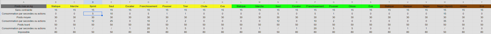
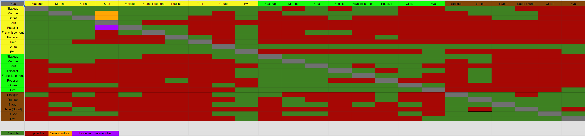

# Déplacement du personnage

## Déplacement
Le déplacement du personnage se base sur les caractéristiques du personnage qui seront modifiées par des éléments extérieurs comme la gravité ou le milieu où évolue le personnage et ce que porte le personnage (armures/équipements/stockage).

- Le poids total du personnage
- L’endurance du personnage avec son état 

### La marche
La marche est le premier déplacement du personnage, il sera le point de transition vers la plupart des autres déplacements. Il permet au joueur de se déplacer sur les longues distances sans se fatiguer. A basse vitesse, il fait peu de bruit permettant, le déplacement en discrétion. Un personnage ne peut pas monter une pente à plus de 60° en marchant

La marche de basse sera de 1.5 m/s la touche sera Z pour un clavier azerty.

La vitesse peut être modifiée pour aller de 0.5 à 3 m/s avec des crans par 0.5 m/s modifiable avec la molette de la souris ce qui fait 6 paliers de vitesse.

Plus la vitesse est élevée plus le personnage fera du bruit.

### Statique
Le personnage ne bouge pas et récupère son endurance plus rapidement. 
Si un personnage est surchargé il sera statique.
S'asseoir rend le personnage statique.
Le fait d'être statique empêche les jambes de bouger. Cependant le personnage peut toujours tourner la tête utiliser les bras et se baisser.

### Le sprint 
Le sprint permet au personnage d'agrandir la longueur d'un saut et de se déplacer plus vite. Il est donc plus simple de fuir un danger. Ce n'est pas un déplacement régulier pour les joueurs il consommera beaucoup d'endurance.
Vitesses 5 m/s 
Avant et après le sprint, le joueur doit marcher 

Impossible de sprinter si l’eau arrive aux genoux

### Saut
Le joueur peut sauter en hauteur 0.5 m avec la barre espace 
Pas de contrôle dans les airs. 
S'il marche ou sprint il se déplacera en l’air vers l’avant plus ou moins loin suivant la vitesse 

### Franchissement/Hisser 
Si je joueur arrive face à un obstacle qu’il veut franchir mais que le saut n'est pas suffisant en terme de hauteur 
Le personnage fera une animation pour se hisser au dessus de l'élément comme une caisse (2 m max) ou franchira l’obstacle comme une barrière ou un muret 0.5 m max

### Nager
Le personnage se met à nager quand il marche dans l’eau au moment où celle-ci dépasse les hanches.
Le personnage se met à l’horizontale et range ce qu’il a dans les mains ou le laisse tomber si ce n’est pas un équipement qui se range rapidement. Des exceptions pour certains outils sont possibles.
La nage peut être impossible si le personnage est trop épuisé. il tombera dans le coma
Vitesse : 1.5 m/s

### Sprint nage 
Le sprint à la nage permet de fuir un danger cependant la consommation est grandement augmentée.
Sprinter dans l’eau consomme beaucoup d’énergie
Vitesse : 2.5 m/s
Touche : Maj+Z

### Glisse 
Le personnage glisse sur le dos, le ventre ou sur les pieds pour descendre une pente trop abrupte. Il est possible de contrôler une glissade. 

### Escalier
Le personnage peut marcher et courir dans les escaliers, sauter est possible mais peut provoquer des blessures et des chutes. 

### Chute 
Impossible à contrôler par le joueur. Il peut se rattraper à un rebord s'il ne chute pas trop vite.  

### Accroupie
Le personnage accroupi peut marcher mais est limité à 2 m/s
Le personnage peut courir mais devra se relever.
Le personnage peut sauter et revenir accroupi mais l'animation est plus longue que debout.
Le personnage passe en nage si les hanches sont submergées
Le personnage peut franchir un léger obstacle, un saut sera fait pour atteindre une surface en hauteur et se hisser. 

### Allonger/ramper
Le personnage ne peut courir, sauter, nager ou se hisser
Le personnage peut  prendre des escaliers et franchir de petits obstacles .0.3 m max

### EVA
Le personnage peut passer en eva, la condition c’est de ne plus avoir de gravité le personnage se retrouve comme flottant dans le vide. Le personnage gardera la poussée qu’il a et pourra se mouvoir dans le vide grâce à des poussées qu'elles soient par rapport à un matériau ou une poussée d’un propulseur comme un jet pack.

Déplacement propulseur 
Jetpack : Propulsion impossible à travers le corps, le personnage devrait se tourner.
Combinaison : pratique mais possible si une combinaison fine ?
Iron Man : difficile à faire si on doit orienter chaque propulseur, sauf si géré par le jeu et difficile d’utiliser des outils. 
Déplacements sur les murs extérieurs sont souvent plus plats. On pourrait ramper à la manière de SC et pouvoir se propulser avec les bras et les jambes avec “espace” et pour se raccrocher “alt” en visant avec la souris pour savoir vers où se propulser

De même pour le déplacement intérieur dans les vaisseaux il serait possible d’attraper des barres ou prises prévues pour le déplacement eva permettant un meilleur déplacement plus précis et rapide.

La sortie d’eva se fait par rapport à la vitesse et à la hauteur en marchant debout en étant accroupi ou allongé si on arrive proche du sol 

## Consommation par action

## Transition
